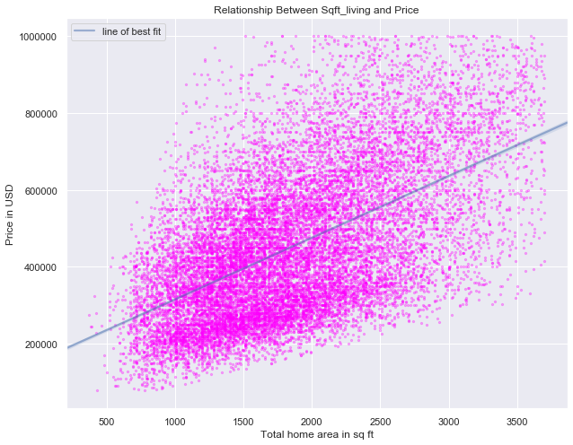
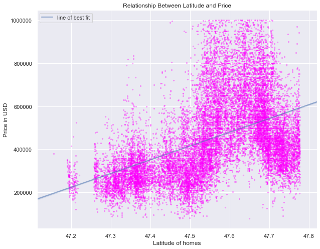
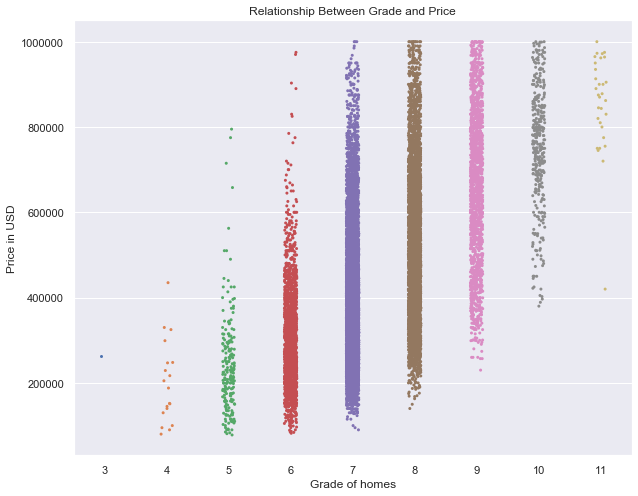

```python
!pip install -U fsds_100719
import IPython.display as disp
disp.clear_output()
print('testing')
```

    testing
    


```python
# Shortcut import of 
# import pandas as pd, numpy as np, etc...
import fsds_100719 as fs
from fsds_100719.imports import *
```

**Taking a preview of the data**


```python
# Ignore pink warnings 
import warnings
warnings.filterwarnings('ignore')

# Allow for a large # of columns
pd.set_option('display.max_columns',0)
# pd.set_option('display.max_rows','')

df = pd.read_csv('kc_house_data.csv')
df.head()
```


<div>
<style scoped>
    .dataframe tbody tr th:only-of-type {
        vertical-align: middle;
    }

    .dataframe tbody tr th {
        vertical-align: top;
    }

    .dataframe thead th {
        text-align: right;
    }
</style>
<table border="1" class="dataframe">
  <thead>
    <tr style="text-align: right;">
      <th></th>
      <th>id</th>
      <th>date</th>
      <th>price</th>
      <th>bedrooms</th>
      <th>bathrooms</th>
      <th>sqft_living</th>
      <th>sqft_lot</th>
      <th>floors</th>
      <th>waterfront</th>
      <th>view</th>
      <th>condition</th>
      <th>grade</th>
      <th>sqft_above</th>
      <th>sqft_basement</th>
      <th>yr_built</th>
      <th>yr_renovated</th>
      <th>zipcode</th>
      <th>lat</th>
      <th>long</th>
      <th>sqft_living15</th>
      <th>sqft_lot15</th>
    </tr>
  </thead>
  <tbody>
    <tr>
      <td>0</td>
      <td>7129300520</td>
      <td>10/13/2014</td>
      <td>221900.0</td>
      <td>3</td>
      <td>1.00</td>
      <td>1180</td>
      <td>5650</td>
      <td>1.0</td>
      <td>NaN</td>
      <td>0.0</td>
      <td>3</td>
      <td>7</td>
      <td>1180</td>
      <td>0.0</td>
      <td>1955</td>
      <td>0.0</td>
      <td>98178</td>
      <td>47.5112</td>
      <td>-122.257</td>
      <td>1340</td>
      <td>5650</td>
    </tr>
    <tr>
      <td>1</td>
      <td>6414100192</td>
      <td>12/9/2014</td>
      <td>538000.0</td>
      <td>3</td>
      <td>2.25</td>
      <td>2570</td>
      <td>7242</td>
      <td>2.0</td>
      <td>0.0</td>
      <td>0.0</td>
      <td>3</td>
      <td>7</td>
      <td>2170</td>
      <td>400.0</td>
      <td>1951</td>
      <td>1991.0</td>
      <td>98125</td>
      <td>47.7210</td>
      <td>-122.319</td>
      <td>1690</td>
      <td>7639</td>
    </tr>
    <tr>
      <td>2</td>
      <td>5631500400</td>
      <td>2/25/2015</td>
      <td>180000.0</td>
      <td>2</td>
      <td>1.00</td>
      <td>770</td>
      <td>10000</td>
      <td>1.0</td>
      <td>0.0</td>
      <td>0.0</td>
      <td>3</td>
      <td>6</td>
      <td>770</td>
      <td>0.0</td>
      <td>1933</td>
      <td>NaN</td>
      <td>98028</td>
      <td>47.7379</td>
      <td>-122.233</td>
      <td>2720</td>
      <td>8062</td>
    </tr>
    <tr>
      <td>3</td>
      <td>2487200875</td>
      <td>12/9/2014</td>
      <td>604000.0</td>
      <td>4</td>
      <td>3.00</td>
      <td>1960</td>
      <td>5000</td>
      <td>1.0</td>
      <td>0.0</td>
      <td>0.0</td>
      <td>5</td>
      <td>7</td>
      <td>1050</td>
      <td>910.0</td>
      <td>1965</td>
      <td>0.0</td>
      <td>98136</td>
      <td>47.5208</td>
      <td>-122.393</td>
      <td>1360</td>
      <td>5000</td>
    </tr>
    <tr>
      <td>4</td>
      <td>1954400510</td>
      <td>2/18/2015</td>
      <td>510000.0</td>
      <td>3</td>
      <td>2.00</td>
      <td>1680</td>
      <td>8080</td>
      <td>1.0</td>
      <td>0.0</td>
      <td>0.0</td>
      <td>3</td>
      <td>8</td>
      <td>1680</td>
      <td>0.0</td>
      <td>1987</td>
      <td>0.0</td>
      <td>98074</td>
      <td>47.6168</td>
      <td>-122.045</td>
      <td>1800</td>
      <td>7503</td>
    </tr>
  </tbody>
</table>
</div>


*Here, we see several variables, which upon initial inspection, I see as four main types:* 
1. Items we can directly control via renovations or timing we put home on market:
    ['bedrooms', 'date', 'bathrooms', 'sqft_living', 'floors', 'condition', 'grade', 'sqft_above', 'sqft_basement', 'yr_renovated']
2. Items we cannot control, but can help us in deciding the right homes/areas to look for our flip:
    ['sqft_lot', 'waterfront', 'view', 'yr_built', 'zipcode', 'lat', 'long', 'sqft_living15', 'sqft_lot15']
3. Item we are using as our target:
    'price'
4. Variables we can drop:
    'id' --> due to us just wanting to see patterns, and it does not matter how we reference the sold home
    'view' --> we are just flipping. Marketing/understanding the complicated selling process will be left to the realtors


```python
df.drop(columns=['id', 'view'], inplace=True)                                         #dropping id, view columns
df.head()
```


<div>
<style scoped>
    .dataframe tbody tr th:only-of-type {
        vertical-align: middle;
    }

    .dataframe tbody tr th {
        vertical-align: top;
    }

    .dataframe thead th {
        text-align: right;
    }
</style>
<table border="1" class="dataframe">
  <thead>
    <tr style="text-align: right;">
      <th></th>
      <th>date</th>
      <th>price</th>
      <th>bedrooms</th>
      <th>bathrooms</th>
      <th>sqft_living</th>
      <th>sqft_lot</th>
      <th>floors</th>
      <th>waterfront</th>
      <th>condition</th>
      <th>grade</th>
      <th>sqft_above</th>
      <th>sqft_basement</th>
      <th>yr_built</th>
      <th>yr_renovated</th>
      <th>zipcode</th>
      <th>lat</th>
      <th>long</th>
      <th>sqft_living15</th>
      <th>sqft_lot15</th>
    </tr>
  </thead>
  <tbody>
    <tr>
      <td>0</td>
      <td>10/13/2014</td>
      <td>221900.0</td>
      <td>3</td>
      <td>1.00</td>
      <td>1180</td>
      <td>5650</td>
      <td>1.0</td>
      <td>NaN</td>
      <td>3</td>
      <td>7</td>
      <td>1180</td>
      <td>0.0</td>
      <td>1955</td>
      <td>0.0</td>
      <td>98178</td>
      <td>47.5112</td>
      <td>-122.257</td>
      <td>1340</td>
      <td>5650</td>
    </tr>
    <tr>
      <td>1</td>
      <td>12/9/2014</td>
      <td>538000.0</td>
      <td>3</td>
      <td>2.25</td>
      <td>2570</td>
      <td>7242</td>
      <td>2.0</td>
      <td>0.0</td>
      <td>3</td>
      <td>7</td>
      <td>2170</td>
      <td>400.0</td>
      <td>1951</td>
      <td>1991.0</td>
      <td>98125</td>
      <td>47.7210</td>
      <td>-122.319</td>
      <td>1690</td>
      <td>7639</td>
    </tr>
    <tr>
      <td>2</td>
      <td>2/25/2015</td>
      <td>180000.0</td>
      <td>2</td>
      <td>1.00</td>
      <td>770</td>
      <td>10000</td>
      <td>1.0</td>
      <td>0.0</td>
      <td>3</td>
      <td>6</td>
      <td>770</td>
      <td>0.0</td>
      <td>1933</td>
      <td>NaN</td>
      <td>98028</td>
      <td>47.7379</td>
      <td>-122.233</td>
      <td>2720</td>
      <td>8062</td>
    </tr>
    <tr>
      <td>3</td>
      <td>12/9/2014</td>
      <td>604000.0</td>
      <td>4</td>
      <td>3.00</td>
      <td>1960</td>
      <td>5000</td>
      <td>1.0</td>
      <td>0.0</td>
      <td>5</td>
      <td>7</td>
      <td>1050</td>
      <td>910.0</td>
      <td>1965</td>
      <td>0.0</td>
      <td>98136</td>
      <td>47.5208</td>
      <td>-122.393</td>
      <td>1360</td>
      <td>5000</td>
    </tr>
    <tr>
      <td>4</td>
      <td>2/18/2015</td>
      <td>510000.0</td>
      <td>3</td>
      <td>2.00</td>
      <td>1680</td>
      <td>8080</td>
      <td>1.0</td>
      <td>0.0</td>
      <td>3</td>
      <td>8</td>
      <td>1680</td>
      <td>0.0</td>
      <td>1987</td>
      <td>0.0</td>
      <td>98074</td>
      <td>47.6168</td>
      <td>-122.045</td>
      <td>1800</td>
      <td>7503</td>
    </tr>
  </tbody>
</table>
</div>


# SCRUB


```python
for col in df.columns:
    print('----'*5)
    print(df[col].name)
    na = df[col].isna().sum()
    if na > 0:
        print(f'Number of NaNs: {na}\n')
    print(f'Most common values are:\n{df[col].value_counts()}')
    #find which ones have NaN values & weird values
```

    --------------------
    date
    Most common values are:
    6/23/2014    142
    6/25/2014    131
    6/26/2014    131
    7/8/2014     127
    4/27/2015    126
                ... 
    1/10/2015      1
    5/27/2015      1
    7/27/2014      1
    8/3/2014       1
    8/30/2014      1
    Name: date, Length: 372, dtype: int64
    --------------------
    price
    Most common values are:
    350000.0    172
    450000.0    172
    550000.0    159
    500000.0    152
    425000.0    150
               ... 
    870515.0      1
    336950.0      1
    386100.0      1
    176250.0      1
    884744.0      1
    Name: price, Length: 3622, dtype: int64
    --------------------
    bedrooms
    Most common values are:
    3     9824
    4     6882
    2     2760
    5     1601
    6      272
    1      196
    7       38
    8       13
    9        6
    10       3
    11       1
    33       1
    Name: bedrooms, dtype: int64
    --------------------
    bathrooms
    Most common values are:
    2.50    5377
    1.00    3851
    1.75    3048
    2.25    2047
    2.00    1930
    1.50    1445
    2.75    1185
    3.00     753
    3.50     731
    3.25     589
    3.75     155
    4.00     136
    4.50     100
    4.25      79
    0.75      71
    4.75      23
    5.00      21
    5.25      13
    5.50      10
    1.25       9
    6.00       6
    5.75       4
    0.50       4
    8.00       2
    6.25       2
    6.75       2
    6.50       2
    7.50       1
    7.75       1
    Name: bathrooms, dtype: int64
    --------------------
    sqft_living
    Most common values are:
    1300    138
    1400    135
    1440    133
    1660    129
    1010    129
           ... 
    4970      1
    2905      1
    2793      1
    4810      1
    1975      1
    Name: sqft_living, Length: 1034, dtype: int64
    --------------------
    sqft_lot
    Most common values are:
    5000      358
    6000      290
    4000      251
    7200      220
    7500      119
             ... 
    1448        1
    38884       1
    17313       1
    35752       1
    315374      1
    Name: sqft_lot, Length: 9776, dtype: int64
    --------------------
    floors
    Most common values are:
    1.0    10673
    2.0     8235
    1.5     1910
    3.0      611
    2.5      161
    3.5        7
    Name: floors, dtype: int64
    --------------------
    waterfront
    Number of NaNs: 2376
    
    Most common values are:
    0.0    19075
    1.0      146
    Name: waterfront, dtype: int64
    --------------------
    condition
    Most common values are:
    3    14020
    4     5677
    5     1701
    2      170
    1       29
    Name: condition, dtype: int64
    --------------------
    grade
    Most common values are:
    7     8974
    8     6065
    9     2615
    6     2038
    10    1134
    11     399
    5      242
    12      89
    4       27
    13      13
    3        1
    Name: grade, dtype: int64
    --------------------
    sqft_above
    Most common values are:
    1300    212
    1010    210
    1200    206
    1220    192
    1140    184
           ... 
    2601      1
    440       1
    2473      1
    2441      1
    1975      1
    Name: sqft_above, Length: 942, dtype: int64
    --------------------
    sqft_basement
    Most common values are:
    0.0       12826
    ?           454
    600.0       217
    500.0       209
    700.0       208
              ...  
    2720.0        1
    1284.0        1
    556.0         1
    1913.0        1
    3480.0        1
    Name: sqft_basement, Length: 304, dtype: int64
    --------------------
    yr_built
    Most common values are:
    2014    559
    2006    453
    2005    450
    2004    433
    2003    420
           ... 
    1933     30
    1901     29
    1902     27
    1935     24
    1934     21
    Name: yr_built, Length: 116, dtype: int64
    --------------------
    yr_renovated
    Number of NaNs: 3842
    
    Most common values are:
    0.0       17011
    2014.0       73
    2003.0       31
    2013.0       31
    2007.0       30
              ...  
    1946.0        1
    1959.0        1
    1971.0        1
    1951.0        1
    1954.0        1
    Name: yr_renovated, Length: 70, dtype: int64
    --------------------
    zipcode
    Most common values are:
    98103    602
    98038    589
    98115    583
    98052    574
    98117    553
            ... 
    98102    104
    98010    100
    98024     80
    98148     57
    98039     50
    Name: zipcode, Length: 70, dtype: int64
    --------------------
    lat
    Most common values are:
    47.6624    17
    47.5491    17
    47.5322    17
    47.6846    17
    47.6711    16
               ..
    47.2785     1
    47.4162     1
    47.3870     1
    47.2313     1
    47.2715     1
    Name: lat, Length: 5033, dtype: int64
    --------------------
    long
    Most common values are:
    -122.290    115
    -122.300    111
    -122.362    104
    -122.291    100
    -122.372     99
               ... 
    -121.403      1
    -121.804      1
    -121.726      1
    -121.895      1
    -121.893      1
    Name: long, Length: 751, dtype: int64
    --------------------
    sqft_living15
    Most common values are:
    1540    197
    1440    195
    1560    192
    1500    180
    1460    169
           ... 
    4890      1
    2873      1
    952       1
    3193      1
    2049      1
    Name: sqft_living15, Length: 777, dtype: int64
    --------------------
    sqft_lot15
    Most common values are:
    5000      427
    4000      356
    6000      288
    7200      210
    4800      145
             ... 
    11036       1
    8989        1
    871200      1
    809         1
    6147        1
    Name: sqft_lot15, Length: 8682, dtype: int64
    

*Waterfront* is missing over 10% of values. With it being whether a house has a view of the water, it's not exactly a simple variable to check up. One would literally have to see the view from the house. And since only 146 out of over 21K homes actually have a view, seems like a pointless column. Will drop


```python
df.drop(columns='waterfront', inplace=True)
df.head()
```


<div>
<style scoped>
    .dataframe tbody tr th:only-of-type {
        vertical-align: middle;
    }

    .dataframe tbody tr th {
        vertical-align: top;
    }

    .dataframe thead th {
        text-align: right;
    }
</style>
<table border="1" class="dataframe">
  <thead>
    <tr style="text-align: right;">
      <th></th>
      <th>date</th>
      <th>price</th>
      <th>bedrooms</th>
      <th>bathrooms</th>
      <th>sqft_living</th>
      <th>sqft_lot</th>
      <th>floors</th>
      <th>condition</th>
      <th>grade</th>
      <th>sqft_above</th>
      <th>sqft_basement</th>
      <th>yr_built</th>
      <th>yr_renovated</th>
      <th>zipcode</th>
      <th>lat</th>
      <th>long</th>
      <th>sqft_living15</th>
      <th>sqft_lot15</th>
    </tr>
  </thead>
  <tbody>
    <tr>
      <td>0</td>
      <td>10/13/2014</td>
      <td>221900.0</td>
      <td>3</td>
      <td>1.00</td>
      <td>1180</td>
      <td>5650</td>
      <td>1.0</td>
      <td>3</td>
      <td>7</td>
      <td>1180</td>
      <td>0.0</td>
      <td>1955</td>
      <td>0.0</td>
      <td>98178</td>
      <td>47.5112</td>
      <td>-122.257</td>
      <td>1340</td>
      <td>5650</td>
    </tr>
    <tr>
      <td>1</td>
      <td>12/9/2014</td>
      <td>538000.0</td>
      <td>3</td>
      <td>2.25</td>
      <td>2570</td>
      <td>7242</td>
      <td>2.0</td>
      <td>3</td>
      <td>7</td>
      <td>2170</td>
      <td>400.0</td>
      <td>1951</td>
      <td>1991.0</td>
      <td>98125</td>
      <td>47.7210</td>
      <td>-122.319</td>
      <td>1690</td>
      <td>7639</td>
    </tr>
    <tr>
      <td>2</td>
      <td>2/25/2015</td>
      <td>180000.0</td>
      <td>2</td>
      <td>1.00</td>
      <td>770</td>
      <td>10000</td>
      <td>1.0</td>
      <td>3</td>
      <td>6</td>
      <td>770</td>
      <td>0.0</td>
      <td>1933</td>
      <td>NaN</td>
      <td>98028</td>
      <td>47.7379</td>
      <td>-122.233</td>
      <td>2720</td>
      <td>8062</td>
    </tr>
    <tr>
      <td>3</td>
      <td>12/9/2014</td>
      <td>604000.0</td>
      <td>4</td>
      <td>3.00</td>
      <td>1960</td>
      <td>5000</td>
      <td>1.0</td>
      <td>5</td>
      <td>7</td>
      <td>1050</td>
      <td>910.0</td>
      <td>1965</td>
      <td>0.0</td>
      <td>98136</td>
      <td>47.5208</td>
      <td>-122.393</td>
      <td>1360</td>
      <td>5000</td>
    </tr>
    <tr>
      <td>4</td>
      <td>2/18/2015</td>
      <td>510000.0</td>
      <td>3</td>
      <td>2.00</td>
      <td>1680</td>
      <td>8080</td>
      <td>1.0</td>
      <td>3</td>
      <td>8</td>
      <td>1680</td>
      <td>0.0</td>
      <td>1987</td>
      <td>0.0</td>
      <td>98074</td>
      <td>47.6168</td>
      <td>-122.045</td>
      <td>1800</td>
      <td>7503</td>
    </tr>
  </tbody>
</table>
</div>


*sqft_basement* weirdly has '?' has value. Seeing as how we have a sqft_living for all the area of the house, and sqft_above, which measures everything outside of basement, makes sense to just set basement = total - above


```python
df['sqft_basement'] = df['sqft_living'] - df['sqft_above']
df.sqft_basement.value_counts()
```


    0       13110
    600       221
    700       218
    500       214
    800       206
            ...  
    792         1
    2590        1
    935         1
    2390        1
    248         1
    Name: sqft_basement, Length: 306, dtype: int64


*fix yr_renovated* has NaN's as well as 0's. If there is a NaN/0, I would assume no renovations were done, or at least none done legally with permits. In either situation, you can't promise a home has been renovated. So in those cases, the new value in this column is the yr the home was built. With that, the name of column is last_constructed to better reflect what it represents now


```python
df['yr_renovated'].fillna(value=df.yr_built, inplace=True)  
df.loc[df['yr_renovated'] == 0, 'yr_renovated'] = df['yr_built']
df.rename(columns = {'yr_renovated': 'last_constructed'}, inplace=True)
df.last_constructed = df.last_constructed.astype('int64')     #it's a yr, shouldn't be a float
df.head()
```


<div>
<style scoped>
    .dataframe tbody tr th:only-of-type {
        vertical-align: middle;
    }

    .dataframe tbody tr th {
        vertical-align: top;
    }

    .dataframe thead th {
        text-align: right;
    }
</style>
<table border="1" class="dataframe">
  <thead>
    <tr style="text-align: right;">
      <th></th>
      <th>date</th>
      <th>price</th>
      <th>bedrooms</th>
      <th>bathrooms</th>
      <th>sqft_living</th>
      <th>sqft_lot</th>
      <th>floors</th>
      <th>condition</th>
      <th>grade</th>
      <th>sqft_above</th>
      <th>sqft_basement</th>
      <th>yr_built</th>
      <th>last_constructed</th>
      <th>zipcode</th>
      <th>lat</th>
      <th>long</th>
      <th>sqft_living15</th>
      <th>sqft_lot15</th>
    </tr>
  </thead>
  <tbody>
    <tr>
      <td>0</td>
      <td>10/13/2014</td>
      <td>221900.0</td>
      <td>3</td>
      <td>1.00</td>
      <td>1180</td>
      <td>5650</td>
      <td>1.0</td>
      <td>3</td>
      <td>7</td>
      <td>1180</td>
      <td>0</td>
      <td>1955</td>
      <td>1955</td>
      <td>98178</td>
      <td>47.5112</td>
      <td>-122.257</td>
      <td>1340</td>
      <td>5650</td>
    </tr>
    <tr>
      <td>1</td>
      <td>12/9/2014</td>
      <td>538000.0</td>
      <td>3</td>
      <td>2.25</td>
      <td>2570</td>
      <td>7242</td>
      <td>2.0</td>
      <td>3</td>
      <td>7</td>
      <td>2170</td>
      <td>400</td>
      <td>1951</td>
      <td>1991</td>
      <td>98125</td>
      <td>47.7210</td>
      <td>-122.319</td>
      <td>1690</td>
      <td>7639</td>
    </tr>
    <tr>
      <td>2</td>
      <td>2/25/2015</td>
      <td>180000.0</td>
      <td>2</td>
      <td>1.00</td>
      <td>770</td>
      <td>10000</td>
      <td>1.0</td>
      <td>3</td>
      <td>6</td>
      <td>770</td>
      <td>0</td>
      <td>1933</td>
      <td>1933</td>
      <td>98028</td>
      <td>47.7379</td>
      <td>-122.233</td>
      <td>2720</td>
      <td>8062</td>
    </tr>
    <tr>
      <td>3</td>
      <td>12/9/2014</td>
      <td>604000.0</td>
      <td>4</td>
      <td>3.00</td>
      <td>1960</td>
      <td>5000</td>
      <td>1.0</td>
      <td>5</td>
      <td>7</td>
      <td>1050</td>
      <td>910</td>
      <td>1965</td>
      <td>1965</td>
      <td>98136</td>
      <td>47.5208</td>
      <td>-122.393</td>
      <td>1360</td>
      <td>5000</td>
    </tr>
    <tr>
      <td>4</td>
      <td>2/18/2015</td>
      <td>510000.0</td>
      <td>3</td>
      <td>2.00</td>
      <td>1680</td>
      <td>8080</td>
      <td>1.0</td>
      <td>3</td>
      <td>8</td>
      <td>1680</td>
      <td>0</td>
      <td>1987</td>
      <td>1987</td>
      <td>98074</td>
      <td>47.6168</td>
      <td>-122.045</td>
      <td>1800</td>
      <td>7503</td>
    </tr>
  </tbody>
</table>
</div>


```python
df.date = pd.to_datetime(df.date).dt.month
df.rename(columns = {'date': 'month_sold'}, inplace=True)
```

was having trouble w/ getting scatter plots of elements since date is not "graphable" in its form. Decided to change it to datetime object, so I can easily get the month. Really unlikely to get a home sold on the same day, so as it was, date was a horrible feature. One could possibly sell a home in a month that seems like prime-time to sell. Depending on models, may turn this into seasons of yr instead of months.


```python
df.hist(figsize=(20,20));
```


*Due to the above scatterplots, can infer the following are categorical: 
    ['month_sold', 'floors', 'condition', 'grade', 'zipcode']
 Will deal with them after getting hist plots.*

*Certain outlier(s) having HUGE affects on my skews for 'bedrooms', 'sqft_living', 'sqft_lot', 'sqft_lot15'. Would appear to be an exceptionally huge home(s). Time to investigate!*


```python
df.describe()
```


<div>
<style scoped>
    .dataframe tbody tr th:only-of-type {
        vertical-align: middle;
    }

    .dataframe tbody tr th {
        vertical-align: top;
    }

    .dataframe thead th {
        text-align: right;
    }
</style>
<table border="1" class="dataframe">
  <thead>
    <tr style="text-align: right;">
      <th></th>
      <th>month_sold</th>
      <th>price</th>
      <th>bedrooms</th>
      <th>bathrooms</th>
      <th>sqft_living</th>
      <th>sqft_lot</th>
      <th>floors</th>
      <th>condition</th>
      <th>grade</th>
      <th>sqft_above</th>
      <th>sqft_basement</th>
      <th>yr_built</th>
      <th>last_constructed</th>
      <th>zipcode</th>
      <th>lat</th>
      <th>long</th>
      <th>sqft_living15</th>
      <th>sqft_lot15</th>
    </tr>
  </thead>
  <tbody>
    <tr>
      <td>count</td>
      <td>21597.000000</td>
      <td>2.159700e+04</td>
      <td>21597.000000</td>
      <td>21597.000000</td>
      <td>21597.000000</td>
      <td>2.159700e+04</td>
      <td>21597.000000</td>
      <td>21597.000000</td>
      <td>21597.000000</td>
      <td>21597.000000</td>
      <td>21597.000000</td>
      <td>21597.000000</td>
      <td>21597.000000</td>
      <td>21597.000000</td>
      <td>21597.000000</td>
      <td>21597.000000</td>
      <td>21597.000000</td>
      <td>21597.000000</td>
    </tr>
    <tr>
      <td>mean</td>
      <td>6.573969</td>
      <td>5.402966e+05</td>
      <td>3.373200</td>
      <td>2.115826</td>
      <td>2080.321850</td>
      <td>1.509941e+04</td>
      <td>1.494096</td>
      <td>3.409825</td>
      <td>7.657915</td>
      <td>1788.596842</td>
      <td>291.725008</td>
      <td>1970.999676</td>
      <td>1972.945131</td>
      <td>98077.951845</td>
      <td>47.560093</td>
      <td>-122.213982</td>
      <td>1986.620318</td>
      <td>12758.283512</td>
    </tr>
    <tr>
      <td>std</td>
      <td>3.115061</td>
      <td>3.673681e+05</td>
      <td>0.926299</td>
      <td>0.768984</td>
      <td>918.106125</td>
      <td>4.141264e+04</td>
      <td>0.539683</td>
      <td>0.650546</td>
      <td>1.173200</td>
      <td>827.759761</td>
      <td>442.667800</td>
      <td>29.375234</td>
      <td>28.945393</td>
      <td>53.513072</td>
      <td>0.138552</td>
      <td>0.140724</td>
      <td>685.230472</td>
      <td>27274.441950</td>
    </tr>
    <tr>
      <td>min</td>
      <td>1.000000</td>
      <td>7.800000e+04</td>
      <td>1.000000</td>
      <td>0.500000</td>
      <td>370.000000</td>
      <td>5.200000e+02</td>
      <td>1.000000</td>
      <td>1.000000</td>
      <td>3.000000</td>
      <td>370.000000</td>
      <td>0.000000</td>
      <td>1900.000000</td>
      <td>1900.000000</td>
      <td>98001.000000</td>
      <td>47.155900</td>
      <td>-122.519000</td>
      <td>399.000000</td>
      <td>651.000000</td>
    </tr>
    <tr>
      <td>25%</td>
      <td>4.000000</td>
      <td>3.220000e+05</td>
      <td>3.000000</td>
      <td>1.750000</td>
      <td>1430.000000</td>
      <td>5.040000e+03</td>
      <td>1.000000</td>
      <td>3.000000</td>
      <td>7.000000</td>
      <td>1190.000000</td>
      <td>0.000000</td>
      <td>1951.000000</td>
      <td>1954.000000</td>
      <td>98033.000000</td>
      <td>47.471100</td>
      <td>-122.328000</td>
      <td>1490.000000</td>
      <td>5100.000000</td>
    </tr>
    <tr>
      <td>50%</td>
      <td>6.000000</td>
      <td>4.500000e+05</td>
      <td>3.000000</td>
      <td>2.250000</td>
      <td>1910.000000</td>
      <td>7.618000e+03</td>
      <td>1.500000</td>
      <td>3.000000</td>
      <td>7.000000</td>
      <td>1560.000000</td>
      <td>0.000000</td>
      <td>1975.000000</td>
      <td>1977.000000</td>
      <td>98065.000000</td>
      <td>47.571800</td>
      <td>-122.231000</td>
      <td>1840.000000</td>
      <td>7620.000000</td>
    </tr>
    <tr>
      <td>75%</td>
      <td>9.000000</td>
      <td>6.450000e+05</td>
      <td>4.000000</td>
      <td>2.500000</td>
      <td>2550.000000</td>
      <td>1.068500e+04</td>
      <td>2.000000</td>
      <td>4.000000</td>
      <td>8.000000</td>
      <td>2210.000000</td>
      <td>560.000000</td>
      <td>1997.000000</td>
      <td>1999.000000</td>
      <td>98118.000000</td>
      <td>47.678000</td>
      <td>-122.125000</td>
      <td>2360.000000</td>
      <td>10083.000000</td>
    </tr>
    <tr>
      <td>max</td>
      <td>12.000000</td>
      <td>7.700000e+06</td>
      <td>33.000000</td>
      <td>8.000000</td>
      <td>13540.000000</td>
      <td>1.651359e+06</td>
      <td>3.500000</td>
      <td>5.000000</td>
      <td>13.000000</td>
      <td>9410.000000</td>
      <td>4820.000000</td>
      <td>2015.000000</td>
      <td>2015.000000</td>
      <td>98199.000000</td>
      <td>47.777600</td>
      <td>-121.315000</td>
      <td>6210.000000</td>
      <td>871200.000000</td>
    </tr>
  </tbody>
</table>
</div>


```python
df[df['bedrooms']>=10]
```


<div>
<style scoped>
    .dataframe tbody tr th:only-of-type {
        vertical-align: middle;
    }

    .dataframe tbody tr th {
        vertical-align: top;
    }

    .dataframe thead th {
        text-align: right;
    }
</style>
<table border="1" class="dataframe">
  <thead>
    <tr style="text-align: right;">
      <th></th>
      <th>month_sold</th>
      <th>price</th>
      <th>bedrooms</th>
      <th>bathrooms</th>
      <th>sqft_living</th>
      <th>sqft_lot</th>
      <th>floors</th>
      <th>condition</th>
      <th>grade</th>
      <th>sqft_above</th>
      <th>sqft_basement</th>
      <th>yr_built</th>
      <th>last_constructed</th>
      <th>zipcode</th>
      <th>lat</th>
      <th>long</th>
      <th>sqft_living15</th>
      <th>sqft_lot15</th>
    </tr>
  </thead>
  <tbody>
    <tr>
      <td>8748</td>
      <td>8</td>
      <td>520000.0</td>
      <td>11</td>
      <td>3.00</td>
      <td>3000</td>
      <td>4960</td>
      <td>2.0</td>
      <td>3</td>
      <td>7</td>
      <td>2400</td>
      <td>600</td>
      <td>1918</td>
      <td>1999</td>
      <td>98106</td>
      <td>47.5560</td>
      <td>-122.363</td>
      <td>1420</td>
      <td>4960</td>
    </tr>
    <tr>
      <td>13301</td>
      <td>8</td>
      <td>1150000.0</td>
      <td>10</td>
      <td>5.25</td>
      <td>4590</td>
      <td>10920</td>
      <td>1.0</td>
      <td>3</td>
      <td>9</td>
      <td>2500</td>
      <td>2090</td>
      <td>2008</td>
      <td>2008</td>
      <td>98004</td>
      <td>47.5861</td>
      <td>-122.113</td>
      <td>2730</td>
      <td>10400</td>
    </tr>
    <tr>
      <td>15147</td>
      <td>10</td>
      <td>650000.0</td>
      <td>10</td>
      <td>2.00</td>
      <td>3610</td>
      <td>11914</td>
      <td>2.0</td>
      <td>4</td>
      <td>7</td>
      <td>3010</td>
      <td>600</td>
      <td>1958</td>
      <td>1958</td>
      <td>98006</td>
      <td>47.5705</td>
      <td>-122.175</td>
      <td>2040</td>
      <td>11914</td>
    </tr>
    <tr>
      <td>15856</td>
      <td>6</td>
      <td>640000.0</td>
      <td>33</td>
      <td>1.75</td>
      <td>1620</td>
      <td>6000</td>
      <td>1.0</td>
      <td>5</td>
      <td>7</td>
      <td>1040</td>
      <td>580</td>
      <td>1947</td>
      <td>1947</td>
      <td>98103</td>
      <td>47.6878</td>
      <td>-122.331</td>
      <td>1330</td>
      <td>4700</td>
    </tr>
    <tr>
      <td>19239</td>
      <td>12</td>
      <td>660000.0</td>
      <td>10</td>
      <td>3.00</td>
      <td>2920</td>
      <td>3745</td>
      <td>2.0</td>
      <td>4</td>
      <td>7</td>
      <td>1860</td>
      <td>1060</td>
      <td>1913</td>
      <td>1913</td>
      <td>98105</td>
      <td>47.6635</td>
      <td>-122.320</td>
      <td>1810</td>
      <td>3745</td>
    </tr>
  </tbody>
</table>
</div>


*We have just 5 homes with 10+ bedrooms. Will drop them not only due to skewness, but also I do not want to renovate that many homes*


```python
df.drop(df[df['bedrooms']>=10].index, inplace=True)
df[df['bedrooms']>=10]
```


<div>
<style scoped>
    .dataframe tbody tr th:only-of-type {
        vertical-align: middle;
    }

    .dataframe tbody tr th {
        vertical-align: top;
    }

    .dataframe thead th {
        text-align: right;
    }
</style>
<table border="1" class="dataframe">
  <thead>
    <tr style="text-align: right;">
      <th></th>
      <th>month_sold</th>
      <th>price</th>
      <th>bedrooms</th>
      <th>bathrooms</th>
      <th>sqft_living</th>
      <th>sqft_lot</th>
      <th>floors</th>
      <th>condition</th>
      <th>grade</th>
      <th>sqft_above</th>
      <th>sqft_basement</th>
      <th>yr_built</th>
      <th>last_constructed</th>
      <th>zipcode</th>
      <th>lat</th>
      <th>long</th>
      <th>sqft_living15</th>
      <th>sqft_lot15</th>
    </tr>
  </thead>
  <tbody>
  </tbody>
</table>
</div>


```python
df[df['sqft_lot']>21780]
```


<div>
<style scoped>
    .dataframe tbody tr th:only-of-type {
        vertical-align: middle;
    }

    .dataframe tbody tr th {
        vertical-align: top;
    }

    .dataframe thead th {
        text-align: right;
    }
</style>
<table border="1" class="dataframe">
  <thead>
    <tr style="text-align: right;">
      <th></th>
      <th>month_sold</th>
      <th>price</th>
      <th>bedrooms</th>
      <th>bathrooms</th>
      <th>sqft_living</th>
      <th>sqft_lot</th>
      <th>floors</th>
      <th>condition</th>
      <th>grade</th>
      <th>sqft_above</th>
      <th>sqft_basement</th>
      <th>yr_built</th>
      <th>last_constructed</th>
      <th>zipcode</th>
      <th>lat</th>
      <th>long</th>
      <th>sqft_living15</th>
      <th>sqft_lot15</th>
    </tr>
  </thead>
  <tbody>
    <tr>
      <td>5</td>
      <td>5</td>
      <td>1230000.0</td>
      <td>4</td>
      <td>4.50</td>
      <td>5420</td>
      <td>101930</td>
      <td>1.0</td>
      <td>3</td>
      <td>11</td>
      <td>3890</td>
      <td>1530</td>
      <td>2001</td>
      <td>2001</td>
      <td>98053</td>
      <td>47.6561</td>
      <td>-122.005</td>
      <td>4760</td>
      <td>101930</td>
    </tr>
    <tr>
      <td>21</td>
      <td>8</td>
      <td>2000000.0</td>
      <td>3</td>
      <td>2.75</td>
      <td>3050</td>
      <td>44867</td>
      <td>1.0</td>
      <td>3</td>
      <td>9</td>
      <td>2330</td>
      <td>720</td>
      <td>1968</td>
      <td>1968</td>
      <td>98040</td>
      <td>47.5316</td>
      <td>-122.233</td>
      <td>4110</td>
      <td>20336</td>
    </tr>
    <tr>
      <td>36</td>
      <td>5</td>
      <td>550000.0</td>
      <td>4</td>
      <td>1.00</td>
      <td>1660</td>
      <td>34848</td>
      <td>1.0</td>
      <td>1</td>
      <td>5</td>
      <td>930</td>
      <td>730</td>
      <td>1933</td>
      <td>1933</td>
      <td>98052</td>
      <td>47.6621</td>
      <td>-122.132</td>
      <td>2160</td>
      <td>11467</td>
    </tr>
    <tr>
      <td>41</td>
      <td>8</td>
      <td>775000.0</td>
      <td>4</td>
      <td>2.25</td>
      <td>4220</td>
      <td>24186</td>
      <td>1.0</td>
      <td>3</td>
      <td>8</td>
      <td>2600</td>
      <td>1620</td>
      <td>1984</td>
      <td>1984</td>
      <td>98166</td>
      <td>47.4450</td>
      <td>-122.347</td>
      <td>2410</td>
      <td>30617</td>
    </tr>
    <tr>
      <td>49</td>
      <td>3</td>
      <td>1350000.0</td>
      <td>3</td>
      <td>2.50</td>
      <td>2753</td>
      <td>65005</td>
      <td>1.0</td>
      <td>5</td>
      <td>9</td>
      <td>2165</td>
      <td>588</td>
      <td>1953</td>
      <td>1953</td>
      <td>98070</td>
      <td>47.4041</td>
      <td>-122.451</td>
      <td>2680</td>
      <td>72513</td>
    </tr>
    <tr>
      <td>...</td>
      <td>...</td>
      <td>...</td>
      <td>...</td>
      <td>...</td>
      <td>...</td>
      <td>...</td>
      <td>...</td>
      <td>...</td>
      <td>...</td>
      <td>...</td>
      <td>...</td>
      <td>...</td>
      <td>...</td>
      <td>...</td>
      <td>...</td>
      <td>...</td>
      <td>...</td>
      <td>...</td>
    </tr>
    <tr>
      <td>21478</td>
      <td>7</td>
      <td>915000.0</td>
      <td>3</td>
      <td>4.50</td>
      <td>3850</td>
      <td>62726</td>
      <td>2.0</td>
      <td>3</td>
      <td>10</td>
      <td>3120</td>
      <td>730</td>
      <td>2013</td>
      <td>2013</td>
      <td>98053</td>
      <td>47.6735</td>
      <td>-122.058</td>
      <td>2630</td>
      <td>46609</td>
    </tr>
    <tr>
      <td>21490</td>
      <td>5</td>
      <td>2240000.0</td>
      <td>5</td>
      <td>6.50</td>
      <td>7270</td>
      <td>130017</td>
      <td>2.0</td>
      <td>3</td>
      <td>12</td>
      <td>6420</td>
      <td>850</td>
      <td>2010</td>
      <td>2010</td>
      <td>98027</td>
      <td>47.5371</td>
      <td>-121.982</td>
      <td>1800</td>
      <td>44890</td>
    </tr>
    <tr>
      <td>21504</td>
      <td>8</td>
      <td>1410000.0</td>
      <td>4</td>
      <td>4.00</td>
      <td>4920</td>
      <td>50621</td>
      <td>2.0</td>
      <td>3</td>
      <td>10</td>
      <td>4280</td>
      <td>640</td>
      <td>2012</td>
      <td>2012</td>
      <td>98053</td>
      <td>47.6575</td>
      <td>-122.006</td>
      <td>4920</td>
      <td>74052</td>
    </tr>
    <tr>
      <td>21509</td>
      <td>11</td>
      <td>1450000.0</td>
      <td>4</td>
      <td>3.50</td>
      <td>4300</td>
      <td>108865</td>
      <td>2.0</td>
      <td>3</td>
      <td>11</td>
      <td>4300</td>
      <td>0</td>
      <td>2014</td>
      <td>2014</td>
      <td>98074</td>
      <td>47.6258</td>
      <td>-122.005</td>
      <td>4650</td>
      <td>107498</td>
    </tr>
    <tr>
      <td>21532</td>
      <td>8</td>
      <td>1060000.0</td>
      <td>2</td>
      <td>1.50</td>
      <td>2370</td>
      <td>184231</td>
      <td>2.0</td>
      <td>3</td>
      <td>11</td>
      <td>2370</td>
      <td>0</td>
      <td>2005</td>
      <td>2005</td>
      <td>98045</td>
      <td>47.4543</td>
      <td>-121.778</td>
      <td>3860</td>
      <td>151081</td>
    </tr>
  </tbody>
</table>
<p>2119 rows × 18 columns</p>
</div>


*These are homes with lots bigger than half acre(21780 sqft). Since I would have to pay for landscaping, and I am not too familiar with doing so, will drop these huge lot-homes. Also, this homes are skewing my data, which can affect my model*


```python
df.drop(df[df['sqft_lot']>=21780].index, inplace=True)
df[df['sqft_lot']>=21780]
```


<div>
<style scoped>
    .dataframe tbody tr th:only-of-type {
        vertical-align: middle;
    }

    .dataframe tbody tr th {
        vertical-align: top;
    }

    .dataframe thead th {
        text-align: right;
    }
</style>
<table border="1" class="dataframe">
  <thead>
    <tr style="text-align: right;">
      <th></th>
      <th>month_sold</th>
      <th>price</th>
      <th>bedrooms</th>
      <th>bathrooms</th>
      <th>sqft_living</th>
      <th>sqft_lot</th>
      <th>floors</th>
      <th>condition</th>
      <th>grade</th>
      <th>sqft_above</th>
      <th>sqft_basement</th>
      <th>yr_built</th>
      <th>last_constructed</th>
      <th>zipcode</th>
      <th>lat</th>
      <th>long</th>
      <th>sqft_living15</th>
      <th>sqft_lot15</th>
    </tr>
  </thead>
  <tbody>
  </tbody>
</table>
</div>


```python
df.hist(figsize=(20,20));
```


```python
df.corrwith(df['sqft_lot'])
```


    month_sold         -0.005005
    price               0.156105
    bedrooms            0.214265
    bathrooms           0.057374
    sqft_living         0.284117
    sqft_lot            1.000000
    floors             -0.290519
    condition           0.109256
    grade               0.154121
    sqft_above          0.238968
    sqft_basement       0.137550
    yr_built           -0.021215
    last_constructed   -0.029397
    zipcode            -0.259312
    lat                -0.120555
    long                0.240146
    sqft_living15       0.322696
    sqft_lot15          0.713697
    dtype: float64


*Figured sqft_lot15 would be strongly correlated with sqft_lot, which it does have a .72 corr value. Will drop those homes as well since in real estate, you do not want your home to be vastly different from others. If someone is looking in a neighborhood with giant lots, they may be disappointed with the smaller lot I am working with.*


```python
df.drop(df[df['sqft_lot15']>=21780].index, inplace=True)
```

*will do the same with homes over 1000 sqft larger than the avg American home size of 2700sqft., and homes over $1 million as I would be a beginner flipper and would not work with homes so costly*


```python
df.drop(df[df['sqft_living']>3700].index, inplace=True)
df.drop(df[df['sqft_living15']>3700].index, inplace=True)
df.drop(df[df['price']>1_000_000].index, inplace=True)
```


```python
df.hist(figsize=(20,20));
```


```python
price_corr = df.corrwith(df['price'])
price_corr.abs().sort_values(ascending=False)
```


    price               1.000000
    grade               0.572922
    sqft_living         0.556873
    sqft_living15       0.498249
    lat                 0.469595
    sqft_above          0.442360
    bathrooms           0.386774
    bedrooms            0.266237
    floors              0.241970
    sqft_basement       0.230926
    condition           0.060042
    sqft_lot15          0.042443
    last_constructed    0.033949
    sqft_lot            0.031685
    long                0.016822
    month_sold          0.013833
    zipcode             0.008057
    yr_built            0.002109
    dtype: float64


*price is most correlated to ['grade', 'sqft_living','sqft_living15', 'lat', 'sqft_above', 'bathrooms']*


```python
features = df.drop(columns='price')
corr = features.corr().abs()
plt.figure(figsize=(12,8))
sns.heatmap(data=corr[corr>.6], annot=True, cmap=sns.color_palette('Blues'));
```


*sqft_living has most colinearity. But is also a top item correlated to price. To fix this, I will drop sqft_above, and sq_ft below. Total living space is more of a measure people pay attention to then splitting. Sqft_lot is strongly correlated to sqft_lot15, so I will drop sqft_lot15 since sqft_lot is something most people can easily understand. Plus with the high correlation, this means lot sizes are similar to those of their neighbors already. Also dropping last_constructed as it has strong correlation to yr_built*


```python
features.drop(columns=['sqft_above','sqft_basement', 'sqft_lot15', 'last_constructed'], inplace=True)
df.drop(columns=['sqft_above','sqft_basement', 'sqft_lot15', 'last_constructed'], inplace=True)
```


```python
for col in df.columns:
    df.plot(kind='scatter',x=col,y='price', figsize=(5,5));
    plt.show()
```


*Due to the above scatterplots,and the definitions of the categories, I can deduce ['month_sold', 'condition', 'grade', and 'zipcode'] are all categorical


```python
df.month_sold = df.month_sold.astype('category')
df.condition = df.condition.astype('category')
df.grade = df.grade.astype('category')
df.zipcode = df.zipcode.astype('category')
df_beforescaler = df
```


```python
features = df.drop(columns='price') #rewriting this as I changed df categoricals
features.head()
```


<div>
<style scoped>
    .dataframe tbody tr th:only-of-type {
        vertical-align: middle;
    }

    .dataframe tbody tr th {
        vertical-align: top;
    }

    .dataframe thead th {
        text-align: right;
    }
</style>
<table border="1" class="dataframe">
  <thead>
    <tr style="text-align: right;">
      <th></th>
      <th>month_sold</th>
      <th>bedrooms</th>
      <th>bathrooms</th>
      <th>sqft_living</th>
      <th>sqft_lot</th>
      <th>floors</th>
      <th>condition</th>
      <th>grade</th>
      <th>yr_built</th>
      <th>zipcode</th>
      <th>lat</th>
      <th>long</th>
      <th>sqft_living15</th>
    </tr>
  </thead>
  <tbody>
    <tr>
      <td>0</td>
      <td>10</td>
      <td>3</td>
      <td>1.00</td>
      <td>1180</td>
      <td>5650</td>
      <td>1.0</td>
      <td>3</td>
      <td>7</td>
      <td>1955</td>
      <td>98178</td>
      <td>47.5112</td>
      <td>-122.257</td>
      <td>1340</td>
    </tr>
    <tr>
      <td>1</td>
      <td>12</td>
      <td>3</td>
      <td>2.25</td>
      <td>2570</td>
      <td>7242</td>
      <td>2.0</td>
      <td>3</td>
      <td>7</td>
      <td>1951</td>
      <td>98125</td>
      <td>47.7210</td>
      <td>-122.319</td>
      <td>1690</td>
    </tr>
    <tr>
      <td>2</td>
      <td>2</td>
      <td>2</td>
      <td>1.00</td>
      <td>770</td>
      <td>10000</td>
      <td>1.0</td>
      <td>3</td>
      <td>6</td>
      <td>1933</td>
      <td>98028</td>
      <td>47.7379</td>
      <td>-122.233</td>
      <td>2720</td>
    </tr>
    <tr>
      <td>3</td>
      <td>12</td>
      <td>4</td>
      <td>3.00</td>
      <td>1960</td>
      <td>5000</td>
      <td>1.0</td>
      <td>5</td>
      <td>7</td>
      <td>1965</td>
      <td>98136</td>
      <td>47.5208</td>
      <td>-122.393</td>
      <td>1360</td>
    </tr>
    <tr>
      <td>4</td>
      <td>2</td>
      <td>3</td>
      <td>2.00</td>
      <td>1680</td>
      <td>8080</td>
      <td>1.0</td>
      <td>3</td>
      <td>8</td>
      <td>1987</td>
      <td>98074</td>
      <td>47.6168</td>
      <td>-122.045</td>
      <td>1800</td>
    </tr>
  </tbody>
</table>
</div>


```python
features_cont = features.drop(columns=['month_sold', 'condition', 'grade', 'zipcode'])
from sklearn.preprocessing import StandardScaler
scaler = StandardScaler()
scaled_features_cont = scaler.fit_transform(features_cont)
```


```python
for i in range(0,9):
    features_cont.iloc[:,i] = scaled_features_cont[:,i]
```

*Above I am scaling my continuous functions*


```python
features_final = pd.concat([features_cont, features[['month_sold', 'condition', 'grade', 'zipcode']]], axis=1)
```


```python
df = pd.concat([df['price'],features_final], axis=1)
df #combining the scaled features to the dataframe again
```


<div>
<style scoped>
    .dataframe tbody tr th:only-of-type {
        vertical-align: middle;
    }

    .dataframe tbody tr th {
        vertical-align: top;
    }

    .dataframe thead th {
        text-align: right;
    }
</style>
<table border="1" class="dataframe">
  <thead>
    <tr style="text-align: right;">
      <th></th>
      <th>price</th>
      <th>bedrooms</th>
      <th>bathrooms</th>
      <th>sqft_living</th>
      <th>sqft_lot</th>
      <th>floors</th>
      <th>yr_built</th>
      <th>lat</th>
      <th>long</th>
      <th>sqft_living15</th>
      <th>month_sold</th>
      <th>condition</th>
      <th>grade</th>
      <th>zipcode</th>
    </tr>
  </thead>
  <tbody>
    <tr>
      <td>0</td>
      <td>221900.0</td>
      <td>-0.331598</td>
      <td>-1.471215</td>
      <td>-1.032020</td>
      <td>-0.446302</td>
      <td>-0.854640</td>
      <td>-0.493261</td>
      <td>-0.344310</td>
      <td>-0.213452</td>
      <td>-0.913782</td>
      <td>10</td>
      <td>3</td>
      <td>7</td>
      <td>98178</td>
    </tr>
    <tr>
      <td>1</td>
      <td>538000.0</td>
      <td>-0.331598</td>
      <td>0.377243</td>
      <td>1.079917</td>
      <td>-0.015396</td>
      <td>0.992494</td>
      <td>-0.627732</td>
      <td>1.162913</td>
      <td>-0.680136</td>
      <td>-0.266098</td>
      <td>12</td>
      <td>3</td>
      <td>7</td>
      <td>98125</td>
    </tr>
    <tr>
      <td>2</td>
      <td>180000.0</td>
      <td>-1.488266</td>
      <td>-1.471215</td>
      <td>-1.654965</td>
      <td>0.731111</td>
      <td>-0.854640</td>
      <td>-1.232850</td>
      <td>1.284324</td>
      <td>-0.032800</td>
      <td>1.639946</td>
      <td>2</td>
      <td>3</td>
      <td>6</td>
      <td>98028</td>
    </tr>
    <tr>
      <td>3</td>
      <td>604000.0</td>
      <td>0.825069</td>
      <td>1.486318</td>
      <td>0.153096</td>
      <td>-0.622237</td>
      <td>-0.854640</td>
      <td>-0.157085</td>
      <td>-0.275343</td>
      <td>-1.237146</td>
      <td>-0.876772</td>
      <td>12</td>
      <td>5</td>
      <td>7</td>
      <td>98136</td>
    </tr>
    <tr>
      <td>4</td>
      <td>510000.0</td>
      <td>-0.331598</td>
      <td>0.007551</td>
      <td>-0.272330</td>
      <td>0.211426</td>
      <td>-0.854640</td>
      <td>0.582504</td>
      <td>0.414330</td>
      <td>1.382308</td>
      <td>-0.062540</td>
      <td>2</td>
      <td>3</td>
      <td>8</td>
      <td>98074</td>
    </tr>
    <tr>
      <td>...</td>
      <td>...</td>
      <td>...</td>
      <td>...</td>
      <td>...</td>
      <td>...</td>
      <td>...</td>
      <td>...</td>
      <td>...</td>
      <td>...</td>
      <td>...</td>
      <td>...</td>
      <td>...</td>
      <td>...</td>
      <td>...</td>
    </tr>
    <tr>
      <td>21592</td>
      <td>360000.0</td>
      <td>-0.331598</td>
      <td>0.746934</td>
      <td>-0.500237</td>
      <td>-1.669458</td>
      <td>2.839627</td>
      <td>1.322092</td>
      <td>1.007018</td>
      <td>-0.883369</td>
      <td>-0.562182</td>
      <td>5</td>
      <td>3</td>
      <td>8</td>
      <td>98103</td>
    </tr>
    <tr>
      <td>21593</td>
      <td>400000.0</td>
      <td>0.825069</td>
      <td>0.746934</td>
      <td>0.684878</td>
      <td>-0.402182</td>
      <td>0.992494</td>
      <td>1.490180</td>
      <td>-0.347902</td>
      <td>-1.003804</td>
      <td>-0.007024</td>
      <td>2</td>
      <td>3</td>
      <td>8</td>
      <td>98146</td>
    </tr>
    <tr>
      <td>21594</td>
      <td>402101.0</td>
      <td>-1.488266</td>
      <td>-1.840907</td>
      <td>-1.275120</td>
      <td>-1.610181</td>
      <td>0.992494</td>
      <td>1.322092</td>
      <td>0.253406</td>
      <td>-0.529593</td>
      <td>-1.505951</td>
      <td>6</td>
      <td>3</td>
      <td>7</td>
      <td>98144</td>
    </tr>
    <tr>
      <td>21595</td>
      <td>400000.0</td>
      <td>-0.331598</td>
      <td>0.746934</td>
      <td>-0.393881</td>
      <td>-1.329226</td>
      <td>0.992494</td>
      <td>1.154004</td>
      <td>-0.176921</td>
      <td>1.201656</td>
      <td>-0.784246</td>
      <td>1</td>
      <td>3</td>
      <td>8</td>
      <td>98027</td>
    </tr>
    <tr>
      <td>21596</td>
      <td>325000.0</td>
      <td>-1.488266</td>
      <td>-1.840907</td>
      <td>-1.275120</td>
      <td>-1.684344</td>
      <td>0.992494</td>
      <td>1.288474</td>
      <td>0.251251</td>
      <td>-0.529593</td>
      <td>-1.505951</td>
      <td>10</td>
      <td>3</td>
      <td>7</td>
      <td>98144</td>
    </tr>
  </tbody>
</table>
<p>17821 rows × 14 columns</p>
</div>


**time for a little RFE**


```python
from sklearn.feature_selection import RFE
from sklearn.linear_model import LinearRegression
target = df.price
linreg = LinearRegression()
# linreg.fit(features_final, target.values.ravel())
```


```python
selector = RFE(linreg, n_features_to_select=1)
selector = selector.fit(features_final, target.values.ravel())
```


```python
selector.ranking_
```


    array([10,  8,  1,  7,  9,  4,  2, 11,  5, 12,  6,  3, 13])


```python
features_final.columns
```


    Index(['bedrooms', 'bathrooms', 'sqft_living', 'sqft_lot', 'floors',
           'yr_built', 'lat', 'long', 'sqft_living15', 'month_sold', 'condition',
           'grade', 'zipcode'],
          dtype='object')


Most important are:
1. sqft_living
2. lat
3. grade
4. yr_built
5. sqft_living15
6. condition
7. sqft_lot
8. bathrooms
9. floors
10. bedrooms
11. long
12. month_sold
13. zipcode
*time to see how many of these variables to use*


```python
R_squareds = []
for i in range(1,len(features_final.columns)+1):
    selector = RFE(linreg, n_features_to_select=i)
    selector.fit(features_final, target)
    linreg.fit(features_final[features_final.columns[selector.support_]], target)
    r_squared = linreg.score(features_final[features_final.columns[selector.support_]], target)
    R_squareds.append(r_squared)
R_squareds
```


    [0.31010797541008495,
     0.5341509269891127,
     0.5864767575448824,
     0.6380059645500338,
     0.6455643863771612,
     0.6504133359376916,
     0.6633380797440263,
     0.6656927198221767,
     0.6671953604525196,
     0.6685152092769413,
     0.6686387891735817,
     0.6700587441439927,
     0.6722757142973791]


*This says the improvement moves up quickest from 1 to 2 features. But my categoricals still should be hot-coded let's see what we can find.*


```python
import statsmodels.formula.api as smf
#Below I included 2 continuous features plus the categoricals
f = 'price~month_sold+condition+grade+zipcode+sqft_living+lat'
model = smf.ols(formula=f, data=df).fit()
model.summary()
```


<table class="simpletable">
<caption>OLS Regression Results</caption>
<tr>
  <th>Dep. Variable:</th>          <td>price</td>      <th>  R-squared:         </th>  <td>   0.815</td>  
</tr>
<tr>
  <th>Model:</th>                   <td>OLS</td>       <th>  Adj. R-squared:    </th>  <td>   0.814</td>  
</tr>
<tr>
  <th>Method:</th>             <td>Least Squares</td>  <th>  F-statistic:       </th>  <td>   832.2</td>  
</tr>
<tr>
  <th>Date:</th>             <td>Thu, 07 Nov 2019</td> <th>  Prob (F-statistic):</th>   <td>  0.00</td>   
</tr>
<tr>
  <th>Time:</th>                 <td>12:52:50</td>     <th>  Log-Likelihood:    </th> <td>-2.2679e+05</td>
</tr>
<tr>
  <th>No. Observations:</th>      <td> 17821</td>      <th>  AIC:               </th>  <td>4.538e+05</td> 
</tr>
<tr>
  <th>Df Residuals:</th>          <td> 17726</td>      <th>  BIC:               </th>  <td>4.545e+05</td> 
</tr>
<tr>
  <th>Df Model:</th>              <td>    94</td>      <th>                     </th>      <td> </td>     
</tr>
<tr>
  <th>Covariance Type:</th>      <td>nonrobust</td>    <th>                     </th>      <td> </td>     
</tr>
</table>
<table class="simpletable">
<tr>
          <td></td>            <th>coef</th>     <th>std err</th>      <th>t</th>      <th>P>|t|</th>  <th>[0.025</th>    <th>0.975]</th>  
</tr>
<tr>
  <th>Intercept</th>        <td> 2.697e+05</td> <td> 8.46e+04</td> <td>    3.188</td> <td> 0.001</td> <td> 1.04e+05</td> <td> 4.35e+05</td>
</tr>
<tr>
  <th>month_sold[T.2]</th>  <td> 6332.4209</td> <td> 3819.342</td> <td>    1.658</td> <td> 0.097</td> <td>-1153.863</td> <td> 1.38e+04</td>
</tr>
<tr>
  <th>month_sold[T.3]</th>  <td>     2e+04</td> <td> 3543.254</td> <td>    5.645</td> <td> 0.000</td> <td> 1.31e+04</td> <td> 2.69e+04</td>
</tr>
<tr>
  <th>month_sold[T.4]</th>  <td> 3.178e+04</td> <td> 3451.146</td> <td>    9.208</td> <td> 0.000</td> <td>  2.5e+04</td> <td> 3.85e+04</td>
</tr>
<tr>
  <th>month_sold[T.5]</th>  <td> 4049.3274</td> <td> 3426.006</td> <td>    1.182</td> <td> 0.237</td> <td>-2665.980</td> <td> 1.08e+04</td>
</tr>
<tr>
  <th>month_sold[T.6]</th>  <td> 1722.4669</td> <td> 3477.089</td> <td>    0.495</td> <td> 0.620</td> <td>-5092.967</td> <td> 8537.901</td>
</tr>
<tr>
  <th>month_sold[T.7]</th>  <td>-1427.2172</td> <td> 3464.518</td> <td>   -0.412</td> <td> 0.680</td> <td>-8218.012</td> <td> 5363.577</td>
</tr>
<tr>
  <th>month_sold[T.8]</th>  <td>-2461.7636</td> <td> 3523.249</td> <td>   -0.699</td> <td> 0.485</td> <td>-9367.677</td> <td> 4444.150</td>
</tr>
<tr>
  <th>month_sold[T.9]</th>  <td>-4677.0850</td> <td> 3578.420</td> <td>   -1.307</td> <td> 0.191</td> <td>-1.17e+04</td> <td> 2336.968</td>
</tr>
<tr>
  <th>month_sold[T.10]</th> <td>-5957.6433</td> <td> 3550.396</td> <td>   -1.678</td> <td> 0.093</td> <td>-1.29e+04</td> <td> 1001.479</td>
</tr>
<tr>
  <th>month_sold[T.11]</th> <td>-6197.2585</td> <td> 3736.791</td> <td>   -1.658</td> <td> 0.097</td> <td>-1.35e+04</td> <td> 1127.217</td>
</tr>
<tr>
  <th>month_sold[T.12]</th> <td>-3834.6695</td> <td> 3712.713</td> <td>   -1.033</td> <td> 0.302</td> <td>-1.11e+04</td> <td> 3442.612</td>
</tr>
<tr>
  <th>condition[T.2]</th>   <td> 4.421e+04</td> <td> 1.93e+04</td> <td>    2.292</td> <td> 0.022</td> <td> 6404.870</td> <td>  8.2e+04</td>
</tr>
<tr>
  <th>condition[T.3]</th>   <td> 7.068e+04</td> <td>  1.8e+04</td> <td>    3.922</td> <td> 0.000</td> <td> 3.54e+04</td> <td> 1.06e+05</td>
</tr>
<tr>
  <th>condition[T.4]</th>   <td> 9.651e+04</td> <td>  1.8e+04</td> <td>    5.351</td> <td> 0.000</td> <td> 6.12e+04</td> <td> 1.32e+05</td>
</tr>
<tr>
  <th>condition[T.5]</th>   <td> 1.282e+05</td> <td> 1.81e+04</td> <td>    7.072</td> <td> 0.000</td> <td> 9.26e+04</td> <td> 1.64e+05</td>
</tr>
<tr>
  <th>grade[T.4]</th>       <td>-1.161e+05</td> <td> 8.41e+04</td> <td>   -1.381</td> <td> 0.167</td> <td>-2.81e+05</td> <td> 4.87e+04</td>
</tr>
<tr>
  <th>grade[T.5]</th>       <td>  -1.3e+05</td> <td> 8.21e+04</td> <td>   -1.582</td> <td> 0.114</td> <td>-2.91e+05</td> <td>  3.1e+04</td>
</tr>
<tr>
  <th>grade[T.6]</th>       <td>-1.256e+05</td> <td>  8.2e+04</td> <td>   -1.532</td> <td> 0.125</td> <td>-2.86e+05</td> <td> 3.51e+04</td>
</tr>
<tr>
  <th>grade[T.7]</th>       <td>-1.029e+05</td> <td>  8.2e+04</td> <td>   -1.256</td> <td> 0.209</td> <td>-2.64e+05</td> <td> 5.77e+04</td>
</tr>
<tr>
  <th>grade[T.8]</th>       <td>-6.183e+04</td> <td>  8.2e+04</td> <td>   -0.754</td> <td> 0.451</td> <td>-2.23e+05</td> <td> 9.88e+04</td>
</tr>
<tr>
  <th>grade[T.9]</th>       <td> 1.595e+04</td> <td>  8.2e+04</td> <td>    0.194</td> <td> 0.846</td> <td>-1.45e+05</td> <td> 1.77e+05</td>
</tr>
<tr>
  <th>grade[T.10]</th>      <td> 5.198e+04</td> <td> 8.21e+04</td> <td>    0.633</td> <td> 0.527</td> <td>-1.09e+05</td> <td> 2.13e+05</td>
</tr>
<tr>
  <th>grade[T.11]</th>      <td> 1.375e+05</td> <td> 8.34e+04</td> <td>    1.649</td> <td> 0.099</td> <td> -2.6e+04</td> <td> 3.01e+05</td>
</tr>
<tr>
  <th>zipcode[T.98002]</th> <td> 1599.8061</td> <td> 7477.217</td> <td>    0.214</td> <td> 0.831</td> <td>-1.31e+04</td> <td> 1.63e+04</td>
</tr>
<tr>
  <th>zipcode[T.98003]</th> <td> 7599.3347</td> <td> 6876.772</td> <td>    1.105</td> <td> 0.269</td> <td>-5879.812</td> <td> 2.11e+04</td>
</tr>
<tr>
  <th>zipcode[T.98004]</th> <td> 5.115e+05</td> <td> 1.46e+04</td> <td>   35.152</td> <td> 0.000</td> <td> 4.83e+05</td> <td>  5.4e+05</td>
</tr>
<tr>
  <th>zipcode[T.98005]</th> <td> 3.414e+05</td> <td> 1.45e+04</td> <td>   23.487</td> <td> 0.000</td> <td> 3.13e+05</td> <td>  3.7e+05</td>
</tr>
<tr>
  <th>zipcode[T.98006]</th> <td> 2.799e+05</td> <td> 1.17e+04</td> <td>   23.934</td> <td> 0.000</td> <td> 2.57e+05</td> <td> 3.03e+05</td>
</tr>
<tr>
  <th>zipcode[T.98007]</th> <td> 2.546e+05</td> <td> 1.45e+04</td> <td>   17.534</td> <td> 0.000</td> <td> 2.26e+05</td> <td> 2.83e+05</td>
</tr>
<tr>
  <th>zipcode[T.98008]</th> <td> 2.546e+05</td> <td> 1.38e+04</td> <td>   18.461</td> <td> 0.000</td> <td> 2.28e+05</td> <td> 2.82e+05</td>
</tr>
<tr>
  <th>zipcode[T.98010]</th> <td>     9e+04</td> <td> 1.22e+04</td> <td>    7.390</td> <td> 0.000</td> <td> 6.61e+04</td> <td> 1.14e+05</td>
</tr>
<tr>
  <th>zipcode[T.98011]</th> <td> 1.591e+05</td> <td>  1.9e+04</td> <td>    8.353</td> <td> 0.000</td> <td> 1.22e+05</td> <td> 1.96e+05</td>
</tr>
<tr>
  <th>zipcode[T.98014]</th> <td> 1.071e+05</td> <td> 1.93e+04</td> <td>    5.561</td> <td> 0.000</td> <td> 6.93e+04</td> <td> 1.45e+05</td>
</tr>
<tr>
  <th>zipcode[T.98019]</th> <td> 1.093e+05</td> <td> 1.86e+04</td> <td>    5.863</td> <td> 0.000</td> <td> 7.27e+04</td> <td> 1.46e+05</td>
</tr>
<tr>
  <th>zipcode[T.98022]</th> <td> 1.326e+04</td> <td> 9214.015</td> <td>    1.439</td> <td> 0.150</td> <td>-4798.456</td> <td> 3.13e+04</td>
</tr>
<tr>
  <th>zipcode[T.98023]</th> <td>-1.424e+04</td> <td> 6008.906</td> <td>   -2.369</td> <td> 0.018</td> <td> -2.6e+04</td> <td>-2459.504</td>
</tr>
<tr>
  <th>zipcode[T.98024]</th> <td> 1.348e+05</td> <td> 1.99e+04</td> <td>    6.778</td> <td> 0.000</td> <td> 9.58e+04</td> <td> 1.74e+05</td>
</tr>
<tr>
  <th>zipcode[T.98027]</th> <td> 2.265e+05</td> <td> 1.14e+04</td> <td>   19.854</td> <td> 0.000</td> <td> 2.04e+05</td> <td> 2.49e+05</td>
</tr>
<tr>
  <th>zipcode[T.98028]</th> <td> 1.449e+05</td> <td> 1.87e+04</td> <td>    7.740</td> <td> 0.000</td> <td> 1.08e+05</td> <td> 1.82e+05</td>
</tr>
<tr>
  <th>zipcode[T.98029]</th> <td> 2.304e+05</td> <td> 1.19e+04</td> <td>   19.424</td> <td> 0.000</td> <td> 2.07e+05</td> <td> 2.54e+05</td>
</tr>
<tr>
  <th>zipcode[T.98030]</th> <td> 5155.4356</td> <td> 7373.607</td> <td>    0.699</td> <td> 0.484</td> <td>-9297.556</td> <td> 1.96e+04</td>
</tr>
<tr>
  <th>zipcode[T.98031]</th> <td> 1.361e+04</td> <td> 7838.158</td> <td>    1.737</td> <td> 0.082</td> <td>-1748.814</td> <td>  2.9e+04</td>
</tr>
<tr>
  <th>zipcode[T.98032]</th> <td>-2347.8659</td> <td> 9186.728</td> <td>   -0.256</td> <td> 0.798</td> <td>-2.04e+04</td> <td> 1.57e+04</td>
</tr>
<tr>
  <th>zipcode[T.98033]</th> <td> 3.192e+05</td> <td> 1.59e+04</td> <td>   20.041</td> <td> 0.000</td> <td> 2.88e+05</td> <td>  3.5e+05</td>
</tr>
<tr>
  <th>zipcode[T.98034]</th> <td> 1.927e+05</td> <td> 1.72e+04</td> <td>   11.236</td> <td> 0.000</td> <td> 1.59e+05</td> <td> 2.26e+05</td>
</tr>
<tr>
  <th>zipcode[T.98038]</th> <td>  3.98e+04</td> <td> 6293.870</td> <td>    6.323</td> <td> 0.000</td> <td> 2.75e+04</td> <td> 5.21e+04</td>
</tr>
<tr>
  <th>zipcode[T.98039]</th> <td> 6.676e+05</td> <td> 3.59e+04</td> <td>   18.576</td> <td> 0.000</td> <td> 5.97e+05</td> <td> 7.38e+05</td>
</tr>
<tr>
  <th>zipcode[T.98040]</th> <td> 4.291e+05</td> <td> 1.31e+04</td> <td>   32.873</td> <td> 0.000</td> <td> 4.03e+05</td> <td> 4.55e+05</td>
</tr>
<tr>
  <th>zipcode[T.98042]</th> <td> 7437.2744</td> <td> 6442.517</td> <td>    1.154</td> <td> 0.248</td> <td>-5190.689</td> <td> 2.01e+04</td>
</tr>
<tr>
  <th>zipcode[T.98045]</th> <td> 1.134e+05</td> <td> 1.04e+04</td> <td>   10.886</td> <td> 0.000</td> <td>  9.3e+04</td> <td> 1.34e+05</td>
</tr>
<tr>
  <th>zipcode[T.98052]</th> <td> 2.612e+05</td> <td> 1.56e+04</td> <td>   16.753</td> <td> 0.000</td> <td> 2.31e+05</td> <td> 2.92e+05</td>
</tr>
<tr>
  <th>zipcode[T.98053]</th> <td> 2.651e+05</td> <td> 1.67e+04</td> <td>   15.859</td> <td> 0.000</td> <td> 2.32e+05</td> <td> 2.98e+05</td>
</tr>
<tr>
  <th>zipcode[T.98055]</th> <td> 4.444e+04</td> <td> 9038.636</td> <td>    4.917</td> <td> 0.000</td> <td> 2.67e+04</td> <td> 6.22e+04</td>
</tr>
<tr>
  <th>zipcode[T.98056]</th> <td> 9.888e+04</td> <td>    1e+04</td> <td>    9.868</td> <td> 0.000</td> <td> 7.92e+04</td> <td> 1.19e+05</td>
</tr>
<tr>
  <th>zipcode[T.98058]</th> <td> 3.679e+04</td> <td> 8232.346</td> <td>    4.469</td> <td> 0.000</td> <td> 2.07e+04</td> <td> 5.29e+04</td>
</tr>
<tr>
  <th>zipcode[T.98059]</th> <td> 1.014e+05</td> <td> 9455.841</td> <td>   10.719</td> <td> 0.000</td> <td> 8.28e+04</td> <td>  1.2e+05</td>
</tr>
<tr>
  <th>zipcode[T.98065]</th> <td> 1.462e+05</td> <td> 1.11e+04</td> <td>   13.171</td> <td> 0.000</td> <td> 1.24e+05</td> <td> 1.68e+05</td>
</tr>
<tr>
  <th>zipcode[T.98070]</th> <td> 1.442e+05</td> <td> 1.77e+04</td> <td>    8.150</td> <td> 0.000</td> <td>  1.1e+05</td> <td> 1.79e+05</td>
</tr>
<tr>
  <th>zipcode[T.98072]</th> <td>  1.59e+05</td> <td> 1.91e+04</td> <td>    8.307</td> <td> 0.000</td> <td> 1.22e+05</td> <td> 1.97e+05</td>
</tr>
<tr>
  <th>zipcode[T.98074]</th> <td> 2.256e+05</td> <td> 1.39e+04</td> <td>   16.219</td> <td> 0.000</td> <td> 1.98e+05</td> <td> 2.53e+05</td>
</tr>
<tr>
  <th>zipcode[T.98075]</th> <td> 2.442e+05</td> <td> 1.32e+04</td> <td>   18.473</td> <td> 0.000</td> <td> 2.18e+05</td> <td>  2.7e+05</td>
</tr>
<tr>
  <th>zipcode[T.98077]</th> <td> 1.825e+05</td> <td> 2.15e+04</td> <td>    8.467</td> <td> 0.000</td> <td>  1.4e+05</td> <td> 2.25e+05</td>
</tr>
<tr>
  <th>zipcode[T.98092]</th> <td>-2.197e+04</td> <td> 6930.750</td> <td>   -3.170</td> <td> 0.002</td> <td>-3.56e+04</td> <td>-8387.641</td>
</tr>
<tr>
  <th>zipcode[T.98102]</th> <td> 3.912e+05</td> <td> 1.63e+04</td> <td>   23.979</td> <td> 0.000</td> <td> 3.59e+05</td> <td> 4.23e+05</td>
</tr>
<tr>
  <th>zipcode[T.98103]</th> <td> 3.229e+05</td> <td> 1.54e+04</td> <td>   20.902</td> <td> 0.000</td> <td> 2.93e+05</td> <td> 3.53e+05</td>
</tr>
<tr>
  <th>zipcode[T.98105]</th> <td> 3.802e+05</td> <td>  1.6e+04</td> <td>   23.792</td> <td> 0.000</td> <td> 3.49e+05</td> <td> 4.12e+05</td>
</tr>
<tr>
  <th>zipcode[T.98106]</th> <td> 1.111e+05</td> <td>  1.1e+04</td> <td>   10.123</td> <td> 0.000</td> <td> 8.96e+04</td> <td> 1.33e+05</td>
</tr>
<tr>
  <th>zipcode[T.98107]</th> <td> 3.232e+05</td> <td> 1.57e+04</td> <td>   20.620</td> <td> 0.000</td> <td> 2.93e+05</td> <td> 3.54e+05</td>
</tr>
<tr>
  <th>zipcode[T.98108]</th> <td> 1.159e+05</td> <td> 1.21e+04</td> <td>    9.600</td> <td> 0.000</td> <td> 9.22e+04</td> <td>  1.4e+05</td>
</tr>
<tr>
  <th>zipcode[T.98109]</th> <td> 4.204e+05</td> <td> 1.63e+04</td> <td>   25.828</td> <td> 0.000</td> <td> 3.88e+05</td> <td> 4.52e+05</td>
</tr>
<tr>
  <th>zipcode[T.98112]</th> <td> 4.163e+05</td> <td> 1.49e+04</td> <td>   27.960</td> <td> 0.000</td> <td> 3.87e+05</td> <td> 4.45e+05</td>
</tr>
<tr>
  <th>zipcode[T.98115]</th> <td> 3.228e+05</td> <td> 1.58e+04</td> <td>   20.417</td> <td> 0.000</td> <td> 2.92e+05</td> <td> 3.54e+05</td>
</tr>
<tr>
  <th>zipcode[T.98116]</th> <td> 3.021e+05</td> <td> 1.22e+04</td> <td>   24.673</td> <td> 0.000</td> <td> 2.78e+05</td> <td> 3.26e+05</td>
</tr>
<tr>
  <th>zipcode[T.98117]</th> <td> 3.142e+05</td> <td> 1.59e+04</td> <td>   19.797</td> <td> 0.000</td> <td> 2.83e+05</td> <td> 3.45e+05</td>
</tr>
<tr>
  <th>zipcode[T.98118]</th> <td> 1.678e+05</td> <td> 1.09e+04</td> <td>   15.383</td> <td> 0.000</td> <td> 1.46e+05</td> <td> 1.89e+05</td>
</tr>
<tr>
  <th>zipcode[T.98119]</th> <td>   4.1e+05</td> <td> 1.53e+04</td> <td>   26.712</td> <td> 0.000</td> <td>  3.8e+05</td> <td>  4.4e+05</td>
</tr>
<tr>
  <th>zipcode[T.98122]</th> <td> 3.151e+05</td> <td> 1.36e+04</td> <td>   23.208</td> <td> 0.000</td> <td> 2.88e+05</td> <td> 3.42e+05</td>
</tr>
<tr>
  <th>zipcode[T.98125]</th> <td> 2.035e+05</td> <td> 1.71e+04</td> <td>   11.901</td> <td> 0.000</td> <td>  1.7e+05</td> <td> 2.37e+05</td>
</tr>
<tr>
  <th>zipcode[T.98126]</th> <td> 1.971e+05</td> <td> 1.12e+04</td> <td>   17.628</td> <td> 0.000</td> <td> 1.75e+05</td> <td> 2.19e+05</td>
</tr>
<tr>
  <th>zipcode[T.98133]</th> <td> 1.535e+05</td> <td> 1.77e+04</td> <td>    8.679</td> <td> 0.000</td> <td> 1.19e+05</td> <td> 1.88e+05</td>
</tr>
<tr>
  <th>zipcode[T.98136]</th> <td> 2.668e+05</td> <td> 1.13e+04</td> <td>   23.527</td> <td> 0.000</td> <td> 2.45e+05</td> <td> 2.89e+05</td>
</tr>
<tr>
  <th>zipcode[T.98144]</th> <td> 2.368e+05</td> <td> 1.27e+04</td> <td>   18.698</td> <td> 0.000</td> <td> 2.12e+05</td> <td> 2.62e+05</td>
</tr>
<tr>
  <th>zipcode[T.98146]</th> <td>  1.15e+05</td> <td> 1.01e+04</td> <td>   11.344</td> <td> 0.000</td> <td> 9.51e+04</td> <td> 1.35e+05</td>
</tr>
<tr>
  <th>zipcode[T.98148]</th> <td> 6.682e+04</td> <td> 1.29e+04</td> <td>    5.191</td> <td> 0.000</td> <td> 4.16e+04</td> <td>  9.2e+04</td>
</tr>
<tr>
  <th>zipcode[T.98155]</th> <td> 1.494e+05</td> <td> 1.85e+04</td> <td>    8.094</td> <td> 0.000</td> <td> 1.13e+05</td> <td> 1.86e+05</td>
</tr>
<tr>
  <th>zipcode[T.98166]</th> <td> 1.151e+05</td> <td> 9236.284</td> <td>   12.466</td> <td> 0.000</td> <td>  9.7e+04</td> <td> 1.33e+05</td>
</tr>
<tr>
  <th>zipcode[T.98168]</th> <td> 4.729e+04</td> <td> 9946.860</td> <td>    4.754</td> <td> 0.000</td> <td> 2.78e+04</td> <td> 6.68e+04</td>
</tr>
<tr>
  <th>zipcode[T.98177]</th> <td> 2.299e+05</td> <td> 1.84e+04</td> <td>   12.461</td> <td> 0.000</td> <td> 1.94e+05</td> <td> 2.66e+05</td>
</tr>
<tr>
  <th>zipcode[T.98178]</th> <td> 7.177e+04</td> <td> 1.02e+04</td> <td>    7.070</td> <td> 0.000</td> <td> 5.19e+04</td> <td> 9.17e+04</td>
</tr>
<tr>
  <th>zipcode[T.98188]</th> <td> 3.563e+04</td> <td> 1.01e+04</td> <td>    3.533</td> <td> 0.000</td> <td> 1.59e+04</td> <td> 5.54e+04</td>
</tr>
<tr>
  <th>zipcode[T.98198]</th> <td> 4.316e+04</td> <td> 7580.631</td> <td>    5.694</td> <td> 0.000</td> <td> 2.83e+04</td> <td>  5.8e+04</td>
</tr>
<tr>
  <th>zipcode[T.98199]</th> <td> 3.547e+05</td> <td>  1.5e+04</td> <td>   23.682</td> <td> 0.000</td> <td> 3.25e+05</td> <td> 3.84e+05</td>
</tr>
<tr>
  <th>sqft_living</th>      <td>  7.85e+04</td> <td>  844.964</td> <td>   92.902</td> <td> 0.000</td> <td> 7.68e+04</td> <td> 8.02e+04</td>
</tr>
<tr>
  <th>lat</th>              <td>-1700.0111</td> <td> 5449.701</td> <td>   -0.312</td> <td> 0.755</td> <td>-1.24e+04</td> <td> 8981.936</td>
</tr>
</table>
<table class="simpletable">
<tr>
  <th>Omnibus:</th>       <td>2017.563</td> <th>  Durbin-Watson:     </th> <td>   1.993</td>
</tr>
<tr>
  <th>Prob(Omnibus):</th>  <td> 0.000</td>  <th>  Jarque-Bera (JB):  </th> <td>6811.145</td>
</tr>
<tr>
  <th>Skew:</th>           <td> 0.569</td>  <th>  Prob(JB):          </th> <td>    0.00</td>
</tr>
<tr>
  <th>Kurtosis:</th>       <td> 5.807</td>  <th>  Cond. No.          </th> <td>    565.</td>
</tr>
</table><br/><br/>Warnings:<br/>[1] Standard Errors assume that the covariance matrix of the errors is correctly specified.


*Let's see what happens if I break up the data!*


```python
df.columns
```


    Index(['price', 'bedrooms', 'bathrooms', 'sqft_living', 'sqft_lot', 'floors',
           'yr_built', 'lat', 'long', 'sqft_living15', 'month_sold', 'condition',
           'grade', 'zipcode'],
          dtype='object')


```python
df_reno = df[['price', 'bedrooms', 'bathrooms', 'sqft_living', 'floors', 'month_sold', 'condition', 'grade']]
```


```python
df_cant_reno = df[['price', 'sqft_lot', 'yr_built', 'lat', 'long', 'sqft_living15', 'zipcode']]
```

*df_reno has items I can change/renovate plus price. df_cant_reno has the more permanent items I can't control for plus price*


```python
#using categoricals plus 2 most important of the features I can influence
f_reno = 'price~C(month_sold)+C(condition)+C(grade)+sqft_living+bathrooms'
model_reno = smf.ols(formula=f_reno, data=df_reno).fit()
model_reno.summary()
```


<table class="simpletable">
<caption>OLS Regression Results</caption>
<tr>
  <th>Dep. Variable:</th>          <td>price</td>      <th>  R-squared:         </th>  <td>   0.418</td>  
</tr>
<tr>
  <th>Model:</th>                   <td>OLS</td>       <th>  Adj. R-squared:    </th>  <td>   0.417</td>  
</tr>
<tr>
  <th>Method:</th>             <td>Least Squares</td>  <th>  F-statistic:       </th>  <td>   511.5</td>  
</tr>
<tr>
  <th>Date:</th>             <td>Thu, 07 Nov 2019</td> <th>  Prob (F-statistic):</th>   <td>  0.00</td>   
</tr>
<tr>
  <th>Time:</th>                 <td>12:41:06</td>     <th>  Log-Likelihood:    </th> <td>-2.3701e+05</td>
</tr>
<tr>
  <th>No. Observations:</th>      <td> 17821</td>      <th>  AIC:               </th>  <td>4.741e+05</td> 
</tr>
<tr>
  <th>Df Residuals:</th>          <td> 17795</td>      <th>  BIC:               </th>  <td>4.743e+05</td> 
</tr>
<tr>
  <th>Df Model:</th>              <td>    25</td>      <th>                     </th>      <td> </td>     
</tr>
<tr>
  <th>Covariance Type:</th>      <td>nonrobust</td>    <th>                     </th>      <td> </td>     
</tr>
</table>
<table class="simpletable">
<tr>
           <td></td>              <th>coef</th>     <th>std err</th>      <th>t</th>      <th>P>|t|</th>  <th>[0.025</th>    <th>0.975]</th>  
</tr>
<tr>
  <th>Intercept</th>           <td> 2.832e+05</td> <td> 1.48e+05</td> <td>    1.911</td> <td> 0.056</td> <td>-7243.208</td> <td> 5.74e+05</td>
</tr>
<tr>
  <th>C(month_sold)[T.2]</th>  <td> 6335.8659</td> <td> 6753.321</td> <td>    0.938</td> <td> 0.348</td> <td>-6901.301</td> <td> 1.96e+04</td>
</tr>
<tr>
  <th>C(month_sold)[T.3]</th>  <td> 2.781e+04</td> <td> 6265.342</td> <td>    4.439</td> <td> 0.000</td> <td> 1.55e+04</td> <td> 4.01e+04</td>
</tr>
<tr>
  <th>C(month_sold)[T.4]</th>  <td> 4.209e+04</td> <td> 6099.848</td> <td>    6.900</td> <td> 0.000</td> <td> 3.01e+04</td> <td>  5.4e+04</td>
</tr>
<tr>
  <th>C(month_sold)[T.5]</th>  <td> 2.198e+04</td> <td> 6054.137</td> <td>    3.631</td> <td> 0.000</td> <td> 1.01e+04</td> <td> 3.38e+04</td>
</tr>
<tr>
  <th>C(month_sold)[T.6]</th>  <td> 1.785e+04</td> <td> 6144.561</td> <td>    2.905</td> <td> 0.004</td> <td> 5804.141</td> <td> 2.99e+04</td>
</tr>
<tr>
  <th>C(month_sold)[T.7]</th>  <td> 1.216e+04</td> <td> 6122.712</td> <td>    1.986</td> <td> 0.047</td> <td>  157.467</td> <td> 2.42e+04</td>
</tr>
<tr>
  <th>C(month_sold)[T.8]</th>  <td>  1.27e+04</td> <td> 6228.152</td> <td>    2.040</td> <td> 0.041</td> <td>  494.808</td> <td> 2.49e+04</td>
</tr>
<tr>
  <th>C(month_sold)[T.9]</th>  <td> 1.266e+04</td> <td> 6326.427</td> <td>    2.001</td> <td> 0.045</td> <td>  261.903</td> <td> 2.51e+04</td>
</tr>
<tr>
  <th>C(month_sold)[T.10]</th> <td> 1.019e+04</td> <td> 6275.077</td> <td>    1.623</td> <td> 0.105</td> <td>-2114.172</td> <td> 2.25e+04</td>
</tr>
<tr>
  <th>C(month_sold)[T.11]</th> <td> 6076.5938</td> <td> 6605.566</td> <td>    0.920</td> <td> 0.358</td> <td>-6870.958</td> <td>  1.9e+04</td>
</tr>
<tr>
  <th>C(month_sold)[T.12]</th> <td> 1475.4077</td> <td> 6565.507</td> <td>    0.225</td> <td> 0.822</td> <td>-1.14e+04</td> <td> 1.43e+04</td>
</tr>
<tr>
  <th>C(condition)[T.2]</th>   <td>-3.503e+04</td> <td>  3.4e+04</td> <td>   -1.029</td> <td> 0.304</td> <td>-1.02e+05</td> <td> 3.17e+04</td>
</tr>
<tr>
  <th>C(condition)[T.3]</th>   <td>-1.959e+04</td> <td> 3.18e+04</td> <td>   -0.616</td> <td> 0.538</td> <td>-8.19e+04</td> <td> 4.27e+04</td>
</tr>
<tr>
  <th>C(condition)[T.4]</th>   <td> 1.693e+04</td> <td> 3.18e+04</td> <td>    0.532</td> <td> 0.595</td> <td>-4.54e+04</td> <td> 7.93e+04</td>
</tr>
<tr>
  <th>C(condition)[T.5]</th>   <td> 7.877e+04</td> <td>  3.2e+04</td> <td>    2.464</td> <td> 0.014</td> <td> 1.61e+04</td> <td> 1.41e+05</td>
</tr>
<tr>
  <th>C(grade)[T.4]</th>       <td> 5883.1435</td> <td> 1.48e+05</td> <td>    0.040</td> <td> 0.968</td> <td>-2.85e+05</td> <td> 2.97e+05</td>
</tr>
<tr>
  <th>C(grade)[T.5]</th>       <td> 5237.6077</td> <td> 1.45e+05</td> <td>    0.036</td> <td> 0.971</td> <td>-2.79e+05</td> <td> 2.89e+05</td>
</tr>
<tr>
  <th>C(grade)[T.6]</th>       <td> 4.633e+04</td> <td> 1.45e+05</td> <td>    0.320</td> <td> 0.749</td> <td>-2.37e+05</td> <td>  3.3e+05</td>
</tr>
<tr>
  <th>C(grade)[T.7]</th>       <td> 1.141e+05</td> <td> 1.45e+05</td> <td>    0.789</td> <td> 0.430</td> <td>-1.69e+05</td> <td> 3.98e+05</td>
</tr>
<tr>
  <th>C(grade)[T.8]</th>       <td> 2.038e+05</td> <td> 1.45e+05</td> <td>    1.408</td> <td> 0.159</td> <td>-7.99e+04</td> <td> 4.87e+05</td>
</tr>
<tr>
  <th>C(grade)[T.9]</th>       <td> 3.105e+05</td> <td> 1.45e+05</td> <td>    2.145</td> <td> 0.032</td> <td> 2.67e+04</td> <td> 5.94e+05</td>
</tr>
<tr>
  <th>C(grade)[T.10]</th>      <td> 3.737e+05</td> <td> 1.45e+05</td> <td>    2.578</td> <td> 0.010</td> <td> 8.95e+04</td> <td> 6.58e+05</td>
</tr>
<tr>
  <th>C(grade)[T.11]</th>      <td> 4.488e+05</td> <td> 1.47e+05</td> <td>    3.051</td> <td> 0.002</td> <td>  1.6e+05</td> <td> 7.37e+05</td>
</tr>
<tr>
  <th>sqft_living</th>         <td> 6.387e+04</td> <td> 1681.849</td> <td>   37.978</td> <td> 0.000</td> <td> 6.06e+04</td> <td> 6.72e+04</td>
</tr>
<tr>
  <th>bathrooms</th>           <td>-1.284e+04</td> <td> 1591.862</td> <td>   -8.063</td> <td> 0.000</td> <td> -1.6e+04</td> <td>-9715.207</td>
</tr>
</table>
<table class="simpletable">
<tr>
  <th>Omnibus:</th>       <td>687.952</td> <th>  Durbin-Watson:     </th> <td>   1.984</td> 
</tr>
<tr>
  <th>Prob(Omnibus):</th> <td> 0.000</td>  <th>  Jarque-Bera (JB):  </th> <td> 771.034</td> 
</tr>
<tr>
  <th>Skew:</th>          <td> 0.493</td>  <th>  Prob(JB):          </th> <td>3.73e-168</td>
</tr>
<tr>
  <th>Kurtosis:</th>      <td> 3.254</td>  <th>  Cond. No.          </th> <td>    560.</td> 
</tr>
</table><br/><br/>Warnings:<br/>[1] Standard Errors assume that the covariance matrix of the errors is correctly specified.


*R2 went down :( Next try the ones I don't have control over*


```python
f_cant_reno = 'price~zipcode+lat+yr_built'
model_cant = smf.ols(formula=f_cant_reno, data=df_cant_reno).fit()
model_cant.summary()
```


<table class="simpletable">
<caption>OLS Regression Results</caption>
<tr>
  <th>Dep. Variable:</th>          <td>price</td>      <th>  R-squared:         </th>  <td>   0.543</td>  
</tr>
<tr>
  <th>Model:</th>                   <td>OLS</td>       <th>  Adj. R-squared:    </th>  <td>   0.541</td>  
</tr>
<tr>
  <th>Method:</th>             <td>Least Squares</td>  <th>  F-statistic:       </th>  <td>   296.9</td>  
</tr>
<tr>
  <th>Date:</th>             <td>Thu, 07 Nov 2019</td> <th>  Prob (F-statistic):</th>   <td>  0.00</td>   
</tr>
<tr>
  <th>Time:</th>                 <td>12:45:27</td>     <th>  Log-Likelihood:    </th> <td>-2.3486e+05</td>
</tr>
<tr>
  <th>No. Observations:</th>      <td> 17821</td>      <th>  AIC:               </th>  <td>4.699e+05</td> 
</tr>
<tr>
  <th>Df Residuals:</th>          <td> 17749</td>      <th>  BIC:               </th>  <td>4.704e+05</td> 
</tr>
<tr>
  <th>Df Model:</th>              <td>    71</td>      <th>                     </th>      <td> </td>     
</tr>
<tr>
  <th>Covariance Type:</th>      <td>nonrobust</td>    <th>                     </th>      <td> </td>     
</tr>
</table>
<table class="simpletable">
<tr>
          <td></td>            <th>coef</th>     <th>std err</th>      <th>t</th>      <th>P>|t|</th>  <th>[0.025</th>    <th>0.975]</th>  
</tr>
<tr>
  <th>Intercept</th>        <td> 2.791e+05</td> <td>  1.7e+04</td> <td>   16.452</td> <td> 0.000</td> <td> 2.46e+05</td> <td> 3.12e+05</td>
</tr>
<tr>
  <th>zipcode[T.98002]</th> <td>-2.253e+04</td> <td> 1.17e+04</td> <td>   -1.922</td> <td> 0.055</td> <td>-4.55e+04</td> <td>  444.700</td>
</tr>
<tr>
  <th>zipcode[T.98003]</th> <td> 1.688e+04</td> <td> 1.08e+04</td> <td>    1.563</td> <td> 0.118</td> <td>-4284.323</td> <td>  3.8e+04</td>
</tr>
<tr>
  <th>zipcode[T.98004]</th> <td> 5.283e+05</td> <td> 2.29e+04</td> <td>   23.116</td> <td> 0.000</td> <td> 4.83e+05</td> <td> 5.73e+05</td>
</tr>
<tr>
  <th>zipcode[T.98005]</th> <td> 4.152e+05</td> <td> 2.28e+04</td> <td>   18.216</td> <td> 0.000</td> <td> 3.71e+05</td> <td>  4.6e+05</td>
</tr>
<tr>
  <th>zipcode[T.98006]</th> <td> 3.785e+05</td> <td> 1.83e+04</td> <td>   20.668</td> <td> 0.000</td> <td> 3.43e+05</td> <td> 4.14e+05</td>
</tr>
<tr>
  <th>zipcode[T.98007]</th> <td> 2.955e+05</td> <td> 2.28e+04</td> <td>   12.966</td> <td> 0.000</td> <td> 2.51e+05</td> <td>  3.4e+05</td>
</tr>
<tr>
  <th>zipcode[T.98008]</th> <td> 2.673e+05</td> <td> 2.17e+04</td> <td>   12.346</td> <td> 0.000</td> <td> 2.25e+05</td> <td>  3.1e+05</td>
</tr>
<tr>
  <th>zipcode[T.98010]</th> <td> 6.406e+04</td> <td> 1.91e+04</td> <td>    3.355</td> <td> 0.001</td> <td> 2.66e+04</td> <td> 1.01e+05</td>
</tr>
<tr>
  <th>zipcode[T.98011]</th> <td> 1.713e+05</td> <td> 2.99e+04</td> <td>    5.726</td> <td> 0.000</td> <td> 1.13e+05</td> <td>  2.3e+05</td>
</tr>
<tr>
  <th>zipcode[T.98014]</th> <td> 1.654e+04</td> <td> 3.02e+04</td> <td>    0.548</td> <td> 0.584</td> <td>-4.27e+04</td> <td> 7.57e+04</td>
</tr>
<tr>
  <th>zipcode[T.98019]</th> <td>  9.75e+04</td> <td> 2.93e+04</td> <td>    3.330</td> <td> 0.001</td> <td> 4.01e+04</td> <td> 1.55e+05</td>
</tr>
<tr>
  <th>zipcode[T.98022]</th> <td> 9471.0729</td> <td> 1.44e+04</td> <td>    0.656</td> <td> 0.512</td> <td>-1.88e+04</td> <td> 3.78e+04</td>
</tr>
<tr>
  <th>zipcode[T.98023]</th> <td> 9151.3736</td> <td> 9419.496</td> <td>    0.972</td> <td> 0.331</td> <td>-9311.758</td> <td> 2.76e+04</td>
</tr>
<tr>
  <th>zipcode[T.98024]</th> <td> 8.212e+04</td> <td> 3.12e+04</td> <td>    2.631</td> <td> 0.009</td> <td> 2.09e+04</td> <td> 1.43e+05</td>
</tr>
<tr>
  <th>zipcode[T.98027]</th> <td>  2.61e+05</td> <td> 1.79e+04</td> <td>   14.574</td> <td> 0.000</td> <td> 2.26e+05</td> <td> 2.96e+05</td>
</tr>
<tr>
  <th>zipcode[T.98028]</th> <td> 1.445e+05</td> <td> 2.94e+04</td> <td>    4.912</td> <td> 0.000</td> <td> 8.68e+04</td> <td> 2.02e+05</td>
</tr>
<tr>
  <th>zipcode[T.98029]</th> <td>  2.72e+05</td> <td> 1.86e+04</td> <td>   14.611</td> <td> 0.000</td> <td> 2.35e+05</td> <td> 3.08e+05</td>
</tr>
<tr>
  <th>zipcode[T.98030]</th> <td> 1.714e+04</td> <td> 1.16e+04</td> <td>    1.479</td> <td> 0.139</td> <td>-5570.006</td> <td> 3.99e+04</td>
</tr>
<tr>
  <th>zipcode[T.98031]</th> <td> 1.746e+04</td> <td> 1.23e+04</td> <td>    1.419</td> <td> 0.156</td> <td>-6658.295</td> <td> 4.16e+04</td>
</tr>
<tr>
  <th>zipcode[T.98032]</th> <td>-1.367e+04</td> <td> 1.44e+04</td> <td>   -0.948</td> <td> 0.343</td> <td>-4.19e+04</td> <td> 1.46e+04</td>
</tr>
<tr>
  <th>zipcode[T.98033]</th> <td> 3.311e+05</td> <td>  2.5e+04</td> <td>   13.242</td> <td> 0.000</td> <td> 2.82e+05</td> <td>  3.8e+05</td>
</tr>
<tr>
  <th>zipcode[T.98034]</th> <td> 1.623e+05</td> <td> 2.69e+04</td> <td>    6.026</td> <td> 0.000</td> <td>  1.1e+05</td> <td> 2.15e+05</td>
</tr>
<tr>
  <th>zipcode[T.98038]</th> <td> 5.163e+04</td> <td> 9903.611</td> <td>    5.213</td> <td> 0.000</td> <td> 3.22e+04</td> <td>  7.1e+04</td>
</tr>
<tr>
  <th>zipcode[T.98039]</th> <td> 6.237e+05</td> <td> 5.64e+04</td> <td>   11.050</td> <td> 0.000</td> <td> 5.13e+05</td> <td> 7.34e+05</td>
</tr>
<tr>
  <th>zipcode[T.98040]</th> <td>  5.29e+05</td> <td> 2.04e+04</td> <td>   25.871</td> <td> 0.000</td> <td> 4.89e+05</td> <td> 5.69e+05</td>
</tr>
<tr>
  <th>zipcode[T.98042]</th> <td> 1.295e+04</td> <td> 1.01e+04</td> <td>    1.280</td> <td> 0.201</td> <td>-6881.695</td> <td> 3.28e+04</td>
</tr>
<tr>
  <th>zipcode[T.98045]</th> <td> 8.516e+04</td> <td> 1.64e+04</td> <td>    5.204</td> <td> 0.000</td> <td> 5.31e+04</td> <td> 1.17e+05</td>
</tr>
<tr>
  <th>zipcode[T.98052]</th> <td> 3.087e+05</td> <td> 2.45e+04</td> <td>   12.610</td> <td> 0.000</td> <td> 2.61e+05</td> <td> 3.57e+05</td>
</tr>
<tr>
  <th>zipcode[T.98053]</th> <td> 2.405e+05</td> <td> 2.63e+04</td> <td>    9.157</td> <td> 0.000</td> <td> 1.89e+05</td> <td> 2.92e+05</td>
</tr>
<tr>
  <th>zipcode[T.98055]</th> <td> 2.988e+04</td> <td> 1.42e+04</td> <td>    2.104</td> <td> 0.035</td> <td> 2045.100</td> <td> 5.77e+04</td>
</tr>
<tr>
  <th>zipcode[T.98056]</th> <td> 1.136e+05</td> <td> 1.57e+04</td> <td>    7.230</td> <td> 0.000</td> <td> 8.28e+04</td> <td> 1.44e+05</td>
</tr>
<tr>
  <th>zipcode[T.98058]</th> <td> 5.453e+04</td> <td> 1.29e+04</td> <td>    4.219</td> <td> 0.000</td> <td> 2.92e+04</td> <td> 7.99e+04</td>
</tr>
<tr>
  <th>zipcode[T.98059]</th> <td> 1.461e+05</td> <td> 1.48e+04</td> <td>    9.844</td> <td> 0.000</td> <td> 1.17e+05</td> <td> 1.75e+05</td>
</tr>
<tr>
  <th>zipcode[T.98065]</th> <td> 1.987e+05</td> <td> 1.74e+04</td> <td>   11.396</td> <td> 0.000</td> <td> 1.65e+05</td> <td> 2.33e+05</td>
</tr>
<tr>
  <th>zipcode[T.98070]</th> <td> 1.573e+05</td> <td> 2.78e+04</td> <td>    5.659</td> <td> 0.000</td> <td> 1.03e+05</td> <td> 2.12e+05</td>
</tr>
<tr>
  <th>zipcode[T.98072]</th> <td> 1.438e+05</td> <td> 3.01e+04</td> <td>    4.781</td> <td> 0.000</td> <td> 8.48e+04</td> <td> 2.03e+05</td>
</tr>
<tr>
  <th>zipcode[T.98074]</th> <td> 3.132e+05</td> <td> 2.18e+04</td> <td>   14.356</td> <td> 0.000</td> <td>  2.7e+05</td> <td> 3.56e+05</td>
</tr>
<tr>
  <th>zipcode[T.98075]</th> <td> 4.118e+05</td> <td> 2.06e+04</td> <td>   19.973</td> <td> 0.000</td> <td> 3.71e+05</td> <td> 4.52e+05</td>
</tr>
<tr>
  <th>zipcode[T.98077]</th> <td> 2.356e+05</td> <td> 3.37e+04</td> <td>    6.995</td> <td> 0.000</td> <td>  1.7e+05</td> <td> 3.02e+05</td>
</tr>
<tr>
  <th>zipcode[T.98092]</th> <td> 2.382e+04</td> <td> 1.09e+04</td> <td>    2.191</td> <td> 0.028</td> <td> 2513.236</td> <td> 4.51e+04</td>
</tr>
<tr>
  <th>zipcode[T.98102]</th> <td> 3.853e+05</td> <td> 2.56e+04</td> <td>   15.028</td> <td> 0.000</td> <td> 3.35e+05</td> <td> 4.36e+05</td>
</tr>
<tr>
  <th>zipcode[T.98103]</th> <td> 2.826e+05</td> <td> 2.43e+04</td> <td>   11.637</td> <td> 0.000</td> <td> 2.35e+05</td> <td>  3.3e+05</td>
</tr>
<tr>
  <th>zipcode[T.98105]</th> <td> 3.733e+05</td> <td> 2.52e+04</td> <td>   14.842</td> <td> 0.000</td> <td> 3.24e+05</td> <td> 4.23e+05</td>
</tr>
<tr>
  <th>zipcode[T.98106]</th> <td>  4.25e+04</td> <td> 1.72e+04</td> <td>    2.469</td> <td> 0.014</td> <td> 8760.273</td> <td> 7.62e+04</td>
</tr>
<tr>
  <th>zipcode[T.98107]</th> <td> 2.734e+05</td> <td> 2.46e+04</td> <td>   11.101</td> <td> 0.000</td> <td> 2.25e+05</td> <td> 3.22e+05</td>
</tr>
<tr>
  <th>zipcode[T.98108]</th> <td> 8.429e+04</td> <td>  1.9e+04</td> <td>    4.442</td> <td> 0.000</td> <td> 4.71e+04</td> <td> 1.21e+05</td>
</tr>
<tr>
  <th>zipcode[T.98109]</th> <td>   4.1e+05</td> <td> 2.56e+04</td> <td>   16.010</td> <td> 0.000</td> <td>  3.6e+05</td> <td>  4.6e+05</td>
</tr>
<tr>
  <th>zipcode[T.98112]</th> <td> 4.254e+05</td> <td> 2.34e+04</td> <td>   18.156</td> <td> 0.000</td> <td> 3.79e+05</td> <td> 4.71e+05</td>
</tr>
<tr>
  <th>zipcode[T.98115]</th> <td>  3.03e+05</td> <td> 2.49e+04</td> <td>   12.186</td> <td> 0.000</td> <td> 2.54e+05</td> <td> 3.52e+05</td>
</tr>
<tr>
  <th>zipcode[T.98116]</th> <td> 2.945e+05</td> <td> 1.93e+04</td> <td>   15.291</td> <td> 0.000</td> <td> 2.57e+05</td> <td> 3.32e+05</td>
</tr>
<tr>
  <th>zipcode[T.98117]</th> <td> 2.783e+05</td> <td>  2.5e+04</td> <td>   11.152</td> <td> 0.000</td> <td> 2.29e+05</td> <td> 3.27e+05</td>
</tr>
<tr>
  <th>zipcode[T.98118]</th> <td> 1.331e+05</td> <td> 1.72e+04</td> <td>    7.756</td> <td> 0.000</td> <td> 9.95e+04</td> <td> 1.67e+05</td>
</tr>
<tr>
  <th>zipcode[T.98119]</th> <td>  4.08e+05</td> <td> 2.41e+04</td> <td>   16.904</td> <td> 0.000</td> <td> 3.61e+05</td> <td> 4.55e+05</td>
</tr>
<tr>
  <th>zipcode[T.98122]</th> <td> 3.003e+05</td> <td> 2.14e+04</td> <td>   14.064</td> <td> 0.000</td> <td> 2.58e+05</td> <td> 3.42e+05</td>
</tr>
<tr>
  <th>zipcode[T.98125]</th> <td> 1.531e+05</td> <td> 2.69e+04</td> <td>    5.701</td> <td> 0.000</td> <td>    1e+05</td> <td> 2.06e+05</td>
</tr>
<tr>
  <th>zipcode[T.98126]</th> <td> 1.548e+05</td> <td> 1.76e+04</td> <td>    8.811</td> <td> 0.000</td> <td>  1.2e+05</td> <td> 1.89e+05</td>
</tr>
<tr>
  <th>zipcode[T.98133]</th> <td> 9.669e+04</td> <td> 2.78e+04</td> <td>    3.480</td> <td> 0.001</td> <td> 4.22e+04</td> <td> 1.51e+05</td>
</tr>
<tr>
  <th>zipcode[T.98136]</th> <td> 2.476e+05</td> <td> 1.78e+04</td> <td>   13.881</td> <td> 0.000</td> <td> 2.13e+05</td> <td> 2.83e+05</td>
</tr>
<tr>
  <th>zipcode[T.98144]</th> <td> 2.162e+05</td> <td> 1.99e+04</td> <td>   10.861</td> <td> 0.000</td> <td> 1.77e+05</td> <td> 2.55e+05</td>
</tr>
<tr>
  <th>zipcode[T.98146]</th> <td> 6.673e+04</td> <td> 1.59e+04</td> <td>    4.192</td> <td> 0.000</td> <td> 3.55e+04</td> <td> 9.79e+04</td>
</tr>
<tr>
  <th>zipcode[T.98148]</th> <td> 1.938e+04</td> <td> 2.02e+04</td> <td>    0.959</td> <td> 0.338</td> <td>-2.02e+04</td> <td>  5.9e+04</td>
</tr>
<tr>
  <th>zipcode[T.98155]</th> <td> 1.009e+05</td> <td>  2.9e+04</td> <td>    3.480</td> <td> 0.001</td> <td>  4.4e+04</td> <td> 1.58e+05</td>
</tr>
<tr>
  <th>zipcode[T.98166]</th> <td>  1.29e+05</td> <td> 1.45e+04</td> <td>    8.887</td> <td> 0.000</td> <td> 1.01e+05</td> <td> 1.57e+05</td>
</tr>
<tr>
  <th>zipcode[T.98168]</th> <td>-2.543e+04</td> <td> 1.56e+04</td> <td>   -1.629</td> <td> 0.103</td> <td> -5.6e+04</td> <td> 5167.003</td>
</tr>
<tr>
  <th>zipcode[T.98177]</th> <td> 2.392e+05</td> <td>  2.9e+04</td> <td>    8.252</td> <td> 0.000</td> <td> 1.82e+05</td> <td> 2.96e+05</td>
</tr>
<tr>
  <th>zipcode[T.98178]</th> <td> 3.443e+04</td> <td>  1.6e+04</td> <td>    2.158</td> <td> 0.031</td> <td> 3155.753</td> <td> 6.57e+04</td>
</tr>
<tr>
  <th>zipcode[T.98188]</th> <td> 1.716e+04</td> <td> 1.59e+04</td> <td>    1.082</td> <td> 0.279</td> <td>-1.39e+04</td> <td> 4.82e+04</td>
</tr>
<tr>
  <th>zipcode[T.98198]</th> <td> 2.348e+04</td> <td> 1.19e+04</td> <td>    1.971</td> <td> 0.049</td> <td>  134.619</td> <td> 4.68e+04</td>
</tr>
<tr>
  <th>zipcode[T.98199]</th> <td> 3.567e+05</td> <td> 2.35e+04</td> <td>   15.151</td> <td> 0.000</td> <td> 3.11e+05</td> <td> 4.03e+05</td>
</tr>
<tr>
  <th>lat</th>              <td> 1.203e+04</td> <td> 8559.135</td> <td>    1.405</td> <td> 0.160</td> <td>-4750.210</td> <td> 2.88e+04</td>
</tr>
<tr>
  <th>yr_built</th>         <td> 2.012e+04</td> <td> 1146.232</td> <td>   17.553</td> <td> 0.000</td> <td> 1.79e+04</td> <td> 2.24e+04</td>
</tr>
</table>
<table class="simpletable">
<tr>
  <th>Omnibus:</th>       <td>1464.151</td> <th>  Durbin-Watson:     </th> <td>   2.011</td>
</tr>
<tr>
  <th>Prob(Omnibus):</th>  <td> 0.000</td>  <th>  Jarque-Bera (JB):  </th> <td>2199.980</td>
</tr>
<tr>
  <th>Skew:</th>           <td> 0.651</td>  <th>  Prob(JB):          </th> <td>    0.00</td>
</tr>
<tr>
  <th>Kurtosis:</th>       <td> 4.127</td>  <th>  Cond. No.          </th> <td>    177.</td>
</tr>
</table><br/><br/>Warnings:<br/>[1] Standard Errors assume that the covariance matrix of the errors is correctly specified.


```python
print(f'Model1 total High Pvalues: {sum(np.abs(model.pvalues) > .05)}\n')
print(f'Model_reno total High Pvalues: {sum(np.abs(model_reno.pvalues) > .05)}\n') 
print(f'Model_cant_reno total High Pvalues: {sum(np.abs(model_cant.pvalues) > .05)}\n')
```

    Model1 total High Pvalues: 25
    
    Model_reno total High Pvalues: 13
    
    Model_cant_reno total High Pvalues: 13
    
    

R2 decreased with items I have control over, but increased for what I don't control(still less than overall model.
What I can't control also is tied with what I can control for the fewest high p-values.


```python
f = 'price~zipcode+sqft_living+lat'
model = smf.ols(formula=f, data=df).fit()
display(sum(np.abs(model.pvalues) > .05))
model.summary()
```


    6


<table class="simpletable">
<caption>OLS Regression Results</caption>
<tr>
  <th>Dep. Variable:</th>          <td>price</td>      <th>  R-squared:         </th>  <td>   0.781</td>  
</tr>
<tr>
  <th>Model:</th>                   <td>OLS</td>       <th>  Adj. R-squared:    </th>  <td>   0.780</td>  
</tr>
<tr>
  <th>Method:</th>             <td>Least Squares</td>  <th>  F-statistic:       </th>  <td>   891.2</td>  
</tr>
<tr>
  <th>Date:</th>             <td>Thu, 07 Nov 2019</td> <th>  Prob (F-statistic):</th>   <td>  0.00</td>   
</tr>
<tr>
  <th>Time:</th>                 <td>12:47:42</td>     <th>  Log-Likelihood:    </th> <td>-2.2831e+05</td>
</tr>
<tr>
  <th>No. Observations:</th>      <td> 17821</td>      <th>  AIC:               </th>  <td>4.568e+05</td> 
</tr>
<tr>
  <th>Df Residuals:</th>          <td> 17749</td>      <th>  BIC:               </th>  <td>4.573e+05</td> 
</tr>
<tr>
  <th>Df Model:</th>              <td>    71</td>      <th>                     </th>      <td> </td>     
</tr>
<tr>
  <th>Covariance Type:</th>      <td>nonrobust</td>    <th>                     </th>      <td> </td>     
</tr>
</table>
<table class="simpletable">
<tr>
          <td></td>            <th>coef</th>     <th>std err</th>      <th>t</th>      <th>P>|t|</th>  <th>[0.025</th>    <th>0.975]</th>  
</tr>
<tr>
  <th>Intercept</th>        <td>  2.71e+05</td> <td> 1.17e+04</td> <td>   23.082</td> <td> 0.000</td> <td> 2.48e+05</td> <td> 2.94e+05</td>
</tr>
<tr>
  <th>zipcode[T.98002]</th> <td> 1927.1536</td> <td> 8107.302</td> <td>    0.238</td> <td> 0.812</td> <td> -1.4e+04</td> <td> 1.78e+04</td>
</tr>
<tr>
  <th>zipcode[T.98003]</th> <td> 1.509e+04</td> <td> 7471.724</td> <td>    2.020</td> <td> 0.043</td> <td>  447.929</td> <td> 2.97e+04</td>
</tr>
<tr>
  <th>zipcode[T.98004]</th> <td> 5.233e+05</td> <td> 1.58e+04</td> <td>   33.105</td> <td> 0.000</td> <td> 4.92e+05</td> <td> 5.54e+05</td>
</tr>
<tr>
  <th>zipcode[T.98005]</th> <td> 3.637e+05</td> <td> 1.58e+04</td> <td>   23.050</td> <td> 0.000</td> <td> 3.33e+05</td> <td> 3.95e+05</td>
</tr>
<tr>
  <th>zipcode[T.98006]</th> <td> 3.154e+05</td> <td> 1.27e+04</td> <td>   24.871</td> <td> 0.000</td> <td> 2.91e+05</td> <td>  3.4e+05</td>
</tr>
<tr>
  <th>zipcode[T.98007]</th> <td> 2.738e+05</td> <td> 1.58e+04</td> <td>   17.357</td> <td> 0.000</td> <td> 2.43e+05</td> <td> 3.05e+05</td>
</tr>
<tr>
  <th>zipcode[T.98008]</th> <td> 2.626e+05</td> <td>  1.5e+04</td> <td>   17.527</td> <td> 0.000</td> <td> 2.33e+05</td> <td> 2.92e+05</td>
</tr>
<tr>
  <th>zipcode[T.98010]</th> <td> 9.147e+04</td> <td> 1.32e+04</td> <td>    6.921</td> <td> 0.000</td> <td> 6.56e+04</td> <td> 1.17e+05</td>
</tr>
<tr>
  <th>zipcode[T.98011]</th> <td>  1.57e+05</td> <td> 2.07e+04</td> <td>    7.578</td> <td> 0.000</td> <td> 1.16e+05</td> <td> 1.98e+05</td>
</tr>
<tr>
  <th>zipcode[T.98014]</th> <td> 9.238e+04</td> <td> 2.09e+04</td> <td>    4.417</td> <td> 0.000</td> <td> 5.14e+04</td> <td> 1.33e+05</td>
</tr>
<tr>
  <th>zipcode[T.98019]</th> <td> 9.327e+04</td> <td> 2.03e+04</td> <td>    4.602</td> <td> 0.000</td> <td> 5.35e+04</td> <td> 1.33e+05</td>
</tr>
<tr>
  <th>zipcode[T.98022]</th> <td> 2.426e+04</td> <td> 9992.219</td> <td>    2.428</td> <td> 0.015</td> <td> 4674.432</td> <td> 4.38e+04</td>
</tr>
<tr>
  <th>zipcode[T.98023]</th> <td>-4197.8747</td> <td> 6520.565</td> <td>   -0.644</td> <td> 0.520</td> <td> -1.7e+04</td> <td> 8583.070</td>
</tr>
<tr>
  <th>zipcode[T.98024]</th> <td> 1.268e+05</td> <td> 2.16e+04</td> <td>    5.869</td> <td> 0.000</td> <td> 8.44e+04</td> <td> 1.69e+05</td>
</tr>
<tr>
  <th>zipcode[T.98027]</th> <td> 2.454e+05</td> <td> 1.24e+04</td> <td>   19.801</td> <td> 0.000</td> <td> 2.21e+05</td> <td>  2.7e+05</td>
</tr>
<tr>
  <th>zipcode[T.98028]</th> <td> 1.423e+05</td> <td> 2.04e+04</td> <td>    6.987</td> <td> 0.000</td> <td> 1.02e+05</td> <td> 1.82e+05</td>
</tr>
<tr>
  <th>zipcode[T.98029]</th> <td> 2.589e+05</td> <td> 1.29e+04</td> <td>   20.102</td> <td> 0.000</td> <td> 2.34e+05</td> <td> 2.84e+05</td>
</tr>
<tr>
  <th>zipcode[T.98030]</th> <td> 9018.4877</td> <td> 8020.640</td> <td>    1.124</td> <td> 0.261</td> <td>-6702.750</td> <td> 2.47e+04</td>
</tr>
<tr>
  <th>zipcode[T.98031]</th> <td> 1.721e+04</td> <td> 8517.784</td> <td>    2.021</td> <td> 0.043</td> <td>  515.297</td> <td> 3.39e+04</td>
</tr>
<tr>
  <th>zipcode[T.98032]</th> <td> 3576.5373</td> <td> 9976.469</td> <td>    0.358</td> <td> 0.720</td> <td> -1.6e+04</td> <td> 2.31e+04</td>
</tr>
<tr>
  <th>zipcode[T.98033]</th> <td> 3.304e+05</td> <td> 1.73e+04</td> <td>   19.087</td> <td> 0.000</td> <td> 2.96e+05</td> <td> 3.64e+05</td>
</tr>
<tr>
  <th>zipcode[T.98034]</th> <td> 1.867e+05</td> <td> 1.86e+04</td> <td>   10.013</td> <td> 0.000</td> <td>  1.5e+05</td> <td> 2.23e+05</td>
</tr>
<tr>
  <th>zipcode[T.98038]</th> <td> 3.762e+04</td> <td> 6845.207</td> <td>    5.496</td> <td> 0.000</td> <td> 2.42e+04</td> <td>  5.1e+04</td>
</tr>
<tr>
  <th>zipcode[T.98039]</th> <td> 6.806e+05</td> <td> 3.91e+04</td> <td>   17.418</td> <td> 0.000</td> <td> 6.04e+05</td> <td> 7.57e+05</td>
</tr>
<tr>
  <th>zipcode[T.98040]</th> <td> 4.659e+05</td> <td> 1.41e+04</td> <td>   32.926</td> <td> 0.000</td> <td> 4.38e+05</td> <td> 4.94e+05</td>
</tr>
<tr>
  <th>zipcode[T.98042]</th> <td> 1.585e+04</td> <td> 7001.697</td> <td>    2.264</td> <td> 0.024</td> <td> 2127.977</td> <td> 2.96e+04</td>
</tr>
<tr>
  <th>zipcode[T.98045]</th> <td> 1.089e+05</td> <td> 1.13e+04</td> <td>    9.610</td> <td> 0.000</td> <td> 8.67e+04</td> <td> 1.31e+05</td>
</tr>
<tr>
  <th>zipcode[T.98052]</th> <td> 2.771e+05</td> <td> 1.69e+04</td> <td>   16.350</td> <td> 0.000</td> <td> 2.44e+05</td> <td>  3.1e+05</td>
</tr>
<tr>
  <th>zipcode[T.98053]</th> <td> 2.588e+05</td> <td> 1.82e+04</td> <td>   14.237</td> <td> 0.000</td> <td> 2.23e+05</td> <td> 2.94e+05</td>
</tr>
<tr>
  <th>zipcode[T.98055]</th> <td> 4.336e+04</td> <td> 9826.700</td> <td>    4.412</td> <td> 0.000</td> <td> 2.41e+04</td> <td> 6.26e+04</td>
</tr>
<tr>
  <th>zipcode[T.98056]</th> <td>  1.13e+05</td> <td> 1.09e+04</td> <td>   10.389</td> <td> 0.000</td> <td> 9.17e+04</td> <td> 1.34e+05</td>
</tr>
<tr>
  <th>zipcode[T.98058]</th> <td> 4.583e+04</td> <td> 8946.404</td> <td>    5.123</td> <td> 0.000</td> <td> 2.83e+04</td> <td> 6.34e+04</td>
</tr>
<tr>
  <th>zipcode[T.98059]</th> <td> 1.054e+05</td> <td> 1.03e+04</td> <td>   10.252</td> <td> 0.000</td> <td> 8.53e+04</td> <td> 1.26e+05</td>
</tr>
<tr>
  <th>zipcode[T.98065]</th> <td> 1.403e+05</td> <td> 1.21e+04</td> <td>   11.618</td> <td> 0.000</td> <td> 1.17e+05</td> <td> 1.64e+05</td>
</tr>
<tr>
  <th>zipcode[T.98070]</th> <td> 1.505e+05</td> <td> 1.92e+04</td> <td>    7.827</td> <td> 0.000</td> <td> 1.13e+05</td> <td> 1.88e+05</td>
</tr>
<tr>
  <th>zipcode[T.98072]</th> <td> 1.569e+05</td> <td> 2.08e+04</td> <td>    7.535</td> <td> 0.000</td> <td> 1.16e+05</td> <td> 1.98e+05</td>
</tr>
<tr>
  <th>zipcode[T.98074]</th> <td> 2.574e+05</td> <td> 1.51e+04</td> <td>   17.036</td> <td> 0.000</td> <td> 2.28e+05</td> <td> 2.87e+05</td>
</tr>
<tr>
  <th>zipcode[T.98075]</th> <td>  2.89e+05</td> <td> 1.43e+04</td> <td>   20.208</td> <td> 0.000</td> <td> 2.61e+05</td> <td> 3.17e+05</td>
</tr>
<tr>
  <th>zipcode[T.98077]</th> <td> 2.208e+05</td> <td> 2.33e+04</td> <td>    9.468</td> <td> 0.000</td> <td> 1.75e+05</td> <td> 2.66e+05</td>
</tr>
<tr>
  <th>zipcode[T.98092]</th> <td>-5984.6622</td> <td> 7525.034</td> <td>   -0.795</td> <td> 0.426</td> <td>-2.07e+04</td> <td> 8765.140</td>
</tr>
<tr>
  <th>zipcode[T.98102]</th> <td> 4.165e+05</td> <td> 1.77e+04</td> <td>   23.482</td> <td> 0.000</td> <td> 3.82e+05</td> <td> 4.51e+05</td>
</tr>
<tr>
  <th>zipcode[T.98103]</th> <td> 3.315e+05</td> <td> 1.68e+04</td> <td>   19.736</td> <td> 0.000</td> <td> 2.99e+05</td> <td> 3.64e+05</td>
</tr>
<tr>
  <th>zipcode[T.98105]</th> <td> 3.887e+05</td> <td> 1.74e+04</td> <td>   22.377</td> <td> 0.000</td> <td> 3.55e+05</td> <td> 4.23e+05</td>
</tr>
<tr>
  <th>zipcode[T.98106]</th> <td> 1.072e+05</td> <td> 1.19e+04</td> <td>    8.991</td> <td> 0.000</td> <td> 8.38e+04</td> <td> 1.31e+05</td>
</tr>
<tr>
  <th>zipcode[T.98107]</th> <td> 3.335e+05</td> <td>  1.7e+04</td> <td>   19.567</td> <td> 0.000</td> <td>    3e+05</td> <td> 3.67e+05</td>
</tr>
<tr>
  <th>zipcode[T.98108]</th> <td> 1.095e+05</td> <td> 1.31e+04</td> <td>    8.348</td> <td> 0.000</td> <td> 8.38e+04</td> <td> 1.35e+05</td>
</tr>
<tr>
  <th>zipcode[T.98109]</th> <td> 4.344e+05</td> <td> 1.77e+04</td> <td>   24.543</td> <td> 0.000</td> <td>    4e+05</td> <td> 4.69e+05</td>
</tr>
<tr>
  <th>zipcode[T.98112]</th> <td> 4.296e+05</td> <td> 1.62e+04</td> <td>   26.540</td> <td> 0.000</td> <td> 3.98e+05</td> <td> 4.61e+05</td>
</tr>
<tr>
  <th>zipcode[T.98115]</th> <td> 3.233e+05</td> <td> 1.72e+04</td> <td>   18.807</td> <td> 0.000</td> <td>  2.9e+05</td> <td> 3.57e+05</td>
</tr>
<tr>
  <th>zipcode[T.98116]</th> <td> 3.149e+05</td> <td> 1.33e+04</td> <td>   23.661</td> <td> 0.000</td> <td> 2.89e+05</td> <td> 3.41e+05</td>
</tr>
<tr>
  <th>zipcode[T.98117]</th> <td> 3.186e+05</td> <td> 1.73e+04</td> <td>   18.467</td> <td> 0.000</td> <td> 2.85e+05</td> <td> 3.52e+05</td>
</tr>
<tr>
  <th>zipcode[T.98118]</th> <td> 1.624e+05</td> <td> 1.19e+04</td> <td>   13.700</td> <td> 0.000</td> <td> 1.39e+05</td> <td> 1.86e+05</td>
</tr>
<tr>
  <th>zipcode[T.98119]</th> <td> 4.306e+05</td> <td> 1.67e+04</td> <td>   25.804</td> <td> 0.000</td> <td> 3.98e+05</td> <td> 4.63e+05</td>
</tr>
<tr>
  <th>zipcode[T.98122]</th> <td> 3.289e+05</td> <td> 1.48e+04</td> <td>   22.285</td> <td> 0.000</td> <td>    3e+05</td> <td> 3.58e+05</td>
</tr>
<tr>
  <th>zipcode[T.98125]</th> <td> 1.954e+05</td> <td> 1.86e+04</td> <td>   10.511</td> <td> 0.000</td> <td> 1.59e+05</td> <td> 2.32e+05</td>
</tr>
<tr>
  <th>zipcode[T.98126]</th> <td> 2.011e+05</td> <td> 1.21e+04</td> <td>   16.551</td> <td> 0.000</td> <td> 1.77e+05</td> <td> 2.25e+05</td>
</tr>
<tr>
  <th>zipcode[T.98133]</th> <td> 1.521e+05</td> <td> 1.92e+04</td> <td>    7.909</td> <td> 0.000</td> <td> 1.14e+05</td> <td>  1.9e+05</td>
</tr>
<tr>
  <th>zipcode[T.98136]</th> <td> 2.769e+05</td> <td> 1.23e+04</td> <td>   22.449</td> <td> 0.000</td> <td> 2.53e+05</td> <td> 3.01e+05</td>
</tr>
<tr>
  <th>zipcode[T.98144]</th> <td> 2.421e+05</td> <td> 1.38e+04</td> <td>   17.582</td> <td> 0.000</td> <td> 2.15e+05</td> <td> 2.69e+05</td>
</tr>
<tr>
  <th>zipcode[T.98146]</th> <td>  1.06e+05</td> <td>  1.1e+04</td> <td>    9.634</td> <td> 0.000</td> <td> 8.44e+04</td> <td> 1.28e+05</td>
</tr>
<tr>
  <th>zipcode[T.98148]</th> <td> 5.508e+04</td> <td>  1.4e+04</td> <td>    3.939</td> <td> 0.000</td> <td> 2.77e+04</td> <td> 8.25e+04</td>
</tr>
<tr>
  <th>zipcode[T.98155]</th> <td> 1.427e+05</td> <td> 2.01e+04</td> <td>    7.114</td> <td> 0.000</td> <td> 1.03e+05</td> <td> 1.82e+05</td>
</tr>
<tr>
  <th>zipcode[T.98166]</th> <td> 1.193e+05</td> <td>    1e+04</td> <td>   11.897</td> <td> 0.000</td> <td> 9.97e+04</td> <td> 1.39e+05</td>
</tr>
<tr>
  <th>zipcode[T.98168]</th> <td> 3.129e+04</td> <td> 1.08e+04</td> <td>    2.900</td> <td> 0.004</td> <td> 1.01e+04</td> <td> 5.24e+04</td>
</tr>
<tr>
  <th>zipcode[T.98177]</th> <td> 2.321e+05</td> <td> 2.01e+04</td> <td>   11.571</td> <td> 0.000</td> <td> 1.93e+05</td> <td> 2.71e+05</td>
</tr>
<tr>
  <th>zipcode[T.98178]</th> <td> 5.545e+04</td> <td>  1.1e+04</td> <td>    5.030</td> <td> 0.000</td> <td> 3.38e+04</td> <td> 7.71e+04</td>
</tr>
<tr>
  <th>zipcode[T.98188]</th> <td> 2.883e+04</td> <td>  1.1e+04</td> <td>    2.629</td> <td> 0.009</td> <td> 7339.638</td> <td> 5.03e+04</td>
</tr>
<tr>
  <th>zipcode[T.98198]</th> <td> 4.384e+04</td> <td> 8239.597</td> <td>    5.320</td> <td> 0.000</td> <td> 2.77e+04</td> <td>    6e+04</td>
</tr>
<tr>
  <th>zipcode[T.98199]</th> <td> 3.687e+05</td> <td> 1.63e+04</td> <td>   22.640</td> <td> 0.000</td> <td> 3.37e+05</td> <td> 4.01e+05</td>
</tr>
<tr>
  <th>sqft_living</th>      <td> 1.022e+05</td> <td>  723.734</td> <td>  141.175</td> <td> 0.000</td> <td> 1.01e+05</td> <td> 1.04e+05</td>
</tr>
<tr>
  <th>lat</th>              <td> 1332.9834</td> <td> 5925.687</td> <td>    0.225</td> <td> 0.822</td> <td>-1.03e+04</td> <td> 1.29e+04</td>
</tr>
</table>
<table class="simpletable">
<tr>
  <th>Omnibus:</th>       <td>1671.622</td> <th>  Durbin-Watson:     </th> <td>   1.996</td>
</tr>
<tr>
  <th>Prob(Omnibus):</th>  <td> 0.000</td>  <th>  Jarque-Bera (JB):  </th> <td>4987.047</td>
</tr>
<tr>
  <th>Skew:</th>           <td> 0.502</td>  <th>  Prob(JB):          </th> <td>    0.00</td>
</tr>
<tr>
  <th>Kurtosis:</th>       <td> 5.389</td>  <th>  Cond. No.          </th> <td>    163.</td>
</tr>
</table><br/><br/>Warnings:<br/>[1] Standard Errors assume that the covariance matrix of the errors is correctly specified.


*using just zipcodes in my original model(that was the only categorical value for my cant_reno model which had the fewest pvalues.....pvalues drop to 6, but my R2 dropped a little bit to .781


```python
f_reno = 'price~zipcode+sqft_living+condition'
model_reno = smf.ols(formula=f_reno, data=df).fit()
display(sum(np.abs(model_reno.pvalues) > .05))
model_reno.summary()
```


    7


<table class="simpletable">
<caption>OLS Regression Results</caption>
<tr>
  <th>Dep. Variable:</th>          <td>price</td>      <th>  R-squared:         </th>  <td>   0.785</td>  
</tr>
<tr>
  <th>Model:</th>                   <td>OLS</td>       <th>  Adj. R-squared:    </th>  <td>   0.784</td>  
</tr>
<tr>
  <th>Method:</th>             <td>Least Squares</td>  <th>  F-statistic:       </th>  <td>   874.1</td>  
</tr>
<tr>
  <th>Date:</th>             <td>Thu, 07 Nov 2019</td> <th>  Prob (F-statistic):</th>   <td>  0.00</td>   
</tr>
<tr>
  <th>Time:</th>                 <td>12:48:30</td>     <th>  Log-Likelihood:    </th> <td>-2.2815e+05</td>
</tr>
<tr>
  <th>No. Observations:</th>      <td> 17821</td>      <th>  AIC:               </th>  <td>4.565e+05</td> 
</tr>
<tr>
  <th>Df Residuals:</th>          <td> 17746</td>      <th>  BIC:               </th>  <td>4.570e+05</td> 
</tr>
<tr>
  <th>Df Model:</th>              <td>    74</td>      <th>                     </th>      <td> </td>     
</tr>
<tr>
  <th>Covariance Type:</th>      <td>nonrobust</td>    <th>                     </th>      <td> </td>     
</tr>
</table>
<table class="simpletable">
<tr>
          <td></td>            <th>coef</th>     <th>std err</th>      <th>t</th>      <th>P>|t|</th>  <th>[0.025</th>    <th>0.975]</th>  
</tr>
<tr>
  <th>Intercept</th>        <td> 1.671e+05</td> <td> 1.99e+04</td> <td>    8.381</td> <td> 0.000</td> <td> 1.28e+05</td> <td> 2.06e+05</td>
</tr>
<tr>
  <th>zipcode[T.98002]</th> <td>-4838.3124</td> <td> 8053.232</td> <td>   -0.601</td> <td> 0.548</td> <td>-2.06e+04</td> <td> 1.09e+04</td>
</tr>
<tr>
  <th>zipcode[T.98003]</th> <td> 1.458e+04</td> <td> 7405.140</td> <td>    1.969</td> <td> 0.049</td> <td>   68.471</td> <td> 2.91e+04</td>
</tr>
<tr>
  <th>zipcode[T.98004]</th> <td> 5.223e+05</td> <td> 9137.016</td> <td>   57.158</td> <td> 0.000</td> <td> 5.04e+05</td> <td>  5.4e+05</td>
</tr>
<tr>
  <th>zipcode[T.98005]</th> <td> 3.597e+05</td> <td> 9672.880</td> <td>   37.190</td> <td> 0.000</td> <td> 3.41e+05</td> <td> 3.79e+05</td>
</tr>
<tr>
  <th>zipcode[T.98006]</th> <td> 3.105e+05</td> <td> 6952.574</td> <td>   44.666</td> <td> 0.000</td> <td> 2.97e+05</td> <td> 3.24e+05</td>
</tr>
<tr>
  <th>zipcode[T.98007]</th> <td> 2.723e+05</td> <td> 9216.122</td> <td>   29.545</td> <td> 0.000</td> <td> 2.54e+05</td> <td>  2.9e+05</td>
</tr>
<tr>
  <th>zipcode[T.98008]</th> <td> 2.601e+05</td> <td> 7483.458</td> <td>   34.760</td> <td> 0.000</td> <td> 2.45e+05</td> <td> 2.75e+05</td>
</tr>
<tr>
  <th>zipcode[T.98010]</th> <td> 8.554e+04</td> <td> 1.31e+04</td> <td>    6.533</td> <td> 0.000</td> <td> 5.99e+04</td> <td> 1.11e+05</td>
</tr>
<tr>
  <th>zipcode[T.98011]</th> <td> 1.616e+05</td> <td> 8286.511</td> <td>   19.506</td> <td> 0.000</td> <td> 1.45e+05</td> <td> 1.78e+05</td>
</tr>
<tr>
  <th>zipcode[T.98014]</th> <td> 9.775e+04</td> <td> 1.37e+04</td> <td>    7.155</td> <td> 0.000</td> <td>  7.1e+04</td> <td> 1.25e+05</td>
</tr>
<tr>
  <th>zipcode[T.98019]</th> <td> 1.006e+05</td> <td> 8909.322</td> <td>   11.290</td> <td> 0.000</td> <td> 8.31e+04</td> <td> 1.18e+05</td>
</tr>
<tr>
  <th>zipcode[T.98022]</th> <td> 1.608e+04</td> <td> 8809.044</td> <td>    1.825</td> <td> 0.068</td> <td>-1189.545</td> <td> 3.33e+04</td>
</tr>
<tr>
  <th>zipcode[T.98023]</th> <td>-4862.0403</td> <td> 6468.405</td> <td>   -0.752</td> <td> 0.452</td> <td>-1.75e+04</td> <td> 7816.665</td>
</tr>
<tr>
  <th>zipcode[T.98024]</th> <td> 1.291e+05</td> <td> 1.87e+04</td> <td>    6.920</td> <td> 0.000</td> <td> 9.25e+04</td> <td> 1.66e+05</td>
</tr>
<tr>
  <th>zipcode[T.98027]</th> <td> 2.482e+05</td> <td> 7601.564</td> <td>   32.647</td> <td> 0.000</td> <td> 2.33e+05</td> <td> 2.63e+05</td>
</tr>
<tr>
  <th>zipcode[T.98028]</th> <td> 1.467e+05</td> <td> 7439.184</td> <td>   19.715</td> <td> 0.000</td> <td> 1.32e+05</td> <td> 1.61e+05</td>
</tr>
<tr>
  <th>zipcode[T.98029]</th> <td> 2.636e+05</td> <td> 7214.155</td> <td>   36.534</td> <td> 0.000</td> <td> 2.49e+05</td> <td> 2.78e+05</td>
</tr>
<tr>
  <th>zipcode[T.98030]</th> <td> 1.009e+04</td> <td> 7553.009</td> <td>    1.336</td> <td> 0.181</td> <td>-4712.113</td> <td> 2.49e+04</td>
</tr>
<tr>
  <th>zipcode[T.98031]</th> <td>  1.53e+04</td> <td> 7462.882</td> <td>    2.050</td> <td> 0.040</td> <td>  670.490</td> <td> 2.99e+04</td>
</tr>
<tr>
  <th>zipcode[T.98032]</th> <td> -712.8730</td> <td> 9534.836</td> <td>   -0.075</td> <td> 0.940</td> <td>-1.94e+04</td> <td>  1.8e+04</td>
</tr>
<tr>
  <th>zipcode[T.98033]</th> <td> 3.298e+05</td> <td> 6983.130</td> <td>   47.223</td> <td> 0.000</td> <td> 3.16e+05</td> <td> 3.43e+05</td>
</tr>
<tr>
  <th>zipcode[T.98034]</th> <td> 1.892e+05</td> <td> 6357.599</td> <td>   29.755</td> <td> 0.000</td> <td> 1.77e+05</td> <td> 2.02e+05</td>
</tr>
<tr>
  <th>zipcode[T.98038]</th> <td> 4.003e+04</td> <td> 6408.153</td> <td>    6.247</td> <td> 0.000</td> <td> 2.75e+04</td> <td> 5.26e+04</td>
</tr>
<tr>
  <th>zipcode[T.98039]</th> <td> 6.775e+05</td> <td> 3.63e+04</td> <td>   18.663</td> <td> 0.000</td> <td> 6.06e+05</td> <td> 7.49e+05</td>
</tr>
<tr>
  <th>zipcode[T.98040]</th> <td> 4.604e+05</td> <td> 9144.525</td> <td>   50.346</td> <td> 0.000</td> <td> 4.42e+05</td> <td> 4.78e+05</td>
</tr>
<tr>
  <th>zipcode[T.98042]</th> <td> 1.259e+04</td> <td> 6511.285</td> <td>    1.934</td> <td> 0.053</td> <td> -169.308</td> <td> 2.54e+04</td>
</tr>
<tr>
  <th>zipcode[T.98045]</th> <td> 1.122e+05</td> <td> 8900.911</td> <td>   12.603</td> <td> 0.000</td> <td> 9.47e+04</td> <td>  1.3e+05</td>
</tr>
<tr>
  <th>zipcode[T.98052]</th> <td> 2.802e+05</td> <td> 6380.339</td> <td>   43.918</td> <td> 0.000</td> <td> 2.68e+05</td> <td> 2.93e+05</td>
</tr>
<tr>
  <th>zipcode[T.98053]</th> <td>  2.66e+05</td> <td> 7802.660</td> <td>   34.095</td> <td> 0.000</td> <td> 2.51e+05</td> <td> 2.81e+05</td>
</tr>
<tr>
  <th>zipcode[T.98055]</th> <td> 4.407e+04</td> <td> 7435.371</td> <td>    5.927</td> <td> 0.000</td> <td> 2.95e+04</td> <td> 5.86e+04</td>
</tr>
<tr>
  <th>zipcode[T.98056]</th> <td> 1.071e+05</td> <td> 6771.751</td> <td>   15.815</td> <td> 0.000</td> <td> 9.38e+04</td> <td>  1.2e+05</td>
</tr>
<tr>
  <th>zipcode[T.98058]</th> <td> 4.461e+04</td> <td> 6714.341</td> <td>    6.644</td> <td> 0.000</td> <td> 3.14e+04</td> <td> 5.78e+04</td>
</tr>
<tr>
  <th>zipcode[T.98059]</th> <td>  1.05e+05</td> <td> 6776.187</td> <td>   15.500</td> <td> 0.000</td> <td> 9.17e+04</td> <td> 1.18e+05</td>
</tr>
<tr>
  <th>zipcode[T.98065]</th> <td> 1.457e+05</td> <td> 7530.723</td> <td>   19.351</td> <td> 0.000</td> <td> 1.31e+05</td> <td>  1.6e+05</td>
</tr>
<tr>
  <th>zipcode[T.98070]</th> <td> 1.429e+05</td> <td> 1.87e+04</td> <td>    7.659</td> <td> 0.000</td> <td> 1.06e+05</td> <td>  1.8e+05</td>
</tr>
<tr>
  <th>zipcode[T.98072]</th> <td> 1.616e+05</td> <td> 8838.250</td> <td>   18.279</td> <td> 0.000</td> <td> 1.44e+05</td> <td> 1.79e+05</td>
</tr>
<tr>
  <th>zipcode[T.98074]</th> <td>  2.63e+05</td> <td> 6908.472</td> <td>   38.071</td> <td> 0.000</td> <td> 2.49e+05</td> <td> 2.77e+05</td>
</tr>
<tr>
  <th>zipcode[T.98075]</th> <td> 2.936e+05</td> <td> 8011.119</td> <td>   36.644</td> <td> 0.000</td> <td> 2.78e+05</td> <td> 3.09e+05</td>
</tr>
<tr>
  <th>zipcode[T.98077]</th> <td>  2.25e+05</td> <td> 1.45e+04</td> <td>   15.541</td> <td> 0.000</td> <td> 1.97e+05</td> <td> 2.53e+05</td>
</tr>
<tr>
  <th>zipcode[T.98092]</th> <td>-5956.9925</td> <td> 7455.430</td> <td>   -0.799</td> <td> 0.424</td> <td>-2.06e+04</td> <td> 8656.378</td>
</tr>
<tr>
  <th>zipcode[T.98102]</th> <td> 4.202e+05</td> <td>  1.1e+04</td> <td>   38.058</td> <td> 0.000</td> <td> 3.99e+05</td> <td> 4.42e+05</td>
</tr>
<tr>
  <th>zipcode[T.98103]</th> <td> 3.314e+05</td> <td> 6215.430</td> <td>   53.323</td> <td> 0.000</td> <td> 3.19e+05</td> <td> 3.44e+05</td>
</tr>
<tr>
  <th>zipcode[T.98105]</th> <td> 3.866e+05</td> <td> 8425.388</td> <td>   45.886</td> <td> 0.000</td> <td>  3.7e+05</td> <td> 4.03e+05</td>
</tr>
<tr>
  <th>zipcode[T.98106]</th> <td> 1.101e+05</td> <td> 6972.372</td> <td>   15.793</td> <td> 0.000</td> <td> 9.65e+04</td> <td> 1.24e+05</td>
</tr>
<tr>
  <th>zipcode[T.98107]</th> <td> 3.346e+05</td> <td> 7413.290</td> <td>   45.133</td> <td> 0.000</td> <td>  3.2e+05</td> <td> 3.49e+05</td>
</tr>
<tr>
  <th>zipcode[T.98108]</th> <td>   1.1e+05</td> <td> 8182.925</td> <td>   13.445</td> <td> 0.000</td> <td>  9.4e+04</td> <td> 1.26e+05</td>
</tr>
<tr>
  <th>zipcode[T.98109]</th> <td> 4.363e+05</td> <td> 1.09e+04</td> <td>   39.903</td> <td> 0.000</td> <td> 4.15e+05</td> <td> 4.58e+05</td>
</tr>
<tr>
  <th>zipcode[T.98112]</th> <td> 4.318e+05</td> <td> 8778.172</td> <td>   49.194</td> <td> 0.000</td> <td> 4.15e+05</td> <td> 4.49e+05</td>
</tr>
<tr>
  <th>zipcode[T.98115]</th> <td> 3.231e+05</td> <td> 6260.476</td> <td>   51.605</td> <td> 0.000</td> <td> 3.11e+05</td> <td> 3.35e+05</td>
</tr>
<tr>
  <th>zipcode[T.98116]</th> <td> 3.142e+05</td> <td> 7115.051</td> <td>   44.161</td> <td> 0.000</td> <td>    3e+05</td> <td> 3.28e+05</td>
</tr>
<tr>
  <th>zipcode[T.98117]</th> <td> 3.184e+05</td> <td> 6304.519</td> <td>   50.497</td> <td> 0.000</td> <td> 3.06e+05</td> <td> 3.31e+05</td>
</tr>
<tr>
  <th>zipcode[T.98118]</th> <td> 1.641e+05</td> <td> 6384.342</td> <td>   25.708</td> <td> 0.000</td> <td> 1.52e+05</td> <td> 1.77e+05</td>
</tr>
<tr>
  <th>zipcode[T.98119]</th> <td> 4.326e+05</td> <td> 8860.707</td> <td>   48.817</td> <td> 0.000</td> <td> 4.15e+05</td> <td>  4.5e+05</td>
</tr>
<tr>
  <th>zipcode[T.98122]</th> <td> 3.327e+05</td> <td> 7350.273</td> <td>   45.259</td> <td> 0.000</td> <td> 3.18e+05</td> <td> 3.47e+05</td>
</tr>
<tr>
  <th>zipcode[T.98125]</th> <td> 1.983e+05</td> <td> 6706.717</td> <td>   29.564</td> <td> 0.000</td> <td> 1.85e+05</td> <td> 2.11e+05</td>
</tr>
<tr>
  <th>zipcode[T.98126]</th> <td> 2.005e+05</td> <td> 6868.915</td> <td>   29.188</td> <td> 0.000</td> <td> 1.87e+05</td> <td> 2.14e+05</td>
</tr>
<tr>
  <th>zipcode[T.98133]</th> <td> 1.521e+05</td> <td> 6396.033</td> <td>   23.775</td> <td> 0.000</td> <td>  1.4e+05</td> <td> 1.65e+05</td>
</tr>
<tr>
  <th>zipcode[T.98136]</th> <td>  2.78e+05</td> <td> 7495.564</td> <td>   37.092</td> <td> 0.000</td> <td> 2.63e+05</td> <td> 2.93e+05</td>
</tr>
<tr>
  <th>zipcode[T.98144]</th> <td> 2.411e+05</td> <td> 7094.454</td> <td>   33.982</td> <td> 0.000</td> <td> 2.27e+05</td> <td> 2.55e+05</td>
</tr>
<tr>
  <th>zipcode[T.98146]</th> <td> 1.087e+05</td> <td> 7301.457</td> <td>   14.893</td> <td> 0.000</td> <td> 9.44e+04</td> <td> 1.23e+05</td>
</tr>
<tr>
  <th>zipcode[T.98148]</th> <td> 6.258e+04</td> <td> 1.28e+04</td> <td>    4.886</td> <td> 0.000</td> <td> 3.75e+04</td> <td> 8.77e+04</td>
</tr>
<tr>
  <th>zipcode[T.98155]</th> <td> 1.437e+05</td> <td> 6607.202</td> <td>   21.747</td> <td> 0.000</td> <td> 1.31e+05</td> <td> 1.57e+05</td>
</tr>
<tr>
  <th>zipcode[T.98166]</th> <td> 1.171e+05</td> <td> 7801.151</td> <td>   15.009</td> <td> 0.000</td> <td> 1.02e+05</td> <td> 1.32e+05</td>
</tr>
<tr>
  <th>zipcode[T.98168]</th> <td>  3.46e+04</td> <td> 7533.361</td> <td>    4.593</td> <td> 0.000</td> <td> 1.98e+04</td> <td> 4.94e+04</td>
</tr>
<tr>
  <th>zipcode[T.98177]</th> <td> 2.333e+05</td> <td> 7953.389</td> <td>   29.328</td> <td> 0.000</td> <td> 2.18e+05</td> <td> 2.49e+05</td>
</tr>
<tr>
  <th>zipcode[T.98178]</th> <td> 5.624e+04</td> <td> 7471.310</td> <td>    7.527</td> <td> 0.000</td> <td> 4.16e+04</td> <td> 7.09e+04</td>
</tr>
<tr>
  <th>zipcode[T.98188]</th> <td> 2.879e+04</td> <td> 9200.829</td> <td>    3.129</td> <td> 0.002</td> <td> 1.08e+04</td> <td> 4.68e+04</td>
</tr>
<tr>
  <th>zipcode[T.98198]</th> <td> 4.291e+04</td> <td> 7416.110</td> <td>    5.786</td> <td> 0.000</td> <td> 2.84e+04</td> <td> 5.74e+04</td>
</tr>
<tr>
  <th>zipcode[T.98199]</th> <td> 3.685e+05</td> <td> 7494.870</td> <td>   49.161</td> <td> 0.000</td> <td> 3.54e+05</td> <td> 3.83e+05</td>
</tr>
<tr>
  <th>condition[T.2]</th>   <td> 5.788e+04</td> <td> 2.07e+04</td> <td>    2.791</td> <td> 0.005</td> <td> 1.72e+04</td> <td> 9.85e+04</td>
</tr>
<tr>
  <th>condition[T.3]</th>   <td> 9.742e+04</td> <td> 1.93e+04</td> <td>    5.045</td> <td> 0.000</td> <td> 5.96e+04</td> <td> 1.35e+05</td>
</tr>
<tr>
  <th>condition[T.4]</th>   <td> 1.097e+05</td> <td> 1.93e+04</td> <td>    5.674</td> <td> 0.000</td> <td> 7.18e+04</td> <td> 1.48e+05</td>
</tr>
<tr>
  <th>condition[T.5]</th>   <td> 1.356e+05</td> <td> 1.94e+04</td> <td>    6.976</td> <td> 0.000</td> <td> 9.75e+04</td> <td> 1.74e+05</td>
</tr>
<tr>
  <th>sqft_living</th>      <td> 1.023e+05</td> <td>  722.244</td> <td>  141.606</td> <td> 0.000</td> <td> 1.01e+05</td> <td> 1.04e+05</td>
</tr>
</table>
<table class="simpletable">
<tr>
  <th>Omnibus:</th>       <td>1774.695</td> <th>  Durbin-Watson:     </th> <td>   1.995</td>
</tr>
<tr>
  <th>Prob(Omnibus):</th>  <td> 0.000</td>  <th>  Jarque-Bera (JB):  </th> <td>5289.214</td>
</tr>
<tr>
  <th>Skew:</th>           <td> 0.534</td>  <th>  Prob(JB):          </th> <td>    0.00</td>
</tr>
<tr>
  <th>Kurtosis:</th>       <td> 5.446</td>  <th>  Cond. No.          </th> <td>    83.8</td>
</tr>
</table><br/><br/>Warnings:<br/>[1] Standard Errors assume that the covariance matrix of the errors is correctly specified.


*zipcode is valuable as it also dropped pvalues and brought R2 up for my can_reno model. While zipcode does have pvalues, it helps with R2 as shown with my original model below w/o zipcode*


```python
f = 'price~month_sold+condition+grade+sqft_living+lat'
model = smf.ols(formula=f, data=df).fit()
display(sum(np.abs(model.pvalues) > .05))
model.summary()
```


    19


<table class="simpletable">
<caption>OLS Regression Results</caption>
<tr>
  <th>Dep. Variable:</th>          <td>price</td>      <th>  R-squared:         </th>  <td>   0.616</td>  
</tr>
<tr>
  <th>Model:</th>                   <td>OLS</td>       <th>  Adj. R-squared:    </th>  <td>   0.615</td>  
</tr>
<tr>
  <th>Method:</th>             <td>Least Squares</td>  <th>  F-statistic:       </th>  <td>   1140.</td>  
</tr>
<tr>
  <th>Date:</th>             <td>Thu, 07 Nov 2019</td> <th>  Prob (F-statistic):</th>   <td>  0.00</td>   
</tr>
<tr>
  <th>Time:</th>                 <td>12:50:15</td>     <th>  Log-Likelihood:    </th> <td>-2.3332e+05</td>
</tr>
<tr>
  <th>No. Observations:</th>      <td> 17821</td>      <th>  AIC:               </th>  <td>4.667e+05</td> 
</tr>
<tr>
  <th>Df Residuals:</th>          <td> 17795</td>      <th>  BIC:               </th>  <td>4.669e+05</td> 
</tr>
<tr>
  <th>Df Model:</th>              <td>    25</td>      <th>                     </th>      <td> </td>     
</tr>
<tr>
  <th>Covariance Type:</th>      <td>nonrobust</td>    <th>                     </th>      <td> </td>     
</tr>
</table>
<table class="simpletable">
<tr>
          <td></td>            <th>coef</th>     <th>std err</th>      <th>t</th>      <th>P>|t|</th>  <th>[0.025</th>    <th>0.975]</th>  
</tr>
<tr>
  <th>Intercept</th>        <td> 5.111e+05</td> <td>  1.2e+05</td> <td>    4.243</td> <td> 0.000</td> <td> 2.75e+05</td> <td> 7.47e+05</td>
</tr>
<tr>
  <th>month_sold[T.2]</th>  <td> 7111.1709</td> <td> 5488.880</td> <td>    1.296</td> <td> 0.195</td> <td>-3647.569</td> <td> 1.79e+04</td>
</tr>
<tr>
  <th>month_sold[T.3]</th>  <td> 2.578e+04</td> <td> 5092.164</td> <td>    5.063</td> <td> 0.000</td> <td> 1.58e+04</td> <td> 3.58e+04</td>
</tr>
<tr>
  <th>month_sold[T.4]</th>  <td> 3.626e+04</td> <td> 4958.180</td> <td>    7.314</td> <td> 0.000</td> <td> 2.65e+04</td> <td>  4.6e+04</td>
</tr>
<tr>
  <th>month_sold[T.5]</th>  <td> 1.087e+04</td> <td> 4922.029</td> <td>    2.208</td> <td> 0.027</td> <td> 1218.583</td> <td> 2.05e+04</td>
</tr>
<tr>
  <th>month_sold[T.6]</th>  <td> 7850.8281</td> <td> 4995.080</td> <td>    1.572</td> <td> 0.116</td> <td>-1940.015</td> <td> 1.76e+04</td>
</tr>
<tr>
  <th>month_sold[T.7]</th>  <td> 5758.0913</td> <td> 4976.842</td> <td>    1.157</td> <td> 0.247</td> <td>-3997.003</td> <td> 1.55e+04</td>
</tr>
<tr>
  <th>month_sold[T.8]</th>  <td> 2624.0251</td> <td> 5063.165</td> <td>    0.518</td> <td> 0.604</td> <td>-7300.271</td> <td> 1.25e+04</td>
</tr>
<tr>
  <th>month_sold[T.9]</th>  <td> 4864.8875</td> <td> 5142.327</td> <td>    0.946</td> <td> 0.344</td> <td>-5214.574</td> <td> 1.49e+04</td>
</tr>
<tr>
  <th>month_sold[T.10]</th> <td> 2094.2311</td> <td> 5100.932</td> <td>    0.411</td> <td> 0.681</td> <td>-7904.091</td> <td> 1.21e+04</td>
</tr>
<tr>
  <th>month_sold[T.11]</th> <td> 1879.3223</td> <td> 5368.987</td> <td>    0.350</td> <td> 0.726</td> <td>-8644.414</td> <td> 1.24e+04</td>
</tr>
<tr>
  <th>month_sold[T.12]</th> <td>-4257.7644</td> <td> 5336.567</td> <td>   -0.798</td> <td> 0.425</td> <td>-1.47e+04</td> <td> 6202.426</td>
</tr>
<tr>
  <th>condition[T.2]</th>   <td>-2693.3592</td> <td> 2.77e+04</td> <td>   -0.097</td> <td> 0.922</td> <td>-5.69e+04</td> <td> 5.16e+04</td>
</tr>
<tr>
  <th>condition[T.3]</th>   <td> 4799.6016</td> <td> 2.58e+04</td> <td>    0.186</td> <td> 0.853</td> <td>-4.58e+04</td> <td> 5.54e+04</td>
</tr>
<tr>
  <th>condition[T.4]</th>   <td> 4.997e+04</td> <td> 2.59e+04</td> <td>    1.932</td> <td> 0.053</td> <td> -716.111</td> <td> 1.01e+05</td>
</tr>
<tr>
  <th>condition[T.5]</th>   <td> 9.126e+04</td> <td>  2.6e+04</td> <td>    3.512</td> <td> 0.000</td> <td> 4.03e+04</td> <td> 1.42e+05</td>
</tr>
<tr>
  <th>grade[T.4]</th>       <td>-1.867e+05</td> <td> 1.21e+05</td> <td>   -1.548</td> <td> 0.122</td> <td>-4.23e+05</td> <td> 4.98e+04</td>
</tr>
<tr>
  <th>grade[T.5]</th>       <td>-1.894e+05</td> <td> 1.18e+05</td> <td>   -1.606</td> <td> 0.108</td> <td> -4.2e+05</td> <td> 4.17e+04</td>
</tr>
<tr>
  <th>grade[T.6]</th>       <td>-1.722e+05</td> <td> 1.18e+05</td> <td>   -1.464</td> <td> 0.143</td> <td>-4.03e+05</td> <td> 5.83e+04</td>
</tr>
<tr>
  <th>grade[T.7]</th>       <td>-1.286e+05</td> <td> 1.18e+05</td> <td>   -1.094</td> <td> 0.274</td> <td>-3.59e+05</td> <td> 1.02e+05</td>
</tr>
<tr>
  <th>grade[T.8]</th>       <td>-5.489e+04</td> <td> 1.18e+05</td> <td>   -0.467</td> <td> 0.641</td> <td>-2.85e+05</td> <td> 1.76e+05</td>
</tr>
<tr>
  <th>grade[T.9]</th>       <td> 4.462e+04</td> <td> 1.18e+05</td> <td>    0.379</td> <td> 0.705</td> <td>-1.86e+05</td> <td> 2.75e+05</td>
</tr>
<tr>
  <th>grade[T.10]</th>      <td> 1.018e+05</td> <td> 1.18e+05</td> <td>    0.864</td> <td> 0.388</td> <td>-1.29e+05</td> <td> 3.33e+05</td>
</tr>
<tr>
  <th>grade[T.11]</th>      <td>  1.62e+05</td> <td>  1.2e+05</td> <td>    1.355</td> <td> 0.175</td> <td>-7.24e+04</td> <td> 3.96e+05</td>
</tr>
<tr>
  <th>sqft_living</th>      <td> 6.507e+04</td> <td> 1172.476</td> <td>   55.495</td> <td> 0.000</td> <td> 6.28e+04</td> <td> 6.74e+04</td>
</tr>
<tr>
  <th>lat</th>              <td>  8.53e+04</td> <td>  887.383</td> <td>   96.129</td> <td> 0.000</td> <td> 8.36e+04</td> <td>  8.7e+04</td>
</tr>
</table>
<table class="simpletable">
<tr>
  <th>Omnibus:</th>       <td>1743.757</td> <th>  Durbin-Watson:     </th> <td>   1.989</td>
</tr>
<tr>
  <th>Prob(Omnibus):</th>  <td> 0.000</td>  <th>  Jarque-Bera (JB):  </th> <td>2756.463</td>
</tr>
<tr>
  <th>Skew:</th>           <td> 0.725</td>  <th>  Prob(JB):          </th> <td>    0.00</td>
</tr>
<tr>
  <th>Kurtosis:</th>       <td> 4.270</td>  <th>  Cond. No.          </th> <td>    560.</td>
</tr>
</table><br/><br/>Warnings:<br/>[1] Standard Errors assume that the covariance matrix of the errors is correctly specified.


```python
df.corrwith(df['price']).abs().sort_values(ascending=False)
```


    price            1.000000
    sqft_living      0.556873
    sqft_living15    0.498249
    lat              0.469595
    bathrooms        0.386774
    bedrooms         0.266237
    floors           0.241970
    sqft_lot         0.031685
    long             0.016822
    yr_built         0.002109
    dtype: float64


```python
f_final = 'price~zipcode+sqft_living+lat+grade' 
model_final = smf.ols(formula=f_final, data=df).fit()
display(sum(np.abs(model_final.pvalues) > .05))
model_final.summary()
#Here decided to make final model w/ 2 features I can control for and 2 I cannot. Using zipcode as it has helped my models
```


    12


<table class="simpletable">
<caption>OLS Regression Results</caption>
<tr>
  <th>Dep. Variable:</th>          <td>price</td>      <th>  R-squared:         </th>  <td>   0.804</td>  
</tr>
<tr>
  <th>Model:</th>                   <td>OLS</td>       <th>  Adj. R-squared:    </th>  <td>   0.803</td>  
</tr>
<tr>
  <th>Method:</th>             <td>Least Squares</td>  <th>  F-statistic:       </th>  <td>   920.2</td>  
</tr>
<tr>
  <th>Date:</th>             <td>Thu, 07 Nov 2019</td> <th>  Prob (F-statistic):</th>   <td>  0.00</td>   
</tr>
<tr>
  <th>Time:</th>                 <td>13:03:18</td>     <th>  Log-Likelihood:    </th> <td>-2.2732e+05</td>
</tr>
<tr>
  <th>No. Observations:</th>      <td> 17821</td>      <th>  AIC:               </th>  <td>4.548e+05</td> 
</tr>
<tr>
  <th>Df Residuals:</th>          <td> 17741</td>      <th>  BIC:               </th>  <td>4.554e+05</td> 
</tr>
<tr>
  <th>Df Model:</th>              <td>    79</td>      <th>                     </th>      <td> </td>     
</tr>
<tr>
  <th>Covariance Type:</th>      <td>nonrobust</td>    <th>                     </th>      <td> </td>     
</tr>
</table>
<table class="simpletable">
<tr>
          <td></td>            <th>coef</th>     <th>std err</th>      <th>t</th>      <th>P>|t|</th>  <th>[0.025</th>    <th>0.975]</th>  
</tr>
<tr>
  <th>Intercept</th>        <td> 3.964e+05</td> <td> 8.51e+04</td> <td>    4.661</td> <td> 0.000</td> <td>  2.3e+05</td> <td> 5.63e+05</td>
</tr>
<tr>
  <th>zipcode[T.98002]</th> <td> 1.214e+04</td> <td> 7687.699</td> <td>    1.579</td> <td> 0.114</td> <td>-2928.147</td> <td> 2.72e+04</td>
</tr>
<tr>
  <th>zipcode[T.98003]</th> <td>     1e+04</td> <td> 7078.951</td> <td>    1.413</td> <td> 0.158</td> <td>-3875.240</td> <td> 2.39e+04</td>
</tr>
<tr>
  <th>zipcode[T.98004]</th> <td> 5.222e+05</td> <td>  1.5e+04</td> <td>   34.891</td> <td> 0.000</td> <td> 4.93e+05</td> <td> 5.52e+05</td>
</tr>
<tr>
  <th>zipcode[T.98005]</th> <td> 3.583e+05</td> <td> 1.49e+04</td> <td>   23.985</td> <td> 0.000</td> <td> 3.29e+05</td> <td> 3.88e+05</td>
</tr>
<tr>
  <th>zipcode[T.98006]</th> <td> 2.985e+05</td> <td>  1.2e+04</td> <td>   24.848</td> <td> 0.000</td> <td> 2.75e+05</td> <td> 3.22e+05</td>
</tr>
<tr>
  <th>zipcode[T.98007]</th> <td> 2.685e+05</td> <td> 1.49e+04</td> <td>   17.979</td> <td> 0.000</td> <td> 2.39e+05</td> <td> 2.98e+05</td>
</tr>
<tr>
  <th>zipcode[T.98008]</th> <td> 2.679e+05</td> <td> 1.42e+04</td> <td>   18.891</td> <td> 0.000</td> <td>  2.4e+05</td> <td> 2.96e+05</td>
</tr>
<tr>
  <th>zipcode[T.98010]</th> <td> 9.989e+04</td> <td> 1.25e+04</td> <td>    7.971</td> <td> 0.000</td> <td> 7.53e+04</td> <td> 1.24e+05</td>
</tr>
<tr>
  <th>zipcode[T.98011]</th> <td> 1.621e+05</td> <td> 1.96e+04</td> <td>    8.265</td> <td> 0.000</td> <td> 1.24e+05</td> <td> 2.01e+05</td>
</tr>
<tr>
  <th>zipcode[T.98014]</th> <td> 1.071e+05</td> <td> 1.98e+04</td> <td>    5.400</td> <td> 0.000</td> <td> 6.82e+04</td> <td> 1.46e+05</td>
</tr>
<tr>
  <th>zipcode[T.98019]</th> <td> 1.076e+05</td> <td> 1.92e+04</td> <td>    5.610</td> <td> 0.000</td> <td>    7e+04</td> <td> 1.45e+05</td>
</tr>
<tr>
  <th>zipcode[T.98022]</th> <td> 2.142e+04</td> <td> 9479.474</td> <td>    2.260</td> <td> 0.024</td> <td> 2839.727</td> <td>    4e+04</td>
</tr>
<tr>
  <th>zipcode[T.98023]</th> <td>-1.178e+04</td> <td> 6180.953</td> <td>   -1.906</td> <td> 0.057</td> <td>-2.39e+04</td> <td>  333.783</td>
</tr>
<tr>
  <th>zipcode[T.98024]</th> <td> 1.363e+05</td> <td> 2.05e+04</td> <td>    6.656</td> <td> 0.000</td> <td> 9.62e+04</td> <td> 1.76e+05</td>
</tr>
<tr>
  <th>zipcode[T.98027]</th> <td> 2.308e+05</td> <td> 1.17e+04</td> <td>   19.652</td> <td> 0.000</td> <td> 2.08e+05</td> <td> 2.54e+05</td>
</tr>
<tr>
  <th>zipcode[T.98028]</th> <td>  1.51e+05</td> <td> 1.93e+04</td> <td>    7.833</td> <td> 0.000</td> <td> 1.13e+05</td> <td> 1.89e+05</td>
</tr>
<tr>
  <th>zipcode[T.98029]</th> <td> 2.322e+05</td> <td> 1.22e+04</td> <td>   19.009</td> <td> 0.000</td> <td> 2.08e+05</td> <td> 2.56e+05</td>
</tr>
<tr>
  <th>zipcode[T.98030]</th> <td> 7228.9425</td> <td> 7592.881</td> <td>    0.952</td> <td> 0.341</td> <td>-7653.847</td> <td> 2.21e+04</td>
</tr>
<tr>
  <th>zipcode[T.98031]</th> <td> 1.925e+04</td> <td> 8065.479</td> <td>    2.387</td> <td> 0.017</td> <td> 3439.546</td> <td> 3.51e+04</td>
</tr>
<tr>
  <th>zipcode[T.98032]</th> <td> 5909.6836</td> <td> 9446.402</td> <td>    0.626</td> <td> 0.532</td> <td>-1.26e+04</td> <td> 2.44e+04</td>
</tr>
<tr>
  <th>zipcode[T.98033]</th> <td> 3.315e+05</td> <td> 1.64e+04</td> <td>   20.230</td> <td> 0.000</td> <td> 2.99e+05</td> <td> 3.64e+05</td>
</tr>
<tr>
  <th>zipcode[T.98034]</th> <td>  1.98e+05</td> <td> 1.77e+04</td> <td>   11.212</td> <td> 0.000</td> <td> 1.63e+05</td> <td> 2.33e+05</td>
</tr>
<tr>
  <th>zipcode[T.98038]</th> <td> 3.696e+04</td> <td> 6480.385</td> <td>    5.704</td> <td> 0.000</td> <td> 2.43e+04</td> <td> 4.97e+04</td>
</tr>
<tr>
  <th>zipcode[T.98039]</th> <td> 6.819e+05</td> <td>  3.7e+04</td> <td>   18.436</td> <td> 0.000</td> <td> 6.09e+05</td> <td> 7.54e+05</td>
</tr>
<tr>
  <th>zipcode[T.98040]</th> <td> 4.501e+05</td> <td> 1.34e+04</td> <td>   33.592</td> <td> 0.000</td> <td> 4.24e+05</td> <td> 4.76e+05</td>
</tr>
<tr>
  <th>zipcode[T.98042]</th> <td> 1.549e+04</td> <td> 6629.345</td> <td>    2.336</td> <td> 0.019</td> <td> 2493.481</td> <td> 2.85e+04</td>
</tr>
<tr>
  <th>zipcode[T.98045]</th> <td> 1.107e+05</td> <td> 1.07e+04</td> <td>   10.319</td> <td> 0.000</td> <td> 8.97e+04</td> <td> 1.32e+05</td>
</tr>
<tr>
  <th>zipcode[T.98052]</th> <td> 2.678e+05</td> <td>  1.6e+04</td> <td>   16.694</td> <td> 0.000</td> <td> 2.36e+05</td> <td> 2.99e+05</td>
</tr>
<tr>
  <th>zipcode[T.98053]</th> <td> 2.625e+05</td> <td> 1.72e+04</td> <td>   15.250</td> <td> 0.000</td> <td> 2.29e+05</td> <td> 2.96e+05</td>
</tr>
<tr>
  <th>zipcode[T.98055]</th> <td>  4.75e+04</td> <td> 9305.904</td> <td>    5.104</td> <td> 0.000</td> <td> 2.93e+04</td> <td> 6.57e+04</td>
</tr>
<tr>
  <th>zipcode[T.98056]</th> <td> 1.142e+05</td> <td> 1.03e+04</td> <td>   11.090</td> <td> 0.000</td> <td>  9.4e+04</td> <td> 1.34e+05</td>
</tr>
<tr>
  <th>zipcode[T.98058]</th> <td> 4.487e+04</td> <td> 8471.820</td> <td>    5.296</td> <td> 0.000</td> <td> 2.83e+04</td> <td> 6.15e+04</td>
</tr>
<tr>
  <th>zipcode[T.98059]</th> <td> 1.065e+05</td> <td> 9733.810</td> <td>   10.939</td> <td> 0.000</td> <td> 8.74e+04</td> <td> 1.26e+05</td>
</tr>
<tr>
  <th>zipcode[T.98065]</th> <td> 1.444e+05</td> <td> 1.14e+04</td> <td>   12.633</td> <td> 0.000</td> <td> 1.22e+05</td> <td> 1.67e+05</td>
</tr>
<tr>
  <th>zipcode[T.98070]</th> <td> 1.582e+05</td> <td> 1.82e+04</td> <td>    8.685</td> <td> 0.000</td> <td> 1.22e+05</td> <td> 1.94e+05</td>
</tr>
<tr>
  <th>zipcode[T.98072]</th> <td>  1.64e+05</td> <td> 1.97e+04</td> <td>    8.322</td> <td> 0.000</td> <td> 1.25e+05</td> <td> 2.03e+05</td>
</tr>
<tr>
  <th>zipcode[T.98074]</th> <td> 2.279e+05</td> <td> 1.43e+04</td> <td>   15.912</td> <td> 0.000</td> <td>    2e+05</td> <td> 2.56e+05</td>
</tr>
<tr>
  <th>zipcode[T.98075]</th> <td> 2.486e+05</td> <td> 1.36e+04</td> <td>   18.262</td> <td> 0.000</td> <td> 2.22e+05</td> <td> 2.75e+05</td>
</tr>
<tr>
  <th>zipcode[T.98077]</th> <td> 1.879e+05</td> <td> 2.22e+04</td> <td>    8.469</td> <td> 0.000</td> <td> 1.44e+05</td> <td> 2.31e+05</td>
</tr>
<tr>
  <th>zipcode[T.98092]</th> <td>-1.956e+04</td> <td> 7137.047</td> <td>   -2.741</td> <td> 0.006</td> <td>-3.36e+04</td> <td>-5571.931</td>
</tr>
<tr>
  <th>zipcode[T.98102]</th> <td> 3.942e+05</td> <td> 1.68e+04</td> <td>   23.469</td> <td> 0.000</td> <td> 3.61e+05</td> <td> 4.27e+05</td>
</tr>
<tr>
  <th>zipcode[T.98103]</th> <td> 3.324e+05</td> <td> 1.59e+04</td> <td>   20.903</td> <td> 0.000</td> <td> 3.01e+05</td> <td> 3.64e+05</td>
</tr>
<tr>
  <th>zipcode[T.98105]</th> <td>  3.92e+05</td> <td> 1.64e+04</td> <td>   23.835</td> <td> 0.000</td> <td>  3.6e+05</td> <td> 4.24e+05</td>
</tr>
<tr>
  <th>zipcode[T.98106]</th> <td> 1.126e+05</td> <td> 1.13e+04</td> <td>    9.971</td> <td> 0.000</td> <td> 9.05e+04</td> <td> 1.35e+05</td>
</tr>
<tr>
  <th>zipcode[T.98107]</th> <td> 3.319e+05</td> <td> 1.61e+04</td> <td>   20.569</td> <td> 0.000</td> <td>    3e+05</td> <td> 3.64e+05</td>
</tr>
<tr>
  <th>zipcode[T.98108]</th> <td> 1.196e+05</td> <td> 1.24e+04</td> <td>    9.628</td> <td> 0.000</td> <td> 9.53e+04</td> <td> 1.44e+05</td>
</tr>
<tr>
  <th>zipcode[T.98109]</th> <td> 4.255e+05</td> <td> 1.68e+04</td> <td>   25.393</td> <td> 0.000</td> <td> 3.93e+05</td> <td> 4.58e+05</td>
</tr>
<tr>
  <th>zipcode[T.98112]</th> <td> 4.217e+05</td> <td> 1.53e+04</td> <td>   27.514</td> <td> 0.000</td> <td> 3.92e+05</td> <td> 4.52e+05</td>
</tr>
<tr>
  <th>zipcode[T.98115]</th> <td> 3.326e+05</td> <td> 1.63e+04</td> <td>   20.436</td> <td> 0.000</td> <td> 3.01e+05</td> <td> 3.65e+05</td>
</tr>
<tr>
  <th>zipcode[T.98116]</th> <td> 3.123e+05</td> <td> 1.26e+04</td> <td>   24.785</td> <td> 0.000</td> <td> 2.88e+05</td> <td> 3.37e+05</td>
</tr>
<tr>
  <th>zipcode[T.98117]</th> <td> 3.245e+05</td> <td> 1.63e+04</td> <td>   19.862</td> <td> 0.000</td> <td> 2.92e+05</td> <td> 3.56e+05</td>
</tr>
<tr>
  <th>zipcode[T.98118]</th> <td>  1.71e+05</td> <td> 1.12e+04</td> <td>   15.223</td> <td> 0.000</td> <td> 1.49e+05</td> <td> 1.93e+05</td>
</tr>
<tr>
  <th>zipcode[T.98119]</th> <td> 4.165e+05</td> <td> 1.58e+04</td> <td>   26.356</td> <td> 0.000</td> <td> 3.86e+05</td> <td> 4.47e+05</td>
</tr>
<tr>
  <th>zipcode[T.98122]</th> <td> 3.185e+05</td> <td>  1.4e+04</td> <td>   22.790</td> <td> 0.000</td> <td> 2.91e+05</td> <td> 3.46e+05</td>
</tr>
<tr>
  <th>zipcode[T.98125]</th> <td> 2.078e+05</td> <td> 1.76e+04</td> <td>   11.805</td> <td> 0.000</td> <td> 1.73e+05</td> <td> 2.42e+05</td>
</tr>
<tr>
  <th>zipcode[T.98126]</th> <td> 2.035e+05</td> <td> 1.15e+04</td> <td>   17.685</td> <td> 0.000</td> <td> 1.81e+05</td> <td> 2.26e+05</td>
</tr>
<tr>
  <th>zipcode[T.98133]</th> <td> 1.642e+05</td> <td> 1.82e+04</td> <td>    9.020</td> <td> 0.000</td> <td> 1.29e+05</td> <td>    2e+05</td>
</tr>
<tr>
  <th>zipcode[T.98136]</th> <td> 2.735e+05</td> <td> 1.17e+04</td> <td>   23.420</td> <td> 0.000</td> <td> 2.51e+05</td> <td> 2.96e+05</td>
</tr>
<tr>
  <th>zipcode[T.98144]</th> <td> 2.465e+05</td> <td>  1.3e+04</td> <td>   18.907</td> <td> 0.000</td> <td> 2.21e+05</td> <td> 2.72e+05</td>
</tr>
<tr>
  <th>zipcode[T.98146]</th> <td> 1.165e+05</td> <td> 1.04e+04</td> <td>   11.162</td> <td> 0.000</td> <td>  9.6e+04</td> <td> 1.37e+05</td>
</tr>
<tr>
  <th>zipcode[T.98148]</th> <td> 6.286e+04</td> <td> 1.32e+04</td> <td>    4.748</td> <td> 0.000</td> <td> 3.69e+04</td> <td> 8.88e+04</td>
</tr>
<tr>
  <th>zipcode[T.98155]</th> <td> 1.577e+05</td> <td>  1.9e+04</td> <td>    8.300</td> <td> 0.000</td> <td>  1.2e+05</td> <td> 1.95e+05</td>
</tr>
<tr>
  <th>zipcode[T.98166]</th> <td> 1.236e+05</td> <td> 9501.656</td> <td>   13.005</td> <td> 0.000</td> <td> 1.05e+05</td> <td> 1.42e+05</td>
</tr>
<tr>
  <th>zipcode[T.98168]</th> <td> 4.523e+04</td> <td> 1.02e+04</td> <td>    4.416</td> <td> 0.000</td> <td> 2.52e+04</td> <td> 6.53e+04</td>
</tr>
<tr>
  <th>zipcode[T.98177]</th> <td> 2.387e+05</td> <td>  1.9e+04</td> <td>   12.574</td> <td> 0.000</td> <td> 2.02e+05</td> <td> 2.76e+05</td>
</tr>
<tr>
  <th>zipcode[T.98178]</th> <td>  7.11e+04</td> <td> 1.05e+04</td> <td>    6.803</td> <td> 0.000</td> <td> 5.06e+04</td> <td> 9.16e+04</td>
</tr>
<tr>
  <th>zipcode[T.98188]</th> <td> 3.884e+04</td> <td> 1.04e+04</td> <td>    3.740</td> <td> 0.000</td> <td> 1.85e+04</td> <td> 5.92e+04</td>
</tr>
<tr>
  <th>zipcode[T.98198]</th> <td> 4.737e+04</td> <td> 7802.769</td> <td>    6.070</td> <td> 0.000</td> <td> 3.21e+04</td> <td> 6.27e+04</td>
</tr>
<tr>
  <th>zipcode[T.98199]</th> <td> 3.647e+05</td> <td> 1.54e+04</td> <td>   23.654</td> <td> 0.000</td> <td> 3.34e+05</td> <td> 3.95e+05</td>
</tr>
<tr>
  <th>grade[T.4]</th>       <td>-1.603e+05</td> <td> 8.65e+04</td> <td>   -1.853</td> <td> 0.064</td> <td> -3.3e+05</td> <td> 9299.479</td>
</tr>
<tr>
  <th>grade[T.5]</th>       <td> -1.73e+05</td> <td> 8.45e+04</td> <td>   -2.046</td> <td> 0.041</td> <td>-3.39e+05</td> <td>-7281.118</td>
</tr>
<tr>
  <th>grade[T.6]</th>       <td>-1.662e+05</td> <td> 8.44e+04</td> <td>   -1.970</td> <td> 0.049</td> <td>-3.32e+05</td> <td> -831.569</td>
</tr>
<tr>
  <th>grade[T.7]</th>       <td>-1.473e+05</td> <td> 8.44e+04</td> <td>   -1.746</td> <td> 0.081</td> <td>-3.13e+05</td> <td> 1.81e+04</td>
</tr>
<tr>
  <th>grade[T.8]</th>       <td>-1.122e+05</td> <td> 8.44e+04</td> <td>   -1.330</td> <td> 0.183</td> <td>-2.78e+05</td> <td> 5.31e+04</td>
</tr>
<tr>
  <th>grade[T.9]</th>       <td>-3.966e+04</td> <td> 8.44e+04</td> <td>   -0.470</td> <td> 0.638</td> <td>-2.05e+05</td> <td> 1.26e+05</td>
</tr>
<tr>
  <th>grade[T.10]</th>      <td>-6543.0686</td> <td> 8.45e+04</td> <td>   -0.077</td> <td> 0.938</td> <td>-1.72e+05</td> <td> 1.59e+05</td>
</tr>
<tr>
  <th>grade[T.11]</th>      <td> 7.911e+04</td> <td> 8.58e+04</td> <td>    0.922</td> <td> 0.357</td> <td>-8.91e+04</td> <td> 2.47e+05</td>
</tr>
<tr>
  <th>sqft_living</th>      <td> 8.025e+04</td> <td>  866.748</td> <td>   92.593</td> <td> 0.000</td> <td> 7.86e+04</td> <td>  8.2e+04</td>
</tr>
<tr>
  <th>lat</th>              <td>-2963.0780</td> <td> 5610.450</td> <td>   -0.528</td> <td> 0.597</td> <td> -1.4e+04</td> <td> 8033.952</td>
</tr>
</table>
<table class="simpletable">
<tr>
  <th>Omnibus:</th>       <td>1910.914</td> <th>  Durbin-Watson:     </th> <td>   1.989</td>
</tr>
<tr>
  <th>Prob(Omnibus):</th>  <td> 0.000</td>  <th>  Jarque-Bera (JB):  </th> <td>6251.288</td>
</tr>
<tr>
  <th>Skew:</th>           <td> 0.547</td>  <th>  Prob(JB):          </th> <td>    0.00</td>
</tr>
<tr>
  <th>Kurtosis:</th>       <td> 5.688</td>  <th>  Cond. No.          </th> <td>    471.</td>
</tr>
</table><br/><br/>Warnings:<br/>[1] Standard Errors assume that the covariance matrix of the errors is correctly specified.


```python
from sklearn.model_selection import train_test_split
X_train, X_test, y_train, y_test = train_test_split(features_final, target)
```


```python
linreg = LinearRegression()
linreg.fit(X_train, y_train)
```


    LinearRegression(copy_X=True, fit_intercept=True, n_jobs=None, normalize=False)


```python
yhat_train = linreg.predict(X_train)
yhat_test = linreg.predict(X_test)
```


```python
from sklearn.metrics import mean_squared_error
```


```python
train_mse = mean_squared_error(y_train, yhat_train)
test_mse = mean_squared_error(y_test, yhat_test)
display(train_mse**.5, test_mse**.5)
```


    107996.6386257837


    109632.75456451645


# CONCLUSIONS & RECOMMENDATIONS

## What's more important? Factors when considering where to buy your house or the renovations?
Seems as if the factors when purchasing the house, appear to be most revelant to house prices. However, there is too much of a difference from those features and our actual price to account for all price changes.

## What is the most revelant feature you can change? Most revelent one you can't change?
The sqft_living appears to have a strong affect on the price. The one I can't change but has a huge affect is zipcode.

# Factors I can change by importance:
- sqft_living
- grade
- condition
- bathrooms
- floors
- bedrooms
- month_sold


# Factors I can't change by importance:
- zipcode
- lat
- yr_built
- sqft_living15
- sqft_lot
- long


```python
# f_final = 'price~zipcode+sqft_living+lat+grade'  
import seaborn as sns
sns.set()
plt.figure(figsize=(10,8));
sc_kws  ={'color': 'magenta', 'alpha': .3, 's': 5, 'label': 'total area of homes'}
l_kws  ={'alpha': .5, 'label': 'line of best fit'}
sns.regplot(x='sqft_living', y='price', data=df_beforescaler, scatter_kws=sc_kws, line_kws=l_kws);
plt.legend()
plt.title('Relationship Between Sqft_living and Price');
plt.xlabel('Total home area in sq ft');
plt.ylabel('Price in USD')
plt.show;
```


```python
plt.figure(figsize=(10,8));
sc_kws  ={'color': 'magenta', 'alpha': .3, 's': 5, 'label': 'total area of homes'}
l_kws  ={'alpha': .5, 'label': 'line of best fit'}
sns.regplot(x='lat', y='price', data=df_beforescaler, scatter_kws=sc_kws, line_kws=l_kws);

plt.legend()
plt.title('Relationship Between Latitude and Price');
plt.xlabel('Latitude of homes');
plt.ylabel('Price in USD')
plt.show;
```





```python
plt.figure(figsize=(10,8));

sns.stripplot(x='grade', y='price', data=df_beforescaler, size=3);

plt.title('Relationship Between Grade and Price');
plt.xlabel('Grade of homes');
plt.ylabel('Price in USD')
plt.show;
```





```python
plt.figure(figsize=(10,8));

sns.stripplot(x='zipcode', y='price', data=df_beforescaler, size=2);

plt.title('Relationship Between Zipcode and Price');
plt.xlabel('Zipcode of homes');
plt.ylabel('Price in USD')
plt.show;
```





