```python
!pip install -U fsds_100719
import IPython.display as disp
disp.clear_output()
print('testing')
```

    testing
    


```python
# Shortcut import of 
# import pandas as pd, numpy as np, etc...
import fsds_100719 as fs
from fsds_100719.imports import *
```

**Taking a preview of the data**


```python
# Ignore pink warnings 
import warnings
warnings.filterwarnings('ignore')

# Allow for a large # of columns
pd.set_option('display.max_columns',0)
# pd.set_option('display.max_rows','')

df = pd.read_csv('kc_house_data.csv')
df.head()
```


<div>
<style scoped>
    .dataframe tbody tr th:only-of-type {
        vertical-align: middle;
    }

    .dataframe tbody tr th {
        vertical-align: top;
    }

    .dataframe thead th {
        text-align: right;
    }
</style>
<table border="1" class="dataframe">
  <thead>
    <tr style="text-align: right;">
      <th></th>
      <th>id</th>
      <th>date</th>
      <th>price</th>
      <th>bedrooms</th>
      <th>bathrooms</th>
      <th>sqft_living</th>
      <th>sqft_lot</th>
      <th>floors</th>
      <th>waterfront</th>
      <th>view</th>
      <th>condition</th>
      <th>grade</th>
      <th>sqft_above</th>
      <th>sqft_basement</th>
      <th>yr_built</th>
      <th>yr_renovated</th>
      <th>zipcode</th>
      <th>lat</th>
      <th>long</th>
      <th>sqft_living15</th>
      <th>sqft_lot15</th>
    </tr>
  </thead>
  <tbody>
    <tr>
      <td>0</td>
      <td>7129300520</td>
      <td>10/13/2014</td>
      <td>221900.0</td>
      <td>3</td>
      <td>1.00</td>
      <td>1180</td>
      <td>5650</td>
      <td>1.0</td>
      <td>NaN</td>
      <td>0.0</td>
      <td>3</td>
      <td>7</td>
      <td>1180</td>
      <td>0.0</td>
      <td>1955</td>
      <td>0.0</td>
      <td>98178</td>
      <td>47.5112</td>
      <td>-122.257</td>
      <td>1340</td>
      <td>5650</td>
    </tr>
    <tr>
      <td>1</td>
      <td>6414100192</td>
      <td>12/9/2014</td>
      <td>538000.0</td>
      <td>3</td>
      <td>2.25</td>
      <td>2570</td>
      <td>7242</td>
      <td>2.0</td>
      <td>0.0</td>
      <td>0.0</td>
      <td>3</td>
      <td>7</td>
      <td>2170</td>
      <td>400.0</td>
      <td>1951</td>
      <td>1991.0</td>
      <td>98125</td>
      <td>47.7210</td>
      <td>-122.319</td>
      <td>1690</td>
      <td>7639</td>
    </tr>
    <tr>
      <td>2</td>
      <td>5631500400</td>
      <td>2/25/2015</td>
      <td>180000.0</td>
      <td>2</td>
      <td>1.00</td>
      <td>770</td>
      <td>10000</td>
      <td>1.0</td>
      <td>0.0</td>
      <td>0.0</td>
      <td>3</td>
      <td>6</td>
      <td>770</td>
      <td>0.0</td>
      <td>1933</td>
      <td>NaN</td>
      <td>98028</td>
      <td>47.7379</td>
      <td>-122.233</td>
      <td>2720</td>
      <td>8062</td>
    </tr>
    <tr>
      <td>3</td>
      <td>2487200875</td>
      <td>12/9/2014</td>
      <td>604000.0</td>
      <td>4</td>
      <td>3.00</td>
      <td>1960</td>
      <td>5000</td>
      <td>1.0</td>
      <td>0.0</td>
      <td>0.0</td>
      <td>5</td>
      <td>7</td>
      <td>1050</td>
      <td>910.0</td>
      <td>1965</td>
      <td>0.0</td>
      <td>98136</td>
      <td>47.5208</td>
      <td>-122.393</td>
      <td>1360</td>
      <td>5000</td>
    </tr>
    <tr>
      <td>4</td>
      <td>1954400510</td>
      <td>2/18/2015</td>
      <td>510000.0</td>
      <td>3</td>
      <td>2.00</td>
      <td>1680</td>
      <td>8080</td>
      <td>1.0</td>
      <td>0.0</td>
      <td>0.0</td>
      <td>3</td>
      <td>8</td>
      <td>1680</td>
      <td>0.0</td>
      <td>1987</td>
      <td>0.0</td>
      <td>98074</td>
      <td>47.6168</td>
      <td>-122.045</td>
      <td>1800</td>
      <td>7503</td>
    </tr>
  </tbody>
</table>
</div>


*Here, we see several variables, which upon initial inspection, I see as four main types:* 
1. Items we can directly control via renovations or timing we put home on market:
    ['bedrooms', 'date', 'bathrooms', 'sqft_living', 'floors', 'condition', 'grade', 'sqft_above', 'sqft_basement', 'yr_renovated']
2. Items we cannot control, but can help us in deciding the right homes/areas to look for our flip:
    ['sqft_lot', 'waterfront', 'view', 'yr_built', 'zipcode', 'lat', 'long', 'sqft_living15', 'sqft_lot15']
3. Item we are using as our target:
    'price'
4. Variables we can drop:
    'id' --> due to us just wanting to see patterns, and it does not matter how we reference the sold home
    'view' --> we are just flipping. Marketing/understanding the complicated selling process will be left to the realtors


```python
df.drop(columns=['id', 'view'], inplace=True)                                         #dropping id, view columns
df.head()
```


<div>
<style scoped>
    .dataframe tbody tr th:only-of-type {
        vertical-align: middle;
    }

    .dataframe tbody tr th {
        vertical-align: top;
    }

    .dataframe thead th {
        text-align: right;
    }
</style>
<table border="1" class="dataframe">
  <thead>
    <tr style="text-align: right;">
      <th></th>
      <th>date</th>
      <th>price</th>
      <th>bedrooms</th>
      <th>bathrooms</th>
      <th>sqft_living</th>
      <th>sqft_lot</th>
      <th>floors</th>
      <th>waterfront</th>
      <th>condition</th>
      <th>grade</th>
      <th>sqft_above</th>
      <th>sqft_basement</th>
      <th>yr_built</th>
      <th>yr_renovated</th>
      <th>zipcode</th>
      <th>lat</th>
      <th>long</th>
      <th>sqft_living15</th>
      <th>sqft_lot15</th>
    </tr>
  </thead>
  <tbody>
    <tr>
      <td>0</td>
      <td>10/13/2014</td>
      <td>221900.0</td>
      <td>3</td>
      <td>1.00</td>
      <td>1180</td>
      <td>5650</td>
      <td>1.0</td>
      <td>NaN</td>
      <td>3</td>
      <td>7</td>
      <td>1180</td>
      <td>0.0</td>
      <td>1955</td>
      <td>0.0</td>
      <td>98178</td>
      <td>47.5112</td>
      <td>-122.257</td>
      <td>1340</td>
      <td>5650</td>
    </tr>
    <tr>
      <td>1</td>
      <td>12/9/2014</td>
      <td>538000.0</td>
      <td>3</td>
      <td>2.25</td>
      <td>2570</td>
      <td>7242</td>
      <td>2.0</td>
      <td>0.0</td>
      <td>3</td>
      <td>7</td>
      <td>2170</td>
      <td>400.0</td>
      <td>1951</td>
      <td>1991.0</td>
      <td>98125</td>
      <td>47.7210</td>
      <td>-122.319</td>
      <td>1690</td>
      <td>7639</td>
    </tr>
    <tr>
      <td>2</td>
      <td>2/25/2015</td>
      <td>180000.0</td>
      <td>2</td>
      <td>1.00</td>
      <td>770</td>
      <td>10000</td>
      <td>1.0</td>
      <td>0.0</td>
      <td>3</td>
      <td>6</td>
      <td>770</td>
      <td>0.0</td>
      <td>1933</td>
      <td>NaN</td>
      <td>98028</td>
      <td>47.7379</td>
      <td>-122.233</td>
      <td>2720</td>
      <td>8062</td>
    </tr>
    <tr>
      <td>3</td>
      <td>12/9/2014</td>
      <td>604000.0</td>
      <td>4</td>
      <td>3.00</td>
      <td>1960</td>
      <td>5000</td>
      <td>1.0</td>
      <td>0.0</td>
      <td>5</td>
      <td>7</td>
      <td>1050</td>
      <td>910.0</td>
      <td>1965</td>
      <td>0.0</td>
      <td>98136</td>
      <td>47.5208</td>
      <td>-122.393</td>
      <td>1360</td>
      <td>5000</td>
    </tr>
    <tr>
      <td>4</td>
      <td>2/18/2015</td>
      <td>510000.0</td>
      <td>3</td>
      <td>2.00</td>
      <td>1680</td>
      <td>8080</td>
      <td>1.0</td>
      <td>0.0</td>
      <td>3</td>
      <td>8</td>
      <td>1680</td>
      <td>0.0</td>
      <td>1987</td>
      <td>0.0</td>
      <td>98074</td>
      <td>47.6168</td>
      <td>-122.045</td>
      <td>1800</td>
      <td>7503</td>
    </tr>
  </tbody>
</table>
</div>


# SCRUB


```python
for col in df.columns:
    print('----'*5)
    print(df[col].name)
    na = df[col].isna().sum()
    if na > 0:
        print(f'Number of NaNs: {na}\n')
    print(f'Most common values are:\n{df[col].value_counts()}')
    #find which ones have NaN values & weird values
```

    --------------------
    date
    Most common values are:
    6/23/2014    142
    6/26/2014    131
    6/25/2014    131
    7/8/2014     127
    4/27/2015    126
                ... 
    1/10/2015      1
    1/17/2015      1
    3/8/2015       1
    2/15/2015      1
    5/27/2015      1
    Name: date, Length: 372, dtype: int64
    --------------------
    price
    Most common values are:
    350000.0    172
    450000.0    172
    550000.0    159
    500000.0    152
    425000.0    150
               ... 
    870515.0      1
    336950.0      1
    386100.0      1
    176250.0      1
    884744.0      1
    Name: price, Length: 3622, dtype: int64
    --------------------
    bedrooms
    Most common values are:
    3     9824
    4     6882
    2     2760
    5     1601
    6      272
    1      196
    7       38
    8       13
    9        6
    10       3
    11       1
    33       1
    Name: bedrooms, dtype: int64
    --------------------
    bathrooms
    Most common values are:
    2.50    5377
    1.00    3851
    1.75    3048
    2.25    2047
    2.00    1930
    1.50    1445
    2.75    1185
    3.00     753
    3.50     731
    3.25     589
    3.75     155
    4.00     136
    4.50     100
    4.25      79
    0.75      71
    4.75      23
    5.00      21
    5.25      13
    5.50      10
    1.25       9
    6.00       6
    5.75       4
    0.50       4
    8.00       2
    6.25       2
    6.75       2
    6.50       2
    7.50       1
    7.75       1
    Name: bathrooms, dtype: int64
    --------------------
    sqft_living
    Most common values are:
    1300    138
    1400    135
    1440    133
    1660    129
    1010    129
           ... 
    4970      1
    2905      1
    2793      1
    4810      1
    1975      1
    Name: sqft_living, Length: 1034, dtype: int64
    --------------------
    sqft_lot
    Most common values are:
    5000      358
    6000      290
    4000      251
    7200      220
    7500      119
             ... 
    1448        1
    38884       1
    17313       1
    35752       1
    315374      1
    Name: sqft_lot, Length: 9776, dtype: int64
    --------------------
    floors
    Most common values are:
    1.0    10673
    2.0     8235
    1.5     1910
    3.0      611
    2.5      161
    3.5        7
    Name: floors, dtype: int64
    --------------------
    waterfront
    Number of NaNs: 2376
    
    Most common values are:
    0.0    19075
    1.0      146
    Name: waterfront, dtype: int64
    --------------------
    condition
    Most common values are:
    3    14020
    4     5677
    5     1701
    2      170
    1       29
    Name: condition, dtype: int64
    --------------------
    grade
    Most common values are:
    7     8974
    8     6065
    9     2615
    6     2038
    10    1134
    11     399
    5      242
    12      89
    4       27
    13      13
    3        1
    Name: grade, dtype: int64
    --------------------
    sqft_above
    Most common values are:
    1300    212
    1010    210
    1200    206
    1220    192
    1140    184
           ... 
    2601      1
    440       1
    2473      1
    2441      1
    1975      1
    Name: sqft_above, Length: 942, dtype: int64
    --------------------
    sqft_basement
    Most common values are:
    0.0       12826
    ?           454
    600.0       217
    500.0       209
    700.0       208
              ...  
    2570.0        1
    225.0         1
    3000.0        1
    1281.0        1
    1275.0        1
    Name: sqft_basement, Length: 304, dtype: int64
    --------------------
    yr_built
    Most common values are:
    2014    559
    2006    453
    2005    450
    2004    433
    2003    420
           ... 
    1933     30
    1901     29
    1902     27
    1935     24
    1934     21
    Name: yr_built, Length: 116, dtype: int64
    --------------------
    yr_renovated
    Number of NaNs: 3842
    
    Most common values are:
    0.0       17011
    2014.0       73
    2003.0       31
    2013.0       31
    2007.0       30
              ...  
    1946.0        1
    1959.0        1
    1971.0        1
    1951.0        1
    1954.0        1
    Name: yr_renovated, Length: 70, dtype: int64
    --------------------
    zipcode
    Most common values are:
    98103    602
    98038    589
    98115    583
    98052    574
    98117    553
            ... 
    98102    104
    98010    100
    98024     80
    98148     57
    98039     50
    Name: zipcode, Length: 70, dtype: int64
    --------------------
    lat
    Most common values are:
    47.6624    17
    47.5491    17
    47.5322    17
    47.6846    17
    47.6711    16
               ..
    47.2785     1
    47.4162     1
    47.3870     1
    47.2313     1
    47.2715     1
    Name: lat, Length: 5033, dtype: int64
    --------------------
    long
    Most common values are:
    -122.290    115
    -122.300    111
    -122.362    104
    -122.291    100
    -122.372     99
               ... 
    -121.403      1
    -121.804      1
    -121.726      1
    -121.895      1
    -121.893      1
    Name: long, Length: 751, dtype: int64
    --------------------
    sqft_living15
    Most common values are:
    1540    197
    1440    195
    1560    192
    1500    180
    1460    169
           ... 
    4890      1
    2873      1
    952       1
    3193      1
    2049      1
    Name: sqft_living15, Length: 777, dtype: int64
    --------------------
    sqft_lot15
    Most common values are:
    5000      427
    4000      356
    6000      288
    7200      210
    4800      145
             ... 
    11036       1
    8989        1
    871200      1
    809         1
    6147        1
    Name: sqft_lot15, Length: 8682, dtype: int64
    

*Waterfront* is missing over 10% of values. With it being whether a house has a view of the water, it's not exactly a simple variable to check up. One would literally have to see the view from the house. And since only 146 out of over 21K homes actually have a view, seems like a pointless column. Will drop


```python
df.drop(columns='waterfront', inplace=True)
df.head()
```


<div>
<style scoped>
    .dataframe tbody tr th:only-of-type {
        vertical-align: middle;
    }

    .dataframe tbody tr th {
        vertical-align: top;
    }

    .dataframe thead th {
        text-align: right;
    }
</style>
<table border="1" class="dataframe">
  <thead>
    <tr style="text-align: right;">
      <th></th>
      <th>date</th>
      <th>price</th>
      <th>bedrooms</th>
      <th>bathrooms</th>
      <th>sqft_living</th>
      <th>sqft_lot</th>
      <th>floors</th>
      <th>condition</th>
      <th>grade</th>
      <th>sqft_above</th>
      <th>sqft_basement</th>
      <th>yr_built</th>
      <th>yr_renovated</th>
      <th>zipcode</th>
      <th>lat</th>
      <th>long</th>
      <th>sqft_living15</th>
      <th>sqft_lot15</th>
    </tr>
  </thead>
  <tbody>
    <tr>
      <td>0</td>
      <td>10/13/2014</td>
      <td>221900.0</td>
      <td>3</td>
      <td>1.00</td>
      <td>1180</td>
      <td>5650</td>
      <td>1.0</td>
      <td>3</td>
      <td>7</td>
      <td>1180</td>
      <td>0.0</td>
      <td>1955</td>
      <td>0.0</td>
      <td>98178</td>
      <td>47.5112</td>
      <td>-122.257</td>
      <td>1340</td>
      <td>5650</td>
    </tr>
    <tr>
      <td>1</td>
      <td>12/9/2014</td>
      <td>538000.0</td>
      <td>3</td>
      <td>2.25</td>
      <td>2570</td>
      <td>7242</td>
      <td>2.0</td>
      <td>3</td>
      <td>7</td>
      <td>2170</td>
      <td>400.0</td>
      <td>1951</td>
      <td>1991.0</td>
      <td>98125</td>
      <td>47.7210</td>
      <td>-122.319</td>
      <td>1690</td>
      <td>7639</td>
    </tr>
    <tr>
      <td>2</td>
      <td>2/25/2015</td>
      <td>180000.0</td>
      <td>2</td>
      <td>1.00</td>
      <td>770</td>
      <td>10000</td>
      <td>1.0</td>
      <td>3</td>
      <td>6</td>
      <td>770</td>
      <td>0.0</td>
      <td>1933</td>
      <td>NaN</td>
      <td>98028</td>
      <td>47.7379</td>
      <td>-122.233</td>
      <td>2720</td>
      <td>8062</td>
    </tr>
    <tr>
      <td>3</td>
      <td>12/9/2014</td>
      <td>604000.0</td>
      <td>4</td>
      <td>3.00</td>
      <td>1960</td>
      <td>5000</td>
      <td>1.0</td>
      <td>5</td>
      <td>7</td>
      <td>1050</td>
      <td>910.0</td>
      <td>1965</td>
      <td>0.0</td>
      <td>98136</td>
      <td>47.5208</td>
      <td>-122.393</td>
      <td>1360</td>
      <td>5000</td>
    </tr>
    <tr>
      <td>4</td>
      <td>2/18/2015</td>
      <td>510000.0</td>
      <td>3</td>
      <td>2.00</td>
      <td>1680</td>
      <td>8080</td>
      <td>1.0</td>
      <td>3</td>
      <td>8</td>
      <td>1680</td>
      <td>0.0</td>
      <td>1987</td>
      <td>0.0</td>
      <td>98074</td>
      <td>47.6168</td>
      <td>-122.045</td>
      <td>1800</td>
      <td>7503</td>
    </tr>
  </tbody>
</table>
</div>


*sqft_basement* weirdly has '?' has value. Seeing as how we have a sqft_living for all the area of the house, and sqft_above, which measures everything outside of basement, makes sense to just set basement = total - above


```python
df['sqft_basement'] = df['sqft_living'] - df['sqft_above']
df.sqft_basement.value_counts()
```


    0       13110
    600       221
    700       218
    500       214
    800       206
            ...  
    792         1
    2590        1
    935         1
    2390        1
    248         1
    Name: sqft_basement, Length: 306, dtype: int64


*fix yr_renovated* has NaN's as well as 0's. If there is a NaN/0, I would assume no renovations were done, or at least none done legally with permits. In either situation, you can't promise a home has been renovated. So in those cases, the new value in this column is the yr the home was built. With that, the name of column is last_constructed to better reflect what it represents now


```python
df['yr_renovated'].fillna(value=df.yr_built, inplace=True)  
df.loc[df['yr_renovated'] == 0, 'yr_renovated'] = df['yr_built']
df.rename(columns = {'yr_renovated': 'last_constructed'}, inplace=True)
df.last_constructed = df.last_constructed.astype('int64')     #it's a yr, shouldn't be a float
df.head()
```


<div>
<style scoped>
    .dataframe tbody tr th:only-of-type {
        vertical-align: middle;
    }

    .dataframe tbody tr th {
        vertical-align: top;
    }

    .dataframe thead th {
        text-align: right;
    }
</style>
<table border="1" class="dataframe">
  <thead>
    <tr style="text-align: right;">
      <th></th>
      <th>date</th>
      <th>price</th>
      <th>bedrooms</th>
      <th>bathrooms</th>
      <th>sqft_living</th>
      <th>sqft_lot</th>
      <th>floors</th>
      <th>condition</th>
      <th>grade</th>
      <th>sqft_above</th>
      <th>sqft_basement</th>
      <th>yr_built</th>
      <th>last_constructed</th>
      <th>zipcode</th>
      <th>lat</th>
      <th>long</th>
      <th>sqft_living15</th>
      <th>sqft_lot15</th>
    </tr>
  </thead>
  <tbody>
    <tr>
      <td>0</td>
      <td>10/13/2014</td>
      <td>221900.0</td>
      <td>3</td>
      <td>1.00</td>
      <td>1180</td>
      <td>5650</td>
      <td>1.0</td>
      <td>3</td>
      <td>7</td>
      <td>1180</td>
      <td>0</td>
      <td>1955</td>
      <td>1955</td>
      <td>98178</td>
      <td>47.5112</td>
      <td>-122.257</td>
      <td>1340</td>
      <td>5650</td>
    </tr>
    <tr>
      <td>1</td>
      <td>12/9/2014</td>
      <td>538000.0</td>
      <td>3</td>
      <td>2.25</td>
      <td>2570</td>
      <td>7242</td>
      <td>2.0</td>
      <td>3</td>
      <td>7</td>
      <td>2170</td>
      <td>400</td>
      <td>1951</td>
      <td>1991</td>
      <td>98125</td>
      <td>47.7210</td>
      <td>-122.319</td>
      <td>1690</td>
      <td>7639</td>
    </tr>
    <tr>
      <td>2</td>
      <td>2/25/2015</td>
      <td>180000.0</td>
      <td>2</td>
      <td>1.00</td>
      <td>770</td>
      <td>10000</td>
      <td>1.0</td>
      <td>3</td>
      <td>6</td>
      <td>770</td>
      <td>0</td>
      <td>1933</td>
      <td>1933</td>
      <td>98028</td>
      <td>47.7379</td>
      <td>-122.233</td>
      <td>2720</td>
      <td>8062</td>
    </tr>
    <tr>
      <td>3</td>
      <td>12/9/2014</td>
      <td>604000.0</td>
      <td>4</td>
      <td>3.00</td>
      <td>1960</td>
      <td>5000</td>
      <td>1.0</td>
      <td>5</td>
      <td>7</td>
      <td>1050</td>
      <td>910</td>
      <td>1965</td>
      <td>1965</td>
      <td>98136</td>
      <td>47.5208</td>
      <td>-122.393</td>
      <td>1360</td>
      <td>5000</td>
    </tr>
    <tr>
      <td>4</td>
      <td>2/18/2015</td>
      <td>510000.0</td>
      <td>3</td>
      <td>2.00</td>
      <td>1680</td>
      <td>8080</td>
      <td>1.0</td>
      <td>3</td>
      <td>8</td>
      <td>1680</td>
      <td>0</td>
      <td>1987</td>
      <td>1987</td>
      <td>98074</td>
      <td>47.6168</td>
      <td>-122.045</td>
      <td>1800</td>
      <td>7503</td>
    </tr>
  </tbody>
</table>
</div>


```python
df.date = pd.to_datetime(df.date).dt.month
df.rename(columns = {'date': 'month_sold'}, inplace=True)
```

was having trouble w/ getting scatter plots of elements since date is not "graphable" in its form. Decided to change it to datetime object, so I can easily get the month. Really unlikely to get a home sold on the same day, so as it was, date was a horrible feature. One could possibly sell a home in a month that seems like prime-time to sell. Depending on models, may turn this into seasons of yr instead of months.


```python
df.hist(figsize=(20,20));
```


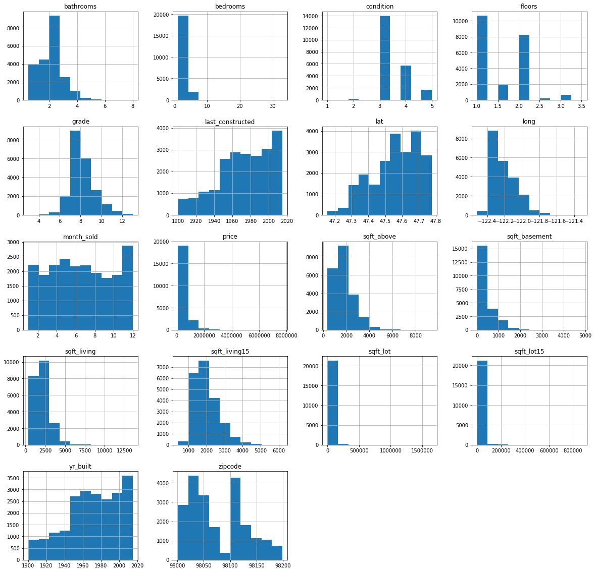


*Due to the above scatterplots, can infer the following are categorical: 
    ['month_sold', 'floors', 'condition', 'grade', 'zipcode']
 Will deal with them after getting hist plots.*

*Certain outlier(s) having HUGE affects on my skews for 'bedrooms', 'sqft_living', 'sqft_lot', 'sqft_lot15'. Would appear to be an exceptionally huge home(s). Time to investigate!*


```python
df.describe()
```


<div>
<style scoped>
    .dataframe tbody tr th:only-of-type {
        vertical-align: middle;
    }

    .dataframe tbody tr th {
        vertical-align: top;
    }

    .dataframe thead th {
        text-align: right;
    }
</style>
<table border="1" class="dataframe">
  <thead>
    <tr style="text-align: right;">
      <th></th>
      <th>month_sold</th>
      <th>price</th>
      <th>bedrooms</th>
      <th>bathrooms</th>
      <th>sqft_living</th>
      <th>sqft_lot</th>
      <th>floors</th>
      <th>condition</th>
      <th>grade</th>
      <th>sqft_above</th>
      <th>sqft_basement</th>
      <th>yr_built</th>
      <th>last_constructed</th>
      <th>zipcode</th>
      <th>lat</th>
      <th>long</th>
      <th>sqft_living15</th>
      <th>sqft_lot15</th>
    </tr>
  </thead>
  <tbody>
    <tr>
      <td>count</td>
      <td>21597.000000</td>
      <td>2.159700e+04</td>
      <td>21597.000000</td>
      <td>21597.000000</td>
      <td>21597.000000</td>
      <td>2.159700e+04</td>
      <td>21597.000000</td>
      <td>21597.000000</td>
      <td>21597.000000</td>
      <td>21597.000000</td>
      <td>21597.000000</td>
      <td>21597.000000</td>
      <td>21597.000000</td>
      <td>21597.000000</td>
      <td>21597.000000</td>
      <td>21597.000000</td>
      <td>21597.000000</td>
      <td>21597.000000</td>
    </tr>
    <tr>
      <td>mean</td>
      <td>6.573969</td>
      <td>5.402966e+05</td>
      <td>3.373200</td>
      <td>2.115826</td>
      <td>2080.321850</td>
      <td>1.509941e+04</td>
      <td>1.494096</td>
      <td>3.409825</td>
      <td>7.657915</td>
      <td>1788.596842</td>
      <td>291.725008</td>
      <td>1970.999676</td>
      <td>1972.945131</td>
      <td>98077.951845</td>
      <td>47.560093</td>
      <td>-122.213982</td>
      <td>1986.620318</td>
      <td>12758.283512</td>
    </tr>
    <tr>
      <td>std</td>
      <td>3.115061</td>
      <td>3.673681e+05</td>
      <td>0.926299</td>
      <td>0.768984</td>
      <td>918.106125</td>
      <td>4.141264e+04</td>
      <td>0.539683</td>
      <td>0.650546</td>
      <td>1.173200</td>
      <td>827.759761</td>
      <td>442.667800</td>
      <td>29.375234</td>
      <td>28.945393</td>
      <td>53.513072</td>
      <td>0.138552</td>
      <td>0.140724</td>
      <td>685.230472</td>
      <td>27274.441950</td>
    </tr>
    <tr>
      <td>min</td>
      <td>1.000000</td>
      <td>7.800000e+04</td>
      <td>1.000000</td>
      <td>0.500000</td>
      <td>370.000000</td>
      <td>5.200000e+02</td>
      <td>1.000000</td>
      <td>1.000000</td>
      <td>3.000000</td>
      <td>370.000000</td>
      <td>0.000000</td>
      <td>1900.000000</td>
      <td>1900.000000</td>
      <td>98001.000000</td>
      <td>47.155900</td>
      <td>-122.519000</td>
      <td>399.000000</td>
      <td>651.000000</td>
    </tr>
    <tr>
      <td>25%</td>
      <td>4.000000</td>
      <td>3.220000e+05</td>
      <td>3.000000</td>
      <td>1.750000</td>
      <td>1430.000000</td>
      <td>5.040000e+03</td>
      <td>1.000000</td>
      <td>3.000000</td>
      <td>7.000000</td>
      <td>1190.000000</td>
      <td>0.000000</td>
      <td>1951.000000</td>
      <td>1954.000000</td>
      <td>98033.000000</td>
      <td>47.471100</td>
      <td>-122.328000</td>
      <td>1490.000000</td>
      <td>5100.000000</td>
    </tr>
    <tr>
      <td>50%</td>
      <td>6.000000</td>
      <td>4.500000e+05</td>
      <td>3.000000</td>
      <td>2.250000</td>
      <td>1910.000000</td>
      <td>7.618000e+03</td>
      <td>1.500000</td>
      <td>3.000000</td>
      <td>7.000000</td>
      <td>1560.000000</td>
      <td>0.000000</td>
      <td>1975.000000</td>
      <td>1977.000000</td>
      <td>98065.000000</td>
      <td>47.571800</td>
      <td>-122.231000</td>
      <td>1840.000000</td>
      <td>7620.000000</td>
    </tr>
    <tr>
      <td>75%</td>
      <td>9.000000</td>
      <td>6.450000e+05</td>
      <td>4.000000</td>
      <td>2.500000</td>
      <td>2550.000000</td>
      <td>1.068500e+04</td>
      <td>2.000000</td>
      <td>4.000000</td>
      <td>8.000000</td>
      <td>2210.000000</td>
      <td>560.000000</td>
      <td>1997.000000</td>
      <td>1999.000000</td>
      <td>98118.000000</td>
      <td>47.678000</td>
      <td>-122.125000</td>
      <td>2360.000000</td>
      <td>10083.000000</td>
    </tr>
    <tr>
      <td>max</td>
      <td>12.000000</td>
      <td>7.700000e+06</td>
      <td>33.000000</td>
      <td>8.000000</td>
      <td>13540.000000</td>
      <td>1.651359e+06</td>
      <td>3.500000</td>
      <td>5.000000</td>
      <td>13.000000</td>
      <td>9410.000000</td>
      <td>4820.000000</td>
      <td>2015.000000</td>
      <td>2015.000000</td>
      <td>98199.000000</td>
      <td>47.777600</td>
      <td>-121.315000</td>
      <td>6210.000000</td>
      <td>871200.000000</td>
    </tr>
  </tbody>
</table>
</div>


```python
df[df['bedrooms']>=10]
```


<div>
<style scoped>
    .dataframe tbody tr th:only-of-type {
        vertical-align: middle;
    }

    .dataframe tbody tr th {
        vertical-align: top;
    }

    .dataframe thead th {
        text-align: right;
    }
</style>
<table border="1" class="dataframe">
  <thead>
    <tr style="text-align: right;">
      <th></th>
      <th>month_sold</th>
      <th>price</th>
      <th>bedrooms</th>
      <th>bathrooms</th>
      <th>sqft_living</th>
      <th>sqft_lot</th>
      <th>floors</th>
      <th>condition</th>
      <th>grade</th>
      <th>sqft_above</th>
      <th>sqft_basement</th>
      <th>yr_built</th>
      <th>last_constructed</th>
      <th>zipcode</th>
      <th>lat</th>
      <th>long</th>
      <th>sqft_living15</th>
      <th>sqft_lot15</th>
    </tr>
  </thead>
  <tbody>
    <tr>
      <td>8748</td>
      <td>8</td>
      <td>520000.0</td>
      <td>11</td>
      <td>3.00</td>
      <td>3000</td>
      <td>4960</td>
      <td>2.0</td>
      <td>3</td>
      <td>7</td>
      <td>2400</td>
      <td>600</td>
      <td>1918</td>
      <td>1999</td>
      <td>98106</td>
      <td>47.5560</td>
      <td>-122.363</td>
      <td>1420</td>
      <td>4960</td>
    </tr>
    <tr>
      <td>13301</td>
      <td>8</td>
      <td>1150000.0</td>
      <td>10</td>
      <td>5.25</td>
      <td>4590</td>
      <td>10920</td>
      <td>1.0</td>
      <td>3</td>
      <td>9</td>
      <td>2500</td>
      <td>2090</td>
      <td>2008</td>
      <td>2008</td>
      <td>98004</td>
      <td>47.5861</td>
      <td>-122.113</td>
      <td>2730</td>
      <td>10400</td>
    </tr>
    <tr>
      <td>15147</td>
      <td>10</td>
      <td>650000.0</td>
      <td>10</td>
      <td>2.00</td>
      <td>3610</td>
      <td>11914</td>
      <td>2.0</td>
      <td>4</td>
      <td>7</td>
      <td>3010</td>
      <td>600</td>
      <td>1958</td>
      <td>1958</td>
      <td>98006</td>
      <td>47.5705</td>
      <td>-122.175</td>
      <td>2040</td>
      <td>11914</td>
    </tr>
    <tr>
      <td>15856</td>
      <td>6</td>
      <td>640000.0</td>
      <td>33</td>
      <td>1.75</td>
      <td>1620</td>
      <td>6000</td>
      <td>1.0</td>
      <td>5</td>
      <td>7</td>
      <td>1040</td>
      <td>580</td>
      <td>1947</td>
      <td>1947</td>
      <td>98103</td>
      <td>47.6878</td>
      <td>-122.331</td>
      <td>1330</td>
      <td>4700</td>
    </tr>
    <tr>
      <td>19239</td>
      <td>12</td>
      <td>660000.0</td>
      <td>10</td>
      <td>3.00</td>
      <td>2920</td>
      <td>3745</td>
      <td>2.0</td>
      <td>4</td>
      <td>7</td>
      <td>1860</td>
      <td>1060</td>
      <td>1913</td>
      <td>1913</td>
      <td>98105</td>
      <td>47.6635</td>
      <td>-122.320</td>
      <td>1810</td>
      <td>3745</td>
    </tr>
  </tbody>
</table>
</div>


*We have just 5 homes with 10+ bedrooms. Will drop them not only due to skewness, but also I do not want to renovate that many homes*


```python
df.drop(df[df['bedrooms']>=10].index, inplace=True)
df[df['bedrooms']>=10]
```


<div>
<style scoped>
    .dataframe tbody tr th:only-of-type {
        vertical-align: middle;
    }

    .dataframe tbody tr th {
        vertical-align: top;
    }

    .dataframe thead th {
        text-align: right;
    }
</style>
<table border="1" class="dataframe">
  <thead>
    <tr style="text-align: right;">
      <th></th>
      <th>month_sold</th>
      <th>price</th>
      <th>bedrooms</th>
      <th>bathrooms</th>
      <th>sqft_living</th>
      <th>sqft_lot</th>
      <th>floors</th>
      <th>condition</th>
      <th>grade</th>
      <th>sqft_above</th>
      <th>sqft_basement</th>
      <th>yr_built</th>
      <th>last_constructed</th>
      <th>zipcode</th>
      <th>lat</th>
      <th>long</th>
      <th>sqft_living15</th>
      <th>sqft_lot15</th>
    </tr>
  </thead>
  <tbody>
  </tbody>
</table>
</div>


```python
df[df['sqft_lot']>21780]
```


<div>
<style scoped>
    .dataframe tbody tr th:only-of-type {
        vertical-align: middle;
    }

    .dataframe tbody tr th {
        vertical-align: top;
    }

    .dataframe thead th {
        text-align: right;
    }
</style>
<table border="1" class="dataframe">
  <thead>
    <tr style="text-align: right;">
      <th></th>
      <th>month_sold</th>
      <th>price</th>
      <th>bedrooms</th>
      <th>bathrooms</th>
      <th>sqft_living</th>
      <th>sqft_lot</th>
      <th>floors</th>
      <th>condition</th>
      <th>grade</th>
      <th>sqft_above</th>
      <th>sqft_basement</th>
      <th>yr_built</th>
      <th>last_constructed</th>
      <th>zipcode</th>
      <th>lat</th>
      <th>long</th>
      <th>sqft_living15</th>
      <th>sqft_lot15</th>
    </tr>
  </thead>
  <tbody>
    <tr>
      <td>5</td>
      <td>5</td>
      <td>1230000.0</td>
      <td>4</td>
      <td>4.50</td>
      <td>5420</td>
      <td>101930</td>
      <td>1.0</td>
      <td>3</td>
      <td>11</td>
      <td>3890</td>
      <td>1530</td>
      <td>2001</td>
      <td>2001</td>
      <td>98053</td>
      <td>47.6561</td>
      <td>-122.005</td>
      <td>4760</td>
      <td>101930</td>
    </tr>
    <tr>
      <td>21</td>
      <td>8</td>
      <td>2000000.0</td>
      <td>3</td>
      <td>2.75</td>
      <td>3050</td>
      <td>44867</td>
      <td>1.0</td>
      <td>3</td>
      <td>9</td>
      <td>2330</td>
      <td>720</td>
      <td>1968</td>
      <td>1968</td>
      <td>98040</td>
      <td>47.5316</td>
      <td>-122.233</td>
      <td>4110</td>
      <td>20336</td>
    </tr>
    <tr>
      <td>36</td>
      <td>5</td>
      <td>550000.0</td>
      <td>4</td>
      <td>1.00</td>
      <td>1660</td>
      <td>34848</td>
      <td>1.0</td>
      <td>1</td>
      <td>5</td>
      <td>930</td>
      <td>730</td>
      <td>1933</td>
      <td>1933</td>
      <td>98052</td>
      <td>47.6621</td>
      <td>-122.132</td>
      <td>2160</td>
      <td>11467</td>
    </tr>
    <tr>
      <td>41</td>
      <td>8</td>
      <td>775000.0</td>
      <td>4</td>
      <td>2.25</td>
      <td>4220</td>
      <td>24186</td>
      <td>1.0</td>
      <td>3</td>
      <td>8</td>
      <td>2600</td>
      <td>1620</td>
      <td>1984</td>
      <td>1984</td>
      <td>98166</td>
      <td>47.4450</td>
      <td>-122.347</td>
      <td>2410</td>
      <td>30617</td>
    </tr>
    <tr>
      <td>49</td>
      <td>3</td>
      <td>1350000.0</td>
      <td>3</td>
      <td>2.50</td>
      <td>2753</td>
      <td>65005</td>
      <td>1.0</td>
      <td>5</td>
      <td>9</td>
      <td>2165</td>
      <td>588</td>
      <td>1953</td>
      <td>1953</td>
      <td>98070</td>
      <td>47.4041</td>
      <td>-122.451</td>
      <td>2680</td>
      <td>72513</td>
    </tr>
    <tr>
      <td>...</td>
      <td>...</td>
      <td>...</td>
      <td>...</td>
      <td>...</td>
      <td>...</td>
      <td>...</td>
      <td>...</td>
      <td>...</td>
      <td>...</td>
      <td>...</td>
      <td>...</td>
      <td>...</td>
      <td>...</td>
      <td>...</td>
      <td>...</td>
      <td>...</td>
      <td>...</td>
      <td>...</td>
    </tr>
    <tr>
      <td>21478</td>
      <td>7</td>
      <td>915000.0</td>
      <td>3</td>
      <td>4.50</td>
      <td>3850</td>
      <td>62726</td>
      <td>2.0</td>
      <td>3</td>
      <td>10</td>
      <td>3120</td>
      <td>730</td>
      <td>2013</td>
      <td>2013</td>
      <td>98053</td>
      <td>47.6735</td>
      <td>-122.058</td>
      <td>2630</td>
      <td>46609</td>
    </tr>
    <tr>
      <td>21490</td>
      <td>5</td>
      <td>2240000.0</td>
      <td>5</td>
      <td>6.50</td>
      <td>7270</td>
      <td>130017</td>
      <td>2.0</td>
      <td>3</td>
      <td>12</td>
      <td>6420</td>
      <td>850</td>
      <td>2010</td>
      <td>2010</td>
      <td>98027</td>
      <td>47.5371</td>
      <td>-121.982</td>
      <td>1800</td>
      <td>44890</td>
    </tr>
    <tr>
      <td>21504</td>
      <td>8</td>
      <td>1410000.0</td>
      <td>4</td>
      <td>4.00</td>
      <td>4920</td>
      <td>50621</td>
      <td>2.0</td>
      <td>3</td>
      <td>10</td>
      <td>4280</td>
      <td>640</td>
      <td>2012</td>
      <td>2012</td>
      <td>98053</td>
      <td>47.6575</td>
      <td>-122.006</td>
      <td>4920</td>
      <td>74052</td>
    </tr>
    <tr>
      <td>21509</td>
      <td>11</td>
      <td>1450000.0</td>
      <td>4</td>
      <td>3.50</td>
      <td>4300</td>
      <td>108865</td>
      <td>2.0</td>
      <td>3</td>
      <td>11</td>
      <td>4300</td>
      <td>0</td>
      <td>2014</td>
      <td>2014</td>
      <td>98074</td>
      <td>47.6258</td>
      <td>-122.005</td>
      <td>4650</td>
      <td>107498</td>
    </tr>
    <tr>
      <td>21532</td>
      <td>8</td>
      <td>1060000.0</td>
      <td>2</td>
      <td>1.50</td>
      <td>2370</td>
      <td>184231</td>
      <td>2.0</td>
      <td>3</td>
      <td>11</td>
      <td>2370</td>
      <td>0</td>
      <td>2005</td>
      <td>2005</td>
      <td>98045</td>
      <td>47.4543</td>
      <td>-121.778</td>
      <td>3860</td>
      <td>151081</td>
    </tr>
  </tbody>
</table>
<p>2119 rows × 18 columns</p>
</div>


*These are homes with lots bigger than half acre(21780 sqft). Since I would have to pay for landscaping, and I am not too familiar with doing so, will drop these huge lot-homes. Also, this homes are skewing my data, which can affect my model*


```python
df.drop(df[df['sqft_lot']>=21780].index, inplace=True)
df[df['sqft_lot']>=21780]
```


<div>
<style scoped>
    .dataframe tbody tr th:only-of-type {
        vertical-align: middle;
    }

    .dataframe tbody tr th {
        vertical-align: top;
    }

    .dataframe thead th {
        text-align: right;
    }
</style>
<table border="1" class="dataframe">
  <thead>
    <tr style="text-align: right;">
      <th></th>
      <th>month_sold</th>
      <th>price</th>
      <th>bedrooms</th>
      <th>bathrooms</th>
      <th>sqft_living</th>
      <th>sqft_lot</th>
      <th>floors</th>
      <th>condition</th>
      <th>grade</th>
      <th>sqft_above</th>
      <th>sqft_basement</th>
      <th>yr_built</th>
      <th>last_constructed</th>
      <th>zipcode</th>
      <th>lat</th>
      <th>long</th>
      <th>sqft_living15</th>
      <th>sqft_lot15</th>
    </tr>
  </thead>
  <tbody>
  </tbody>
</table>
</div>


```python
df.hist(figsize=(20,20));
```


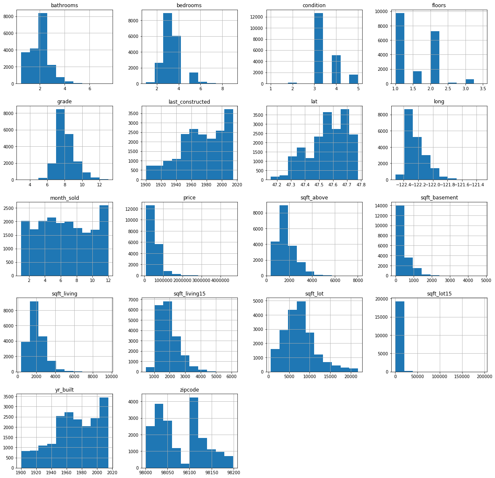


```python
df.corrwith(df['sqft_lot'])
```


    month_sold         -0.005005
    price               0.156105
    bedrooms            0.214265
    bathrooms           0.057374
    sqft_living         0.284117
    sqft_lot            1.000000
    floors             -0.290519
    condition           0.109256
    grade               0.154121
    sqft_above          0.238968
    sqft_basement       0.137550
    yr_built           -0.021215
    last_constructed   -0.029397
    zipcode            -0.259312
    lat                -0.120555
    long                0.240146
    sqft_living15       0.322696
    sqft_lot15          0.713697
    dtype: float64


*Figured sqft_lot15 would be strongly correlated with sqft_lot, which it does have a .72 corr value. Will drop those homes as well since in real estate, you do not want your home to be vastly different from others. If someone is looking in a neighborhood with giant lots, they may be disappointed with the smaller lot I am working with.*


```python
df.drop(df[df['sqft_lot15']>=21780].index, inplace=True)
```

*will do the same with homes over 1000 sqft larger than the avg American home size of 2700sqft.*


```python
df.drop(df[df['sqft_living']>3700].index, inplace=True)
df.drop(df[df['sqft_living15']>3700].index, inplace=True)
```


```python
df.hist(figsize=(20,20));
```


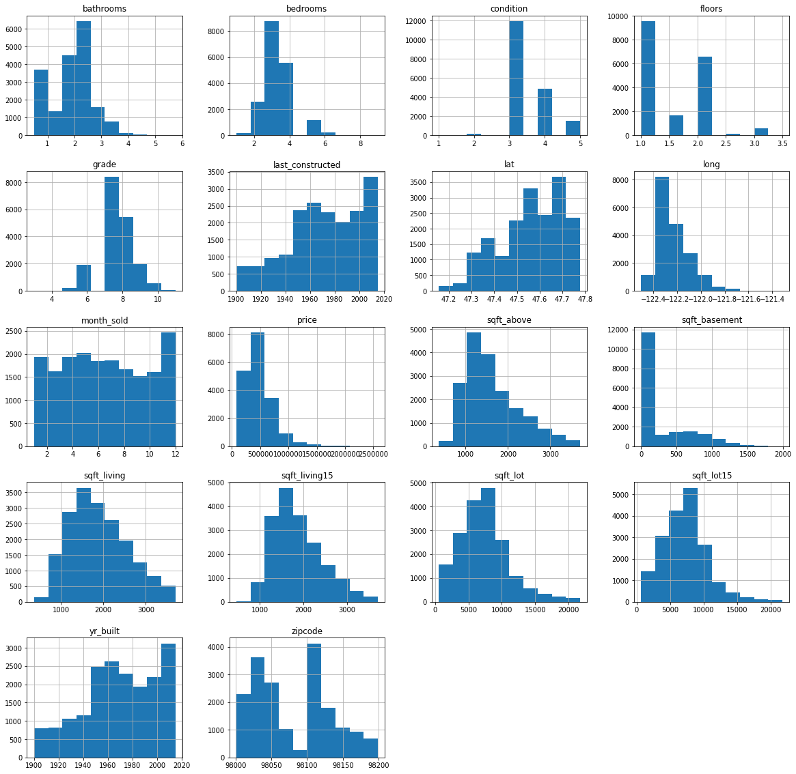


```python
price_corr = df.corrwith(df['price'])
price_corr.abs().sort_values(ascending=False)
```


    price               1.000000
    grade               0.600265
    sqft_living         0.584175
    sqft_living15       0.518544
    sqft_above          0.462514
    bathrooms           0.405424
    lat                 0.404888
    bedrooms            0.266657
    sqft_basement       0.258925
    floors              0.235849
    condition           0.071562
    sqft_lot            0.030844
    sqft_lot15          0.029064
    yr_built            0.025972
    long                0.025226
    last_constructed    0.024910
    month_sold          0.020093
    zipcode             0.010494
    dtype: float64


*price is most correlated to ['grade', 'sqft_living','sqft_living15', 'sqft_above', 'bathrooms']*


```python
features = df.drop(columns='price')
corr = features.corr().abs()
plt.figure(figsize=(12,14))
sns.heatmap(data=corr[corr>.7], annot=True, cmap=sns.color_palette('Blues'));
```


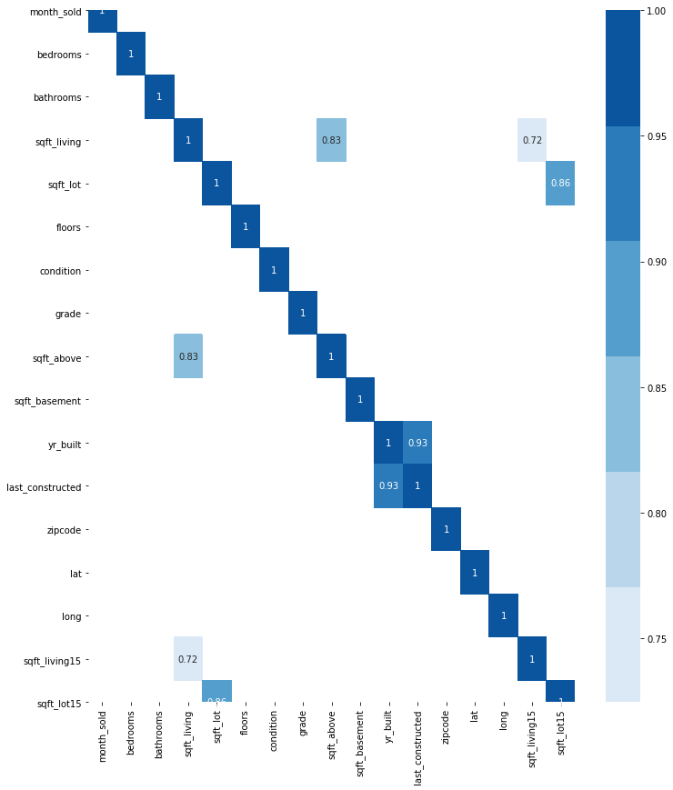


*sqft_living has most colinearity. But is also a top item correlated to price. To fix this, I will drop sqft_above, and sq_ft below. Total living space is more of a measure people pay attention to then splitting. Sqft_lot is strongly correlated to sqft_lot15, so I will drop sqft_lot15 since sqft_lot is something most people can easily understand. Plus with the high correlation, this means lot sizes are similar to those of their neighbors already.*


```python
features.drop(columns=['sqft_above','sqft_basement', 'sqft_lot15'], inplace=True)
df.drop(columns=['sqft_above','sqft_basement', 'sqft_lot15'], inplace=True)
```


```python
for col in df.columns:
    df.plot(kind='scatter',x=col,y='price', figsize=(5,5));
    plt.show()
```


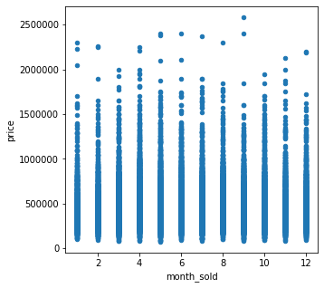


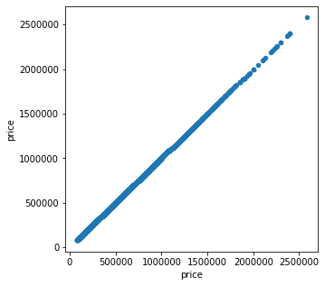


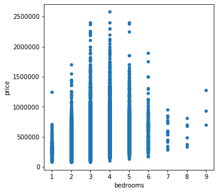


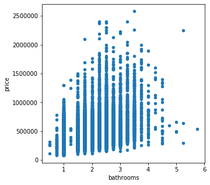


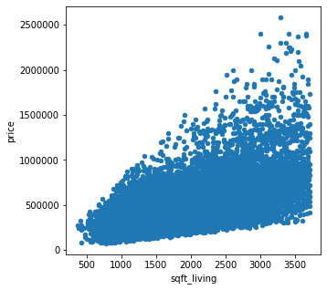


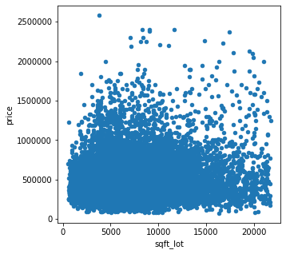


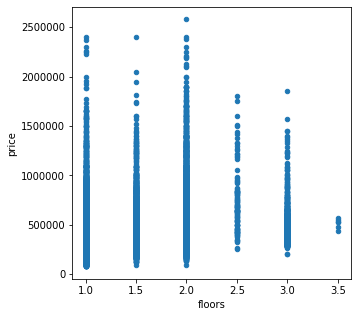


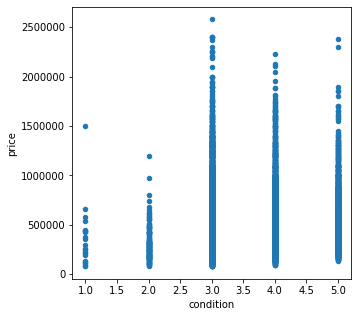


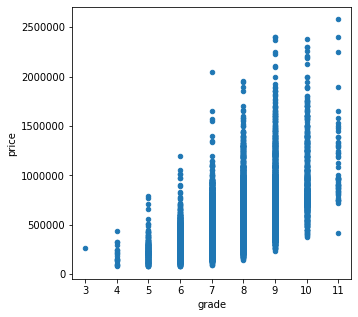


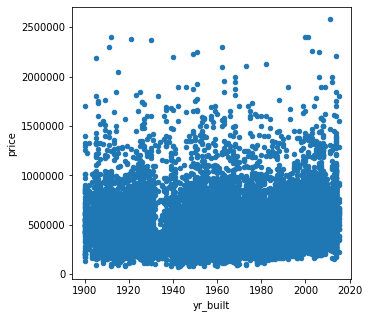


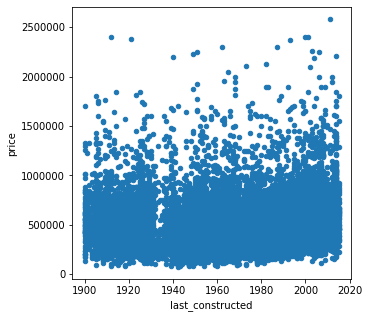


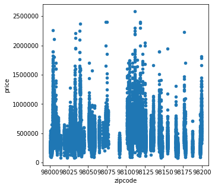


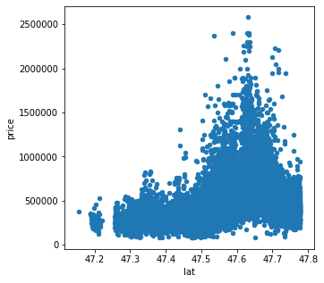


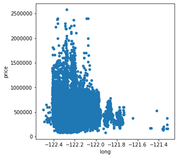


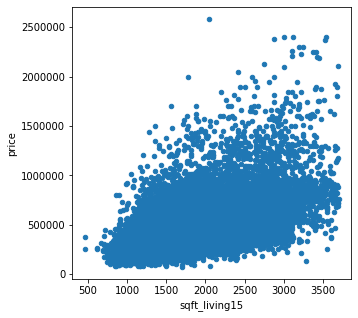


*Due to the above scatterplots,and the definitions of the categories, I can deduce ['month_sold', 'condition', 'grade', and 'zipcode'] are all categorical


```python
df.month_sold = df.month_sold.astype('category')
df.condition = df.condition.astype('category')
df.grade = df.grade.astype('category')
df.zipcode = df.zipcode.astype('category')
```


```python
features = df.drop(columns='price') #rewriting this as I changed df categoricals
features.head()
```


<div>
<style scoped>
    .dataframe tbody tr th:only-of-type {
        vertical-align: middle;
    }

    .dataframe tbody tr th {
        vertical-align: top;
    }

    .dataframe thead th {
        text-align: right;
    }
</style>
<table border="1" class="dataframe">
  <thead>
    <tr style="text-align: right;">
      <th></th>
      <th>month_sold</th>
      <th>bedrooms</th>
      <th>bathrooms</th>
      <th>sqft_living</th>
      <th>sqft_lot</th>
      <th>floors</th>
      <th>condition</th>
      <th>grade</th>
      <th>yr_built</th>
      <th>last_constructed</th>
      <th>zipcode</th>
      <th>lat</th>
      <th>long</th>
      <th>sqft_living15</th>
    </tr>
  </thead>
  <tbody>
    <tr>
      <td>0</td>
      <td>10</td>
      <td>3</td>
      <td>1.00</td>
      <td>1180</td>
      <td>5650</td>
      <td>1.0</td>
      <td>3</td>
      <td>7</td>
      <td>1955</td>
      <td>1955</td>
      <td>98178</td>
      <td>47.5112</td>
      <td>-122.257</td>
      <td>1340</td>
    </tr>
    <tr>
      <td>1</td>
      <td>12</td>
      <td>3</td>
      <td>2.25</td>
      <td>2570</td>
      <td>7242</td>
      <td>2.0</td>
      <td>3</td>
      <td>7</td>
      <td>1951</td>
      <td>1991</td>
      <td>98125</td>
      <td>47.7210</td>
      <td>-122.319</td>
      <td>1690</td>
    </tr>
    <tr>
      <td>2</td>
      <td>2</td>
      <td>2</td>
      <td>1.00</td>
      <td>770</td>
      <td>10000</td>
      <td>1.0</td>
      <td>3</td>
      <td>6</td>
      <td>1933</td>
      <td>1933</td>
      <td>98028</td>
      <td>47.7379</td>
      <td>-122.233</td>
      <td>2720</td>
    </tr>
    <tr>
      <td>3</td>
      <td>12</td>
      <td>4</td>
      <td>3.00</td>
      <td>1960</td>
      <td>5000</td>
      <td>1.0</td>
      <td>5</td>
      <td>7</td>
      <td>1965</td>
      <td>1965</td>
      <td>98136</td>
      <td>47.5208</td>
      <td>-122.393</td>
      <td>1360</td>
    </tr>
    <tr>
      <td>4</td>
      <td>2</td>
      <td>3</td>
      <td>2.00</td>
      <td>1680</td>
      <td>8080</td>
      <td>1.0</td>
      <td>3</td>
      <td>8</td>
      <td>1987</td>
      <td>1987</td>
      <td>98074</td>
      <td>47.6168</td>
      <td>-122.045</td>
      <td>1800</td>
    </tr>
  </tbody>
</table>
</div>


```python
features_cont = features.drop(columns=['month_sold', 'condition', 'grade', 'zipcode'])
from sklearn.preprocessing import PowerTransformer
scaler = PowerTransformer()
scaled_features_cont = scaler.fit_transform(features_cont)
```


```python
for i in range(0,10):
    features_cont.iloc[:,i] = scaled_features_cont[:,i]
```

*Above I am scaling my continuous functions*


```python
features_final = pd.concat([features_cont, features[['month_sold', 'condition', 'grade', 'zipcode']]], axis=1)
```


```python
df = pd.concat([df['price'],features_final], axis=1)
df #combining the scaled features to the dataframe again
```


<div>
<style scoped>
    .dataframe tbody tr th:only-of-type {
        vertical-align: middle;
    }

    .dataframe tbody tr th {
        vertical-align: top;
    }

    .dataframe thead th {
        text-align: right;
    }
</style>
<table border="1" class="dataframe">
  <thead>
    <tr style="text-align: right;">
      <th></th>
      <th>price</th>
      <th>bedrooms</th>
      <th>bathrooms</th>
      <th>sqft_living</th>
      <th>sqft_lot</th>
      <th>floors</th>
      <th>yr_built</th>
      <th>last_constructed</th>
      <th>lat</th>
      <th>long</th>
      <th>sqft_living15</th>
      <th>month_sold</th>
      <th>condition</th>
      <th>grade</th>
      <th>zipcode</th>
    </tr>
  </thead>
  <tbody>
    <tr>
      <td>0</td>
      <td>221900.0</td>
      <td>-0.306624</td>
      <td>-1.521937</td>
      <td>-1.083631</td>
      <td>-0.347152</td>
      <td>-0.936612</td>
      <td>-0.568725</td>
      <td>-0.648977</td>
      <td>-0.488900</td>
      <td>-0.173044</td>
      <td>-0.965542</td>
      <td>10</td>
      <td>3</td>
      <td>7</td>
      <td>98178</td>
    </tr>
    <tr>
      <td>1</td>
      <td>538000.0</td>
      <td>-0.306624</td>
      <td>0.358924</td>
      <td>0.998462</td>
      <td>0.099053</td>
      <td>1.084250</td>
      <td>-0.690932</td>
      <td>0.620844</td>
      <td>1.266075</td>
      <td>-0.678038</td>
      <td>-0.166491</td>
      <td>12</td>
      <td>3</td>
      <td>7</td>
      <td>98125</td>
    </tr>
    <tr>
      <td>2</td>
      <td>180000.0</td>
      <td>-1.587150</td>
      <td>-1.521937</td>
      <td>-2.003357</td>
      <td>0.772312</td>
      <td>-0.936612</td>
      <td>-1.202291</td>
      <td>-1.265595</td>
      <td>1.439584</td>
      <td>0.017505</td>
      <td>1.426859</td>
      <td>2</td>
      <td>3</td>
      <td>6</td>
      <td>98028</td>
    </tr>
    <tr>
      <td>3</td>
      <td>604000.0</td>
      <td>0.819073</td>
      <td>1.393618</td>
      <td>0.207554</td>
      <td>-0.546535</td>
      <td>-0.936612</td>
      <td>-0.248652</td>
      <td>-0.331289</td>
      <td>-0.422699</td>
      <td>-1.305587</td>
      <td>-0.914089</td>
      <td>12</td>
      <td>5</td>
      <td>7</td>
      <td>98136</td>
    </tr>
    <tr>
      <td>4</td>
      <td>510000.0</td>
      <td>-0.306624</td>
      <td>0.000587</td>
      <td>-0.209576</td>
      <td>0.314948</td>
      <td>-0.936612</td>
      <td>0.534302</td>
      <td>0.461552</td>
      <td>0.308865</td>
      <td>1.419817</td>
      <td>0.048109</td>
      <td>2</td>
      <td>3</td>
      <td>8</td>
      <td>98074</td>
    </tr>
    <tr>
      <td>...</td>
      <td>...</td>
      <td>...</td>
      <td>...</td>
      <td>...</td>
      <td>...</td>
      <td>...</td>
      <td>...</td>
      <td>...</td>
      <td>...</td>
      <td>...</td>
      <td>...</td>
      <td>...</td>
      <td>...</td>
      <td>...</td>
      <td>...</td>
    </tr>
    <tr>
      <td>21592</td>
      <td>360000.0</td>
      <td>-0.306624</td>
      <td>0.710132</td>
      <td>-0.451748</td>
      <td>-2.181592</td>
      <td>1.807138</td>
      <td>1.438136</td>
      <td>1.401752</td>
      <td>1.051139</td>
      <td>-0.903825</td>
      <td>-0.507167</td>
      <td>5</td>
      <td>3</td>
      <td>8</td>
      <td>98103</td>
    </tr>
    <tr>
      <td>21593</td>
      <td>400000.0</td>
      <td>0.819073</td>
      <td>0.710132</td>
      <td>0.678027</td>
      <td>-0.298906</td>
      <td>1.084250</td>
      <td>1.662132</td>
      <td>1.638529</td>
      <td>-0.492315</td>
      <td>-1.039340</td>
      <td>0.104184</td>
      <td>2</td>
      <td>3</td>
      <td>8</td>
      <td>98146</td>
    </tr>
    <tr>
      <td>21594</td>
      <td>402101.0</td>
      <td>-1.587150</td>
      <td>-1.931427</td>
      <td>-1.413378</td>
      <td>-2.046473</td>
      <td>1.084250</td>
      <td>1.438136</td>
      <td>1.401752</td>
      <td>0.126263</td>
      <td>-0.513103</td>
      <td>-1.924078</td>
      <td>6</td>
      <td>3</td>
      <td>7</td>
      <td>98144</td>
    </tr>
    <tr>
      <td>21595</td>
      <td>400000.0</td>
      <td>-0.306624</td>
      <td>0.710132</td>
      <td>-0.336915</td>
      <td>-1.515791</td>
      <td>1.084250</td>
      <td>1.221254</td>
      <td>1.173877</td>
      <td>-0.326146</td>
      <td>1.249396</td>
      <td>-0.788948</td>
      <td>1</td>
      <td>3</td>
      <td>8</td>
      <td>98027</td>
    </tr>
    <tr>
      <td>21596</td>
      <td>325000.0</td>
      <td>-1.587150</td>
      <td>-1.931427</td>
      <td>-1.413378</td>
      <td>-2.217452</td>
      <td>1.084250</td>
      <td>1.394197</td>
      <td>1.355475</td>
      <td>0.123869</td>
      <td>-0.513103</td>
      <td>-1.924078</td>
      <td>10</td>
      <td>3</td>
      <td>7</td>
      <td>98144</td>
    </tr>
  </tbody>
</table>
<p>18470 rows × 15 columns</p>
</div>


**time for a little RFE**


```python
from sklearn.feature_selection import RFE
from sklearn.linear_model import LinearRegression
target = df.price
linreg = LinearRegression()
# linreg.fit(features_final, target.values.ravel())
```


```python
selector = RFE(linreg, n_features_to_select=4)
selector = selector.fit(features_final, target.values.ravel())
```


```python
selector.ranking_
```


    array([ 7,  6,  1,  5,  8,  1,  2,  1,  9,  3, 10,  4,  1, 11])


```python
features_final.columns
```


    Index(['bedrooms', 'bathrooms', 'sqft_living', 'sqft_lot', 'floors',
           'yr_built', 'last_constructed', 'lat', 'long', 'sqft_living15',
           'month_sold', 'condition', 'grade', 'zipcode'],
          dtype='object')


Most important are:
1. sqft_living
2. lat
3. grade
4. yr_built
5. sqft_living15
6. last_constructed
7. condition
8. bathrooms
9. bedrooms
10. floors
11. sqft_lot
12. long
13. month_sold
14. zipcode
*time to see how many of these variables to use*


```python
R_squareds = []
for i in range(1,len(features_final.columns)+1):
    selector = RFE(linreg, n_features_to_select=i)
    selector.fit(features_final, target)
    linreg.fit(features_final[features_final.columns[selector.support_]], target)
    r_squared = linreg.score(features_final[features_final.columns[selector.support_]], target)
    R_squareds.append(r_squared)
R_squareds
```


    [0.36031784436909453,
     0.46429134781299697,
     0.5134447329218452,
     0.5871081464454591,
     0.5891655943546346,
     0.5947839494627015,
     0.598676325969868,
     0.6077746213983866,
     0.6095309530660886,
     0.6125712643793081,
     0.6136758892083831,
     0.6138653229431357,
     0.6154033262149597,
     0.6163527142220492]


*This says the improvement moves up quickest from 3 to 4 features. But my categoricals still should be hot-coded let's see what we can find.*


```python
import statsmodels.formula.api as smf
#Below I included 4 continuous features plus the categoricals
f = 'price~month_sold+condition+grade+zipcode+sqft_living+lat+yr_built+sqft_living15'
model = smf.ols(formula=f, data=df).fit()
model.summary()
```


<table class="simpletable">
<caption>OLS Regression Results</caption>
<tr>
  <th>Dep. Variable:</th>          <td>price</td>      <th>  R-squared:         </th>  <td>   0.784</td>  
</tr>
<tr>
  <th>Model:</th>                   <td>OLS</td>       <th>  Adj. R-squared:    </th>  <td>   0.783</td>  
</tr>
<tr>
  <th>Method:</th>             <td>Least Squares</td>  <th>  F-statistic:       </th>  <td>   694.5</td>  
</tr>
<tr>
  <th>Date:</th>             <td>Thu, 31 Oct 2019</td> <th>  Prob (F-statistic):</th>   <td>  0.00</td>   
</tr>
<tr>
  <th>Time:</th>                 <td>13:52:16</td>     <th>  Log-Likelihood:    </th> <td>-2.4162e+05</td>
</tr>
<tr>
  <th>No. Observations:</th>      <td> 18470</td>      <th>  AIC:               </th>  <td>4.834e+05</td> 
</tr>
<tr>
  <th>Df Residuals:</th>          <td> 18373</td>      <th>  BIC:               </th>  <td>4.842e+05</td> 
</tr>
<tr>
  <th>Df Model:</th>              <td>    96</td>      <th>                     </th>      <td> </td>     
</tr>
<tr>
  <th>Covariance Type:</th>      <td>nonrobust</td>    <th>                     </th>      <td> </td>     
</tr>
</table>
<table class="simpletable">
<tr>
          <td></td>            <th>coef</th>     <th>std err</th>      <th>t</th>      <th>P>|t|</th>  <th>[0.025</th>    <th>0.975]</th>  
</tr>
<tr>
  <th>Intercept</th>        <td> 2.576e+05</td> <td>  1.2e+05</td> <td>    2.139</td> <td> 0.032</td> <td> 2.15e+04</td> <td> 4.94e+05</td>
</tr>
<tr>
  <th>month_sold[T.2]</th>  <td> 1457.6220</td> <td> 5361.266</td> <td>    0.272</td> <td> 0.786</td> <td>-9050.959</td> <td>  1.2e+04</td>
</tr>
<tr>
  <th>month_sold[T.3]</th>  <td> 1.696e+04</td> <td> 4961.887</td> <td>    3.418</td> <td> 0.001</td> <td> 7234.306</td> <td> 2.67e+04</td>
</tr>
<tr>
  <th>month_sold[T.4]</th>  <td> 2.858e+04</td> <td> 4832.338</td> <td>    5.914</td> <td> 0.000</td> <td> 1.91e+04</td> <td> 3.81e+04</td>
</tr>
<tr>
  <th>month_sold[T.5]</th>  <td>-1581.2415</td> <td> 4800.251</td> <td>   -0.329</td> <td> 0.742</td> <td> -1.1e+04</td> <td> 7827.697</td>
</tr>
<tr>
  <th>month_sold[T.6]</th>  <td>-6606.2201</td> <td> 4868.094</td> <td>   -1.357</td> <td> 0.175</td> <td>-1.61e+04</td> <td> 2935.698</td>
</tr>
<tr>
  <th>month_sold[T.7]</th>  <td>-7639.2977</td> <td> 4858.260</td> <td>   -1.572</td> <td> 0.116</td> <td>-1.72e+04</td> <td> 1883.344</td>
</tr>
<tr>
  <th>month_sold[T.8]</th>  <td> -1.42e+04</td> <td> 4947.649</td> <td>   -2.870</td> <td> 0.004</td> <td>-2.39e+04</td> <td>-4500.239</td>
</tr>
<tr>
  <th>month_sold[T.9]</th>  <td>-1.478e+04</td> <td> 5025.220</td> <td>   -2.940</td> <td> 0.003</td> <td>-2.46e+04</td> <td>-4926.644</td>
</tr>
<tr>
  <th>month_sold[T.10]</th> <td>-1.379e+04</td> <td> 4974.966</td> <td>   -2.771</td> <td> 0.006</td> <td>-2.35e+04</td> <td>-4036.171</td>
</tr>
<tr>
  <th>month_sold[T.11]</th> <td>-1.175e+04</td> <td> 5240.268</td> <td>   -2.241</td> <td> 0.025</td> <td> -2.2e+04</td> <td>-1474.550</td>
</tr>
<tr>
  <th>month_sold[T.12]</th> <td>-1.091e+04</td> <td> 5207.082</td> <td>   -2.095</td> <td> 0.036</td> <td>-2.11e+04</td> <td> -704.097</td>
</tr>
<tr>
  <th>condition[T.2]</th>   <td> 4.519e+04</td> <td>  2.7e+04</td> <td>    1.675</td> <td> 0.094</td> <td>-7682.129</td> <td> 9.81e+04</td>
</tr>
<tr>
  <th>condition[T.3]</th>   <td> 7.238e+04</td> <td> 2.51e+04</td> <td>    2.879</td> <td> 0.004</td> <td> 2.31e+04</td> <td> 1.22e+05</td>
</tr>
<tr>
  <th>condition[T.4]</th>   <td> 9.118e+04</td> <td> 2.52e+04</td> <td>    3.624</td> <td> 0.000</td> <td> 4.19e+04</td> <td>  1.4e+05</td>
</tr>
<tr>
  <th>condition[T.5]</th>   <td> 1.282e+05</td> <td> 2.53e+04</td> <td>    5.072</td> <td> 0.000</td> <td> 7.87e+04</td> <td> 1.78e+05</td>
</tr>
<tr>
  <th>grade[T.4]</th>       <td>-1.173e+05</td> <td>  1.2e+05</td> <td>   -0.978</td> <td> 0.328</td> <td>-3.53e+05</td> <td> 1.18e+05</td>
</tr>
<tr>
  <th>grade[T.5]</th>       <td>-1.497e+05</td> <td> 1.17e+05</td> <td>   -1.276</td> <td> 0.202</td> <td>-3.79e+05</td> <td> 8.02e+04</td>
</tr>
<tr>
  <th>grade[T.6]</th>       <td>-1.568e+05</td> <td> 1.17e+05</td> <td>   -1.340</td> <td> 0.180</td> <td>-3.86e+05</td> <td> 7.26e+04</td>
</tr>
<tr>
  <th>grade[T.7]</th>       <td> -1.46e+05</td> <td> 1.17e+05</td> <td>   -1.248</td> <td> 0.212</td> <td>-3.75e+05</td> <td> 8.34e+04</td>
</tr>
<tr>
  <th>grade[T.8]</th>       <td>-9.451e+04</td> <td> 1.17e+05</td> <td>   -0.807</td> <td> 0.420</td> <td>-3.24e+05</td> <td> 1.35e+05</td>
</tr>
<tr>
  <th>grade[T.9]</th>       <td> 2.771e+04</td> <td> 1.17e+05</td> <td>    0.237</td> <td> 0.813</td> <td>-2.02e+05</td> <td> 2.57e+05</td>
</tr>
<tr>
  <th>grade[T.10]</th>      <td> 1.596e+05</td> <td> 1.17e+05</td> <td>    1.362</td> <td> 0.173</td> <td>-7.02e+04</td> <td> 3.89e+05</td>
</tr>
<tr>
  <th>grade[T.11]</th>      <td> 2.942e+05</td> <td> 1.18e+05</td> <td>    2.489</td> <td> 0.013</td> <td> 6.25e+04</td> <td> 5.26e+05</td>
</tr>
<tr>
  <th>zipcode[T.98002]</th> <td>  1.49e+04</td> <td> 1.07e+04</td> <td>    1.394</td> <td> 0.163</td> <td>-6052.031</td> <td> 3.59e+04</td>
</tr>
<tr>
  <th>zipcode[T.98003]</th> <td> 2307.5096</td> <td> 9821.591</td> <td>    0.235</td> <td> 0.814</td> <td>-1.69e+04</td> <td> 2.16e+04</td>
</tr>
<tr>
  <th>zipcode[T.98004]</th> <td> 6.847e+05</td> <td> 1.73e+04</td> <td>   39.464</td> <td> 0.000</td> <td> 6.51e+05</td> <td> 7.19e+05</td>
</tr>
<tr>
  <th>zipcode[T.98005]</th> <td> 3.847e+05</td> <td> 1.83e+04</td> <td>   21.080</td> <td> 0.000</td> <td> 3.49e+05</td> <td> 4.21e+05</td>
</tr>
<tr>
  <th>zipcode[T.98006]</th> <td> 3.169e+05</td> <td> 1.41e+04</td> <td>   22.535</td> <td> 0.000</td> <td> 2.89e+05</td> <td> 3.44e+05</td>
</tr>
<tr>
  <th>zipcode[T.98007]</th> <td> 3.032e+05</td> <td> 1.83e+04</td> <td>   16.594</td> <td> 0.000</td> <td> 2.67e+05</td> <td> 3.39e+05</td>
</tr>
<tr>
  <th>zipcode[T.98008]</th> <td> 3.285e+05</td> <td>  1.7e+04</td> <td>   19.347</td> <td> 0.000</td> <td> 2.95e+05</td> <td> 3.62e+05</td>
</tr>
<tr>
  <th>zipcode[T.98010]</th> <td> 9.831e+04</td> <td> 1.74e+04</td> <td>    5.658</td> <td> 0.000</td> <td> 6.43e+04</td> <td> 1.32e+05</td>
</tr>
<tr>
  <th>zipcode[T.98011]</th> <td> 2.663e+05</td> <td> 2.59e+04</td> <td>   10.280</td> <td> 0.000</td> <td> 2.16e+05</td> <td> 3.17e+05</td>
</tr>
<tr>
  <th>zipcode[T.98014]</th> <td> 2.236e+05</td> <td> 2.56e+04</td> <td>    8.746</td> <td> 0.000</td> <td> 1.74e+05</td> <td> 2.74e+05</td>
</tr>
<tr>
  <th>zipcode[T.98019]</th> <td> 2.267e+05</td> <td>  2.5e+04</td> <td>    9.070</td> <td> 0.000</td> <td> 1.78e+05</td> <td> 2.76e+05</td>
</tr>
<tr>
  <th>zipcode[T.98022]</th> <td> -755.7906</td> <td> 1.22e+04</td> <td>   -0.062</td> <td> 0.950</td> <td>-2.46e+04</td> <td> 2.31e+04</td>
</tr>
<tr>
  <th>zipcode[T.98023]</th> <td>-2.448e+04</td> <td> 8581.541</td> <td>   -2.853</td> <td> 0.004</td> <td>-4.13e+04</td> <td>-7658.256</td>
</tr>
<tr>
  <th>zipcode[T.98024]</th> <td> 1.949e+05</td> <td>  2.7e+04</td> <td>    7.219</td> <td> 0.000</td> <td> 1.42e+05</td> <td> 2.48e+05</td>
</tr>
<tr>
  <th>zipcode[T.98027]</th> <td> 2.595e+05</td> <td> 1.39e+04</td> <td>   18.622</td> <td> 0.000</td> <td> 2.32e+05</td> <td> 2.87e+05</td>
</tr>
<tr>
  <th>zipcode[T.98028]</th> <td> 2.571e+05</td> <td> 2.54e+04</td> <td>   10.116</td> <td> 0.000</td> <td> 2.07e+05</td> <td> 3.07e+05</td>
</tr>
<tr>
  <th>zipcode[T.98029]</th> <td> 2.685e+05</td> <td> 1.44e+04</td> <td>   18.644</td> <td> 0.000</td> <td>  2.4e+05</td> <td> 2.97e+05</td>
</tr>
<tr>
  <th>zipcode[T.98030]</th> <td> 1.071e+04</td> <td> 1.02e+04</td> <td>    1.048</td> <td> 0.294</td> <td>-9310.199</td> <td> 3.07e+04</td>
</tr>
<tr>
  <th>zipcode[T.98031]</th> <td> 2.814e+04</td> <td> 1.05e+04</td> <td>    2.688</td> <td> 0.007</td> <td> 7622.079</td> <td> 4.87e+04</td>
</tr>
<tr>
  <th>zipcode[T.98032]</th> <td> 1.079e+04</td> <td> 1.28e+04</td> <td>    0.840</td> <td> 0.401</td> <td>-1.44e+04</td> <td>  3.6e+04</td>
</tr>
<tr>
  <th>zipcode[T.98033]</th> <td> 4.327e+05</td> <td> 2.02e+04</td> <td>   21.388</td> <td> 0.000</td> <td> 3.93e+05</td> <td> 4.72e+05</td>
</tr>
<tr>
  <th>zipcode[T.98034]</th> <td> 3.164e+05</td> <td> 2.25e+04</td> <td>   14.050</td> <td> 0.000</td> <td> 2.72e+05</td> <td> 3.61e+05</td>
</tr>
<tr>
  <th>zipcode[T.98038]</th> <td> 4.906e+04</td> <td> 8701.352</td> <td>    5.638</td> <td> 0.000</td> <td>  3.2e+04</td> <td> 6.61e+04</td>
</tr>
<tr>
  <th>zipcode[T.98039]</th> <td> 9.922e+05</td> <td> 2.92e+04</td> <td>   34.016</td> <td> 0.000</td> <td> 9.35e+05</td> <td> 1.05e+06</td>
</tr>
<tr>
  <th>zipcode[T.98040]</th> <td> 5.172e+05</td> <td> 1.53e+04</td> <td>   33.767</td> <td> 0.000</td> <td> 4.87e+05</td> <td> 5.47e+05</td>
</tr>
<tr>
  <th>zipcode[T.98042]</th> <td>  2.17e+04</td> <td> 8862.290</td> <td>    2.449</td> <td> 0.014</td> <td> 4328.645</td> <td> 3.91e+04</td>
</tr>
<tr>
  <th>zipcode[T.98045]</th> <td> 1.559e+05</td> <td> 1.34e+04</td> <td>   11.621</td> <td> 0.000</td> <td>  1.3e+05</td> <td> 1.82e+05</td>
</tr>
<tr>
  <th>zipcode[T.98052]</th> <td> 3.388e+05</td> <td> 1.98e+04</td> <td>   17.108</td> <td> 0.000</td> <td>    3e+05</td> <td> 3.78e+05</td>
</tr>
<tr>
  <th>zipcode[T.98053]</th> <td> 3.787e+05</td> <td> 2.17e+04</td> <td>   17.478</td> <td> 0.000</td> <td> 3.36e+05</td> <td> 4.21e+05</td>
</tr>
<tr>
  <th>zipcode[T.98055]</th> <td> 6.946e+04</td> <td> 1.14e+04</td> <td>    6.071</td> <td> 0.000</td> <td>  4.7e+04</td> <td> 9.19e+04</td>
</tr>
<tr>
  <th>zipcode[T.98056]</th> <td> 1.371e+05</td> <td> 1.21e+04</td> <td>   11.306</td> <td> 0.000</td> <td> 1.13e+05</td> <td> 1.61e+05</td>
</tr>
<tr>
  <th>zipcode[T.98058]</th> <td> 5.388e+04</td> <td> 1.03e+04</td> <td>    5.209</td> <td> 0.000</td> <td> 3.36e+04</td> <td> 7.42e+04</td>
</tr>
<tr>
  <th>zipcode[T.98059]</th> <td> 1.273e+05</td> <td> 1.15e+04</td> <td>   11.045</td> <td> 0.000</td> <td> 1.05e+05</td> <td>  1.5e+05</td>
</tr>
<tr>
  <th>zipcode[T.98065]</th> <td> 1.811e+05</td> <td> 1.36e+04</td> <td>   13.342</td> <td> 0.000</td> <td> 1.54e+05</td> <td> 2.08e+05</td>
</tr>
<tr>
  <th>zipcode[T.98070]</th> <td> 1.582e+05</td> <td>  2.5e+04</td> <td>    6.336</td> <td> 0.000</td> <td> 1.09e+05</td> <td> 2.07e+05</td>
</tr>
<tr>
  <th>zipcode[T.98072]</th> <td> 2.774e+05</td> <td>  2.6e+04</td> <td>   10.671</td> <td> 0.000</td> <td> 2.26e+05</td> <td> 3.28e+05</td>
</tr>
<tr>
  <th>zipcode[T.98074]</th> <td> 2.677e+05</td> <td> 1.71e+04</td> <td>   15.610</td> <td> 0.000</td> <td> 2.34e+05</td> <td> 3.01e+05</td>
</tr>
<tr>
  <th>zipcode[T.98075]</th> <td> 2.626e+05</td> <td> 1.62e+04</td> <td>   16.209</td> <td> 0.000</td> <td> 2.31e+05</td> <td> 2.94e+05</td>
</tr>
<tr>
  <th>zipcode[T.98077]</th> <td> 2.542e+05</td> <td> 2.94e+04</td> <td>    8.660</td> <td> 0.000</td> <td> 1.97e+05</td> <td> 3.12e+05</td>
</tr>
<tr>
  <th>zipcode[T.98092]</th> <td>-3.365e+04</td> <td> 9891.938</td> <td>   -3.402</td> <td> 0.001</td> <td> -5.3e+04</td> <td>-1.43e+04</td>
</tr>
<tr>
  <th>zipcode[T.98102]</th> <td> 4.893e+05</td> <td> 2.05e+04</td> <td>   23.926</td> <td> 0.000</td> <td> 4.49e+05</td> <td> 5.29e+05</td>
</tr>
<tr>
  <th>zipcode[T.98103]</th> <td> 4.313e+05</td> <td> 1.96e+04</td> <td>   22.005</td> <td> 0.000</td> <td> 3.93e+05</td> <td>  4.7e+05</td>
</tr>
<tr>
  <th>zipcode[T.98105]</th> <td> 5.253e+05</td> <td>    2e+04</td> <td>   26.224</td> <td> 0.000</td> <td> 4.86e+05</td> <td> 5.65e+05</td>
</tr>
<tr>
  <th>zipcode[T.98106]</th> <td> 1.814e+05</td> <td> 1.33e+04</td> <td>   13.633</td> <td> 0.000</td> <td> 1.55e+05</td> <td> 2.08e+05</td>
</tr>
<tr>
  <th>zipcode[T.98107]</th> <td> 4.237e+05</td> <td> 1.99e+04</td> <td>   21.250</td> <td> 0.000</td> <td> 3.85e+05</td> <td> 4.63e+05</td>
</tr>
<tr>
  <th>zipcode[T.98108]</th> <td> 1.717e+05</td> <td> 1.49e+04</td> <td>   11.506</td> <td> 0.000</td> <td> 1.42e+05</td> <td> 2.01e+05</td>
</tr>
<tr>
  <th>zipcode[T.98109]</th> <td> 5.505e+05</td> <td> 2.02e+04</td> <td>   27.227</td> <td> 0.000</td> <td> 5.11e+05</td> <td>  5.9e+05</td>
</tr>
<tr>
  <th>zipcode[T.98112]</th> <td> 6.032e+05</td> <td>  1.8e+04</td> <td>   33.435</td> <td> 0.000</td> <td> 5.68e+05</td> <td> 6.39e+05</td>
</tr>
<tr>
  <th>zipcode[T.98115]</th> <td> 4.263e+05</td> <td> 2.02e+04</td> <td>   21.113</td> <td> 0.000</td> <td> 3.87e+05</td> <td> 4.66e+05</td>
</tr>
<tr>
  <th>zipcode[T.98116]</th> <td>  3.64e+05</td> <td> 1.49e+04</td> <td>   24.467</td> <td> 0.000</td> <td> 3.35e+05</td> <td> 3.93e+05</td>
</tr>
<tr>
  <th>zipcode[T.98117]</th> <td> 4.175e+05</td> <td> 2.03e+04</td> <td>   20.553</td> <td> 0.000</td> <td> 3.78e+05</td> <td> 4.57e+05</td>
</tr>
<tr>
  <th>zipcode[T.98118]</th> <td> 2.161e+05</td> <td> 1.31e+04</td> <td>   16.522</td> <td> 0.000</td> <td>  1.9e+05</td> <td> 2.42e+05</td>
</tr>
<tr>
  <th>zipcode[T.98119]</th> <td> 5.515e+05</td> <td>  1.9e+04</td> <td>   28.981</td> <td> 0.000</td> <td> 5.14e+05</td> <td> 5.89e+05</td>
</tr>
<tr>
  <th>zipcode[T.98122]</th> <td> 4.011e+05</td> <td> 1.67e+04</td> <td>   24.011</td> <td> 0.000</td> <td> 3.68e+05</td> <td> 4.34e+05</td>
</tr>
<tr>
  <th>zipcode[T.98125]</th> <td> 3.306e+05</td> <td> 2.24e+04</td> <td>   14.744</td> <td> 0.000</td> <td> 2.87e+05</td> <td> 3.75e+05</td>
</tr>
<tr>
  <th>zipcode[T.98126]</th> <td> 2.596e+05</td> <td> 1.36e+04</td> <td>   19.151</td> <td> 0.000</td> <td> 2.33e+05</td> <td> 2.86e+05</td>
</tr>
<tr>
  <th>zipcode[T.98133]</th> <td> 2.805e+05</td> <td> 2.36e+04</td> <td>   11.889</td> <td> 0.000</td> <td> 2.34e+05</td> <td> 3.27e+05</td>
</tr>
<tr>
  <th>zipcode[T.98136]</th> <td> 3.219e+05</td> <td> 1.38e+04</td> <td>   23.284</td> <td> 0.000</td> <td> 2.95e+05</td> <td> 3.49e+05</td>
</tr>
<tr>
  <th>zipcode[T.98144]</th> <td> 3.251e+05</td> <td> 1.54e+04</td> <td>   21.143</td> <td> 0.000</td> <td> 2.95e+05</td> <td> 3.55e+05</td>
</tr>
<tr>
  <th>zipcode[T.98146]</th> <td> 1.676e+05</td> <td> 1.24e+04</td> <td>   13.462</td> <td> 0.000</td> <td> 1.43e+05</td> <td> 1.92e+05</td>
</tr>
<tr>
  <th>zipcode[T.98148]</th> <td> 9.564e+04</td> <td> 1.76e+04</td> <td>    5.421</td> <td> 0.000</td> <td> 6.11e+04</td> <td>  1.3e+05</td>
</tr>
<tr>
  <th>zipcode[T.98155]</th> <td> 2.808e+05</td> <td>  2.5e+04</td> <td>   11.231</td> <td> 0.000</td> <td> 2.32e+05</td> <td>  3.3e+05</td>
</tr>
<tr>
  <th>zipcode[T.98166]</th> <td> 1.351e+05</td> <td> 1.18e+04</td> <td>   11.457</td> <td> 0.000</td> <td> 1.12e+05</td> <td> 1.58e+05</td>
</tr>
<tr>
  <th>zipcode[T.98168]</th> <td> 8.899e+04</td> <td> 1.24e+04</td> <td>    7.185</td> <td> 0.000</td> <td> 6.47e+04</td> <td> 1.13e+05</td>
</tr>
<tr>
  <th>zipcode[T.98177]</th> <td> 3.523e+05</td> <td> 2.47e+04</td> <td>   14.245</td> <td> 0.000</td> <td> 3.04e+05</td> <td> 4.01e+05</td>
</tr>
<tr>
  <th>zipcode[T.98178]</th> <td> 1.138e+05</td> <td> 1.25e+04</td> <td>    9.076</td> <td> 0.000</td> <td> 8.92e+04</td> <td> 1.38e+05</td>
</tr>
<tr>
  <th>zipcode[T.98188]</th> <td>  6.33e+04</td> <td> 1.33e+04</td> <td>    4.761</td> <td> 0.000</td> <td> 3.72e+04</td> <td> 8.94e+04</td>
</tr>
<tr>
  <th>zipcode[T.98198]</th> <td> 5.824e+04</td> <td> 1.03e+04</td> <td>    5.671</td> <td> 0.000</td> <td> 3.81e+04</td> <td> 7.84e+04</td>
</tr>
<tr>
  <th>zipcode[T.98199]</th> <td> 4.561e+05</td> <td> 1.86e+04</td> <td>   24.505</td> <td> 0.000</td> <td>  4.2e+05</td> <td> 4.93e+05</td>
</tr>
<tr>
  <th>sqft_living</th>      <td> 8.131e+04</td> <td> 1379.577</td> <td>   58.935</td> <td> 0.000</td> <td> 7.86e+04</td> <td>  8.4e+04</td>
</tr>
<tr>
  <th>lat</th>              <td>-4.193e+04</td> <td> 7205.641</td> <td>   -5.819</td> <td> 0.000</td> <td>-5.61e+04</td> <td>-2.78e+04</td>
</tr>
<tr>
  <th>yr_built</th>         <td>-2.233e+04</td> <td> 1265.942</td> <td>  -17.639</td> <td> 0.000</td> <td>-2.48e+04</td> <td>-1.98e+04</td>
</tr>
<tr>
  <th>sqft_living15</th>    <td>  2.41e+04</td> <td> 1388.599</td> <td>   17.355</td> <td> 0.000</td> <td> 2.14e+04</td> <td> 2.68e+04</td>
</tr>
</table>
<table class="simpletable">
<tr>
  <th>Omnibus:</th>       <td>11957.985</td> <th>  Durbin-Watson:     </th>  <td>   1.986</td> 
</tr>
<tr>
  <th>Prob(Omnibus):</th>  <td> 0.000</td>   <th>  Jarque-Bera (JB):  </th> <td>377588.648</td>
</tr>
<tr>
  <th>Skew:</th>           <td> 2.635</td>   <th>  Prob(JB):          </th>  <td>    0.00</td> 
</tr>
<tr>
  <th>Kurtosis:</th>       <td>24.514</td>   <th>  Cond. No.          </th>  <td>    587.</td> 
</tr>
</table><br/><br/>Warnings:<br/>[1] Standard Errors assume that the covariance matrix of the errors is correctly specified.


*Let's see what happens if I break up the data!*


```python
df.columns
```


    Index(['price', 'bedrooms', 'bathrooms', 'sqft_living', 'sqft_lot', 'floors',
           'yr_built', 'last_constructed', 'lat', 'long', 'sqft_living15',
           'month_sold', 'condition', 'grade', 'zipcode'],
          dtype='object')


```python
df_reno = df[['price', 'bedrooms', 'bathrooms', 'sqft_living', 'floors', 'last_constructed', 'month_sold', 'condition', 'grade']]
```


```python
df_cant_reno = df[['price', 'sqft_lot', 'yr_built', 'lat', 'long', 'sqft_living15', 'zipcode']]
```

*df_reno has items I can change/renovate plus price. df_cant_reno has the more permanent items I can't control for plus price*


```python
#using categoricals plus 4 most important of the features I can influence
f_reno = 'price~C(month_sold)+C(condition)+C(grade)+sqft_living+last_constructed+condition+bathrooms'
model_reno = smf.ols(formula=f_reno, data=df_reno).fit()
model_reno.summary()
```


<table class="simpletable">
<caption>OLS Regression Results</caption>
<tr>
  <th>Dep. Variable:</th>          <td>price</td>      <th>  R-squared:         </th>  <td>   0.510</td>  
</tr>
<tr>
  <th>Model:</th>                   <td>OLS</td>       <th>  Adj. R-squared:    </th>  <td>   0.509</td>  
</tr>
<tr>
  <th>Method:</th>             <td>Least Squares</td>  <th>  F-statistic:       </th>  <td>   737.6</td>  
</tr>
<tr>
  <th>Date:</th>             <td>Thu, 31 Oct 2019</td> <th>  Prob (F-statistic):</th>   <td>  0.00</td>   
</tr>
<tr>
  <th>Time:</th>                 <td>13:52:34</td>     <th>  Log-Likelihood:    </th> <td>-2.4919e+05</td>
</tr>
<tr>
  <th>No. Observations:</th>      <td> 18470</td>      <th>  AIC:               </th>  <td>4.984e+05</td> 
</tr>
<tr>
  <th>Df Residuals:</th>          <td> 18443</td>      <th>  BIC:               </th>  <td>4.986e+05</td> 
</tr>
<tr>
  <th>Df Model:</th>              <td>    26</td>      <th>                     </th>      <td> </td>     
</tr>
<tr>
  <th>Covariance Type:</th>      <td>nonrobust</td>    <th>                     </th>      <td> </td>     
</tr>
</table>
<table class="simpletable">
<tr>
           <td></td>              <th>coef</th>     <th>std err</th>      <th>t</th>      <th>P>|t|</th>  <th>[0.025</th>    <th>0.975]</th>  
</tr>
<tr>
  <th>Intercept</th>           <td> 3.147e+05</td> <td> 1.79e+05</td> <td>    1.754</td> <td> 0.079</td> <td> -3.7e+04</td> <td> 6.66e+05</td>
</tr>
<tr>
  <th>C(month_sold)[T.2]</th>  <td> 5837.7699</td> <td> 8083.041</td> <td>    0.722</td> <td> 0.470</td> <td>   -1e+04</td> <td> 2.17e+04</td>
</tr>
<tr>
  <th>C(month_sold)[T.3]</th>  <td> 2.857e+04</td> <td> 7454.928</td> <td>    3.833</td> <td> 0.000</td> <td>  1.4e+04</td> <td> 4.32e+04</td>
</tr>
<tr>
  <th>C(month_sold)[T.4]</th>  <td> 3.968e+04</td> <td> 7257.188</td> <td>    5.468</td> <td> 0.000</td> <td> 2.55e+04</td> <td> 5.39e+04</td>
</tr>
<tr>
  <th>C(month_sold)[T.5]</th>  <td> 1.975e+04</td> <td> 7232.955</td> <td>    2.731</td> <td> 0.006</td> <td> 5573.751</td> <td> 3.39e+04</td>
</tr>
<tr>
  <th>C(month_sold)[T.6]</th>  <td> 8449.7398</td> <td> 7314.447</td> <td>    1.155</td> <td> 0.248</td> <td>-5887.254</td> <td> 2.28e+04</td>
</tr>
<tr>
  <th>C(month_sold)[T.7]</th>  <td> 7993.6873</td> <td> 7297.741</td> <td>    1.095</td> <td> 0.273</td> <td>-6310.560</td> <td> 2.23e+04</td>
</tr>
<tr>
  <th>C(month_sold)[T.8]</th>  <td> 2413.8190</td> <td> 7469.473</td> <td>    0.323</td> <td> 0.747</td> <td>-1.22e+04</td> <td> 1.71e+04</td>
</tr>
<tr>
  <th>C(month_sold)[T.9]</th>  <td>  -11.5039</td> <td> 7568.222</td> <td>   -0.002</td> <td> 0.999</td> <td>-1.48e+04</td> <td> 1.48e+04</td>
</tr>
<tr>
  <th>C(month_sold)[T.10]</th> <td> 3537.6673</td> <td> 7480.719</td> <td>    0.473</td> <td> 0.636</td> <td>-1.11e+04</td> <td> 1.82e+04</td>
</tr>
<tr>
  <th>C(month_sold)[T.11]</th> <td> -127.1772</td> <td> 7865.850</td> <td>   -0.016</td> <td> 0.987</td> <td>-1.55e+04</td> <td> 1.53e+04</td>
</tr>
<tr>
  <th>C(month_sold)[T.12]</th> <td>-3313.5202</td> <td> 7817.109</td> <td>   -0.424</td> <td> 0.672</td> <td>-1.86e+04</td> <td>  1.2e+04</td>
</tr>
<tr>
  <th>C(condition)[T.2]</th>   <td> 8.837e+15</td> <td> 1.44e+16</td> <td>    0.613</td> <td> 0.540</td> <td>-1.94e+16</td> <td> 3.71e+16</td>
</tr>
<tr>
  <th>C(condition)[T.3]</th>   <td>-1.944e+17</td> <td> 3.17e+17</td> <td>   -0.613</td> <td> 0.540</td> <td>-8.16e+17</td> <td> 4.27e+17</td>
</tr>
<tr>
  <th>C(condition)[T.4]</th>   <td> 1.347e+17</td> <td>  2.2e+17</td> <td>    0.613</td> <td> 0.540</td> <td>-2.96e+17</td> <td> 5.66e+17</td>
</tr>
<tr>
  <th>C(condition)[T.5]</th>   <td>-9.087e+16</td> <td> 1.48e+17</td> <td>   -0.613</td> <td> 0.540</td> <td>-3.81e+17</td> <td>    2e+17</td>
</tr>
<tr>
  <th>C(grade)[T.4]</th>       <td>-4879.1330</td> <td>  1.8e+05</td> <td>   -0.027</td> <td> 0.978</td> <td>-3.57e+05</td> <td> 3.48e+05</td>
</tr>
<tr>
  <th>C(grade)[T.5]</th>       <td>-3.581e+04</td> <td> 1.76e+05</td> <td>   -0.204</td> <td> 0.839</td> <td> -3.8e+05</td> <td> 3.09e+05</td>
</tr>
<tr>
  <th>C(grade)[T.6]</th>       <td>  1.13e+04</td> <td> 1.75e+05</td> <td>    0.064</td> <td> 0.949</td> <td>-3.32e+05</td> <td> 3.55e+05</td>
</tr>
<tr>
  <th>C(grade)[T.7]</th>       <td> 9.104e+04</td> <td> 1.75e+05</td> <td>    0.519</td> <td> 0.604</td> <td>-2.53e+05</td> <td> 4.35e+05</td>
</tr>
<tr>
  <th>C(grade)[T.8]</th>       <td> 2.176e+05</td> <td> 1.75e+05</td> <td>    1.241</td> <td> 0.215</td> <td>-1.26e+05</td> <td> 5.61e+05</td>
</tr>
<tr>
  <th>C(grade)[T.9]</th>       <td> 4.072e+05</td> <td> 1.75e+05</td> <td>    2.320</td> <td> 0.020</td> <td> 6.32e+04</td> <td> 7.51e+05</td>
</tr>
<tr>
  <th>C(grade)[T.10]</th>      <td> 5.811e+05</td> <td> 1.76e+05</td> <td>    3.308</td> <td> 0.001</td> <td> 2.37e+05</td> <td> 9.25e+05</td>
</tr>
<tr>
  <th>C(grade)[T.11]</th>      <td>  7.46e+05</td> <td> 1.77e+05</td> <td>    4.213</td> <td> 0.000</td> <td> 3.99e+05</td> <td> 1.09e+06</td>
</tr>
<tr>
  <th>condition[T.2]</th>      <td>-8.837e+15</td> <td> 1.44e+16</td> <td>   -0.613</td> <td> 0.540</td> <td>-3.71e+16</td> <td> 1.94e+16</td>
</tr>
<tr>
  <th>condition[T.3]</th>      <td> 1.944e+17</td> <td> 3.17e+17</td> <td>    0.613</td> <td> 0.540</td> <td>-4.27e+17</td> <td> 8.16e+17</td>
</tr>
<tr>
  <th>condition[T.4]</th>      <td>-1.347e+17</td> <td>  2.2e+17</td> <td>   -0.613</td> <td> 0.540</td> <td>-5.66e+17</td> <td> 2.96e+17</td>
</tr>
<tr>
  <th>condition[T.5]</th>      <td> 9.087e+16</td> <td> 1.48e+17</td> <td>    0.613</td> <td> 0.540</td> <td>   -2e+17</td> <td> 3.81e+17</td>
</tr>
<tr>
  <th>sqft_living</th>         <td> 6.122e+04</td> <td> 2125.144</td> <td>   28.808</td> <td> 0.000</td> <td> 5.71e+04</td> <td> 6.54e+04</td>
</tr>
<tr>
  <th>last_constructed</th>    <td>-8.134e+04</td> <td> 1811.363</td> <td>  -44.908</td> <td> 0.000</td> <td>-8.49e+04</td> <td>-7.78e+04</td>
</tr>
<tr>
  <th>bathrooms</th>           <td> 2.819e+04</td> <td> 2152.330</td> <td>   13.096</td> <td> 0.000</td> <td>  2.4e+04</td> <td> 3.24e+04</td>
</tr>
</table>
<table class="simpletable">
<tr>
  <th>Omnibus:</th>       <td>6444.048</td> <th>  Durbin-Watson:     </th> <td>   1.975</td> 
</tr>
<tr>
  <th>Prob(Omnibus):</th>  <td> 0.000</td>  <th>  Jarque-Bera (JB):  </th> <td>45667.061</td>
</tr>
<tr>
  <th>Skew:</th>           <td> 1.497</td>  <th>  Prob(JB):          </th> <td>    0.00</td> 
</tr>
<tr>
  <th>Kurtosis:</th>       <td>10.098</td>  <th>  Cond. No.          </th> <td>2.46e+16</td> 
</tr>
</table><br/><br/>Warnings:<br/>[1] Standard Errors assume that the covariance matrix of the errors is correctly specified.<br/>[2] The smallest eigenvalue is 7.77e-29. This might indicate that there are<br/>strong multicollinearity problems or that the design matrix is singular.


*R2 went down :( Next try the ones I don't have control over*


```python
f_cant_reno = 'price~zipcode+lat+yr_built+sqft_living15+sqft_lot'
model_cant = smf.ols(formula=f_cant_reno, data=df_cant_reno).fit()
model_cant.summary()
```


<table class="simpletable">
<caption>OLS Regression Results</caption>
<tr>
  <th>Dep. Variable:</th>          <td>price</td>      <th>  R-squared:         </th>  <td>   0.660</td>  
</tr>
<tr>
  <th>Model:</th>                   <td>OLS</td>       <th>  Adj. R-squared:    </th>  <td>   0.659</td>  
</tr>
<tr>
  <th>Method:</th>             <td>Least Squares</td>  <th>  F-statistic:       </th>  <td>   489.1</td>  
</tr>
<tr>
  <th>Date:</th>             <td>Thu, 31 Oct 2019</td> <th>  Prob (F-statistic):</th>   <td>  0.00</td>   
</tr>
<tr>
  <th>Time:</th>                 <td>13:52:37</td>     <th>  Log-Likelihood:    </th> <td>-2.4581e+05</td>
</tr>
<tr>
  <th>No. Observations:</th>      <td> 18470</td>      <th>  AIC:               </th>  <td>4.918e+05</td> 
</tr>
<tr>
  <th>Df Residuals:</th>          <td> 18396</td>      <th>  BIC:               </th>  <td>4.923e+05</td> 
</tr>
<tr>
  <th>Df Model:</th>              <td>    73</td>      <th>                     </th>      <td> </td>     
</tr>
<tr>
  <th>Covariance Type:</th>      <td>nonrobust</td>    <th>                     </th>      <td> </td>     
</tr>
</table>
<table class="simpletable">
<tr>
          <td></td>            <th>coef</th>     <th>std err</th>      <th>t</th>      <th>P>|t|</th>  <th>[0.025</th>    <th>0.975]</th>  
</tr>
<tr>
  <th>Intercept</th>        <td> 1.444e+05</td> <td>  1.7e+04</td> <td>    8.511</td> <td> 0.000</td> <td> 1.11e+05</td> <td> 1.78e+05</td>
</tr>
<tr>
  <th>zipcode[T.98002]</th> <td>  7.22e+04</td> <td> 1.34e+04</td> <td>    5.391</td> <td> 0.000</td> <td> 4.59e+04</td> <td> 9.85e+04</td>
</tr>
<tr>
  <th>zipcode[T.98003]</th> <td> 1.675e+04</td> <td> 1.23e+04</td> <td>    1.363</td> <td> 0.173</td> <td>-7337.782</td> <td> 4.08e+04</td>
</tr>
<tr>
  <th>zipcode[T.98004]</th> <td> 7.541e+05</td> <td> 2.17e+04</td> <td>   34.752</td> <td> 0.000</td> <td> 7.12e+05</td> <td> 7.97e+05</td>
</tr>
<tr>
  <th>zipcode[T.98005]</th> <td> 4.645e+05</td> <td> 2.28e+04</td> <td>   20.358</td> <td> 0.000</td> <td>  4.2e+05</td> <td> 5.09e+05</td>
</tr>
<tr>
  <th>zipcode[T.98006]</th> <td> 4.146e+05</td> <td> 1.75e+04</td> <td>   23.631</td> <td> 0.000</td> <td>  3.8e+05</td> <td> 4.49e+05</td>
</tr>
<tr>
  <th>zipcode[T.98007]</th> <td> 3.992e+05</td> <td> 2.29e+04</td> <td>   17.454</td> <td> 0.000</td> <td> 3.54e+05</td> <td> 4.44e+05</td>
</tr>
<tr>
  <th>zipcode[T.98008]</th> <td> 4.097e+05</td> <td> 2.13e+04</td> <td>   19.263</td> <td> 0.000</td> <td> 3.68e+05</td> <td> 4.51e+05</td>
</tr>
<tr>
  <th>zipcode[T.98010]</th> <td> 9.036e+04</td> <td> 2.17e+04</td> <td>    4.158</td> <td> 0.000</td> <td> 4.78e+04</td> <td> 1.33e+05</td>
</tr>
<tr>
  <th>zipcode[T.98011]</th> <td> 3.377e+05</td> <td> 3.25e+04</td> <td>   10.400</td> <td> 0.000</td> <td> 2.74e+05</td> <td> 4.01e+05</td>
</tr>
<tr>
  <th>zipcode[T.98014]</th> <td> 2.444e+05</td> <td>  3.2e+04</td> <td>    7.638</td> <td> 0.000</td> <td> 1.82e+05</td> <td> 3.07e+05</td>
</tr>
<tr>
  <th>zipcode[T.98019]</th> <td> 2.577e+05</td> <td> 3.13e+04</td> <td>    8.226</td> <td> 0.000</td> <td> 1.96e+05</td> <td> 3.19e+05</td>
</tr>
<tr>
  <th>zipcode[T.98022]</th> <td> 1.212e+04</td> <td> 1.52e+04</td> <td>    0.798</td> <td> 0.425</td> <td>-1.76e+04</td> <td> 4.19e+04</td>
</tr>
<tr>
  <th>zipcode[T.98023]</th> <td> -989.7596</td> <td> 1.07e+04</td> <td>   -0.092</td> <td> 0.927</td> <td> -2.2e+04</td> <td>    2e+04</td>
</tr>
<tr>
  <th>zipcode[T.98024]</th> <td> 2.638e+05</td> <td> 3.38e+04</td> <td>    7.810</td> <td> 0.000</td> <td> 1.98e+05</td> <td>  3.3e+05</td>
</tr>
<tr>
  <th>zipcode[T.98027]</th> <td> 3.471e+05</td> <td> 1.75e+04</td> <td>   19.812</td> <td> 0.000</td> <td> 3.13e+05</td> <td> 3.81e+05</td>
</tr>
<tr>
  <th>zipcode[T.98028]</th> <td> 3.222e+05</td> <td> 3.19e+04</td> <td>   10.114</td> <td> 0.000</td> <td>  2.6e+05</td> <td> 3.85e+05</td>
</tr>
<tr>
  <th>zipcode[T.98029]</th> <td> 3.698e+05</td> <td> 1.81e+04</td> <td>   20.419</td> <td> 0.000</td> <td> 3.34e+05</td> <td> 4.05e+05</td>
</tr>
<tr>
  <th>zipcode[T.98030]</th> <td> 2.595e+04</td> <td> 1.28e+04</td> <td>    2.026</td> <td> 0.043</td> <td>  847.631</td> <td> 5.11e+04</td>
</tr>
<tr>
  <th>zipcode[T.98031]</th> <td> 4.443e+04</td> <td> 1.31e+04</td> <td>    3.387</td> <td> 0.001</td> <td> 1.87e+04</td> <td> 7.01e+04</td>
</tr>
<tr>
  <th>zipcode[T.98032]</th> <td> 4.363e+04</td> <td> 1.61e+04</td> <td>    2.714</td> <td> 0.007</td> <td> 1.21e+04</td> <td> 7.51e+04</td>
</tr>
<tr>
  <th>zipcode[T.98033]</th> <td>  5.29e+05</td> <td> 2.53e+04</td> <td>   20.881</td> <td> 0.000</td> <td> 4.79e+05</td> <td> 5.79e+05</td>
</tr>
<tr>
  <th>zipcode[T.98034]</th> <td> 3.867e+05</td> <td> 2.82e+04</td> <td>   13.704</td> <td> 0.000</td> <td> 3.31e+05</td> <td> 4.42e+05</td>
</tr>
<tr>
  <th>zipcode[T.98038]</th> <td> 5.381e+04</td> <td> 1.09e+04</td> <td>    4.919</td> <td> 0.000</td> <td> 3.24e+04</td> <td> 7.52e+04</td>
</tr>
<tr>
  <th>zipcode[T.98039]</th> <td> 1.084e+06</td> <td> 3.65e+04</td> <td>   29.698</td> <td> 0.000</td> <td> 1.01e+06</td> <td> 1.16e+06</td>
</tr>
<tr>
  <th>zipcode[T.98040]</th> <td> 6.338e+05</td> <td> 1.91e+04</td> <td>   33.187</td> <td> 0.000</td> <td> 5.96e+05</td> <td> 6.71e+05</td>
</tr>
<tr>
  <th>zipcode[T.98042]</th> <td> 3.934e+04</td> <td> 1.11e+04</td> <td>    3.543</td> <td> 0.000</td> <td> 1.76e+04</td> <td> 6.11e+04</td>
</tr>
<tr>
  <th>zipcode[T.98045]</th> <td> 1.529e+05</td> <td> 1.68e+04</td> <td>    9.100</td> <td> 0.000</td> <td>  1.2e+05</td> <td> 1.86e+05</td>
</tr>
<tr>
  <th>zipcode[T.98052]</th> <td>   4.3e+05</td> <td> 2.48e+04</td> <td>   17.335</td> <td> 0.000</td> <td> 3.81e+05</td> <td> 4.79e+05</td>
</tr>
<tr>
  <th>zipcode[T.98053]</th> <td> 4.324e+05</td> <td> 2.72e+04</td> <td>   15.904</td> <td> 0.000</td> <td> 3.79e+05</td> <td> 4.86e+05</td>
</tr>
<tr>
  <th>zipcode[T.98055]</th> <td> 1.175e+05</td> <td> 1.44e+04</td> <td>    8.166</td> <td> 0.000</td> <td> 8.93e+04</td> <td> 1.46e+05</td>
</tr>
<tr>
  <th>zipcode[T.98056]</th> <td>  2.12e+05</td> <td> 1.52e+04</td> <td>   13.973</td> <td> 0.000</td> <td> 1.82e+05</td> <td> 2.42e+05</td>
</tr>
<tr>
  <th>zipcode[T.98058]</th> <td> 9.421e+04</td> <td>  1.3e+04</td> <td>    7.268</td> <td> 0.000</td> <td> 6.88e+04</td> <td>  1.2e+05</td>
</tr>
<tr>
  <th>zipcode[T.98059]</th> <td> 1.589e+05</td> <td> 1.44e+04</td> <td>   10.999</td> <td> 0.000</td> <td> 1.31e+05</td> <td> 1.87e+05</td>
</tr>
<tr>
  <th>zipcode[T.98065]</th> <td> 2.228e+05</td> <td> 1.71e+04</td> <td>   13.056</td> <td> 0.000</td> <td> 1.89e+05</td> <td> 2.56e+05</td>
</tr>
<tr>
  <th>zipcode[T.98070]</th> <td> 1.972e+05</td> <td> 3.13e+04</td> <td>    6.303</td> <td> 0.000</td> <td> 1.36e+05</td> <td> 2.58e+05</td>
</tr>
<tr>
  <th>zipcode[T.98072]</th> <td> 3.353e+05</td> <td> 3.26e+04</td> <td>   10.296</td> <td> 0.000</td> <td> 2.71e+05</td> <td> 3.99e+05</td>
</tr>
<tr>
  <th>zipcode[T.98074]</th> <td> 3.687e+05</td> <td> 2.14e+04</td> <td>   17.202</td> <td> 0.000</td> <td> 3.27e+05</td> <td> 4.11e+05</td>
</tr>
<tr>
  <th>zipcode[T.98075]</th> <td> 4.041e+05</td> <td> 2.02e+04</td> <td>   20.016</td> <td> 0.000</td> <td> 3.65e+05</td> <td> 4.44e+05</td>
</tr>
<tr>
  <th>zipcode[T.98077]</th> <td> 3.908e+05</td> <td> 3.66e+04</td> <td>   10.671</td> <td> 0.000</td> <td> 3.19e+05</td> <td> 4.63e+05</td>
</tr>
<tr>
  <th>zipcode[T.98092]</th> <td>-8043.4394</td> <td> 1.24e+04</td> <td>   -0.649</td> <td> 0.516</td> <td>-3.23e+04</td> <td> 1.63e+04</td>
</tr>
<tr>
  <th>zipcode[T.98102]</th> <td> 6.861e+05</td> <td> 2.59e+04</td> <td>   26.528</td> <td> 0.000</td> <td> 6.35e+05</td> <td> 7.37e+05</td>
</tr>
<tr>
  <th>zipcode[T.98103]</th> <td> 6.038e+05</td> <td> 2.48e+04</td> <td>   24.364</td> <td> 0.000</td> <td> 5.55e+05</td> <td> 6.52e+05</td>
</tr>
<tr>
  <th>zipcode[T.98105]</th> <td> 7.114e+05</td> <td> 2.53e+04</td> <td>   28.124</td> <td> 0.000</td> <td> 6.62e+05</td> <td> 7.61e+05</td>
</tr>
<tr>
  <th>zipcode[T.98106]</th> <td>  2.85e+05</td> <td> 1.68e+04</td> <td>   16.998</td> <td> 0.000</td> <td> 2.52e+05</td> <td> 3.18e+05</td>
</tr>
<tr>
  <th>zipcode[T.98107]</th> <td> 5.769e+05</td> <td> 2.52e+04</td> <td>   22.875</td> <td> 0.000</td> <td> 5.27e+05</td> <td> 6.26e+05</td>
</tr>
<tr>
  <th>zipcode[T.98108]</th> <td> 2.827e+05</td> <td> 1.88e+04</td> <td>   15.010</td> <td> 0.000</td> <td> 2.46e+05</td> <td>  3.2e+05</td>
</tr>
<tr>
  <th>zipcode[T.98109]</th> <td> 7.522e+05</td> <td> 2.56e+04</td> <td>   29.417</td> <td> 0.000</td> <td> 7.02e+05</td> <td> 8.02e+05</td>
</tr>
<tr>
  <th>zipcode[T.98112]</th> <td>  8.23e+05</td> <td> 2.28e+04</td> <td>   36.111</td> <td> 0.000</td> <td> 7.78e+05</td> <td> 8.68e+05</td>
</tr>
<tr>
  <th>zipcode[T.98115]</th> <td> 5.801e+05</td> <td> 2.54e+04</td> <td>   22.808</td> <td> 0.000</td> <td>  5.3e+05</td> <td>  6.3e+05</td>
</tr>
<tr>
  <th>zipcode[T.98116]</th> <td> 5.159e+05</td> <td> 1.88e+04</td> <td>   27.422</td> <td> 0.000</td> <td> 4.79e+05</td> <td> 5.53e+05</td>
</tr>
<tr>
  <th>zipcode[T.98117]</th> <td> 5.862e+05</td> <td> 2.56e+04</td> <td>   22.890</td> <td> 0.000</td> <td> 5.36e+05</td> <td> 6.36e+05</td>
</tr>
<tr>
  <th>zipcode[T.98118]</th> <td> 3.228e+05</td> <td> 1.65e+04</td> <td>   19.519</td> <td> 0.000</td> <td>  2.9e+05</td> <td> 3.55e+05</td>
</tr>
<tr>
  <th>zipcode[T.98119]</th> <td> 7.523e+05</td> <td> 2.41e+04</td> <td>   31.251</td> <td> 0.000</td> <td> 7.05e+05</td> <td> 7.99e+05</td>
</tr>
<tr>
  <th>zipcode[T.98122]</th> <td> 5.757e+05</td> <td> 2.12e+04</td> <td>   27.189</td> <td> 0.000</td> <td> 5.34e+05</td> <td> 6.17e+05</td>
</tr>
<tr>
  <th>zipcode[T.98125]</th> <td> 4.328e+05</td> <td> 2.81e+04</td> <td>   15.377</td> <td> 0.000</td> <td> 3.78e+05</td> <td> 4.88e+05</td>
</tr>
<tr>
  <th>zipcode[T.98126]</th> <td> 3.946e+05</td> <td> 1.71e+04</td> <td>   23.061</td> <td> 0.000</td> <td> 3.61e+05</td> <td> 4.28e+05</td>
</tr>
<tr>
  <th>zipcode[T.98133]</th> <td> 3.896e+05</td> <td> 2.96e+04</td> <td>   13.163</td> <td> 0.000</td> <td> 3.32e+05</td> <td> 4.48e+05</td>
</tr>
<tr>
  <th>zipcode[T.98136]</th> <td> 4.408e+05</td> <td> 1.75e+04</td> <td>   25.238</td> <td> 0.000</td> <td> 4.07e+05</td> <td> 4.75e+05</td>
</tr>
<tr>
  <th>zipcode[T.98144]</th> <td> 4.777e+05</td> <td> 1.95e+04</td> <td>   24.463</td> <td> 0.000</td> <td> 4.39e+05</td> <td> 5.16e+05</td>
</tr>
<tr>
  <th>zipcode[T.98146]</th> <td> 2.368e+05</td> <td> 1.56e+04</td> <td>   15.185</td> <td> 0.000</td> <td> 2.06e+05</td> <td> 2.67e+05</td>
</tr>
<tr>
  <th>zipcode[T.98148]</th> <td> 1.147e+05</td> <td> 2.21e+04</td> <td>    5.193</td> <td> 0.000</td> <td> 7.14e+04</td> <td> 1.58e+05</td>
</tr>
<tr>
  <th>zipcode[T.98155]</th> <td> 3.665e+05</td> <td> 3.13e+04</td> <td>   11.699</td> <td> 0.000</td> <td> 3.05e+05</td> <td> 4.28e+05</td>
</tr>
<tr>
  <th>zipcode[T.98166]</th> <td> 1.951e+05</td> <td> 1.48e+04</td> <td>   13.225</td> <td> 0.000</td> <td> 1.66e+05</td> <td> 2.24e+05</td>
</tr>
<tr>
  <th>zipcode[T.98168]</th> <td> 1.236e+05</td> <td> 1.55e+04</td> <td>    7.977</td> <td> 0.000</td> <td> 9.32e+04</td> <td> 1.54e+05</td>
</tr>
<tr>
  <th>zipcode[T.98177]</th> <td> 4.626e+05</td> <td>  3.1e+04</td> <td>   14.920</td> <td> 0.000</td> <td> 4.02e+05</td> <td> 5.23e+05</td>
</tr>
<tr>
  <th>zipcode[T.98178]</th> <td> 1.732e+05</td> <td> 1.57e+04</td> <td>   11.003</td> <td> 0.000</td> <td> 1.42e+05</td> <td> 2.04e+05</td>
</tr>
<tr>
  <th>zipcode[T.98188]</th> <td> 1.051e+05</td> <td> 1.67e+04</td> <td>    6.311</td> <td> 0.000</td> <td> 7.25e+04</td> <td> 1.38e+05</td>
</tr>
<tr>
  <th>zipcode[T.98198]</th> <td> 8.727e+04</td> <td> 1.29e+04</td> <td>    6.777</td> <td> 0.000</td> <td>  6.2e+04</td> <td> 1.13e+05</td>
</tr>
<tr>
  <th>zipcode[T.98199]</th> <td> 6.294e+05</td> <td> 2.35e+04</td> <td>   26.837</td> <td> 0.000</td> <td> 5.83e+05</td> <td> 6.75e+05</td>
</tr>
<tr>
  <th>lat</th>              <td>-5.841e+04</td> <td> 9026.977</td> <td>   -6.471</td> <td> 0.000</td> <td>-7.61e+04</td> <td>-4.07e+04</td>
</tr>
<tr>
  <th>yr_built</th>         <td> 2.222e+04</td> <td> 1452.291</td> <td>   15.303</td> <td> 0.000</td> <td> 1.94e+04</td> <td> 2.51e+04</td>
</tr>
<tr>
  <th>sqft_living15</th>    <td> 1.027e+05</td> <td> 1352.642</td> <td>   75.923</td> <td> 0.000</td> <td>    1e+05</td> <td> 1.05e+05</td>
</tr>
<tr>
  <th>sqft_lot</th>         <td> 4.029e+04</td> <td> 1579.993</td> <td>   25.502</td> <td> 0.000</td> <td> 3.72e+04</td> <td> 4.34e+04</td>
</tr>
</table>
<table class="simpletable">
<tr>
  <th>Omnibus:</th>       <td>10035.129</td> <th>  Durbin-Watson:     </th>  <td>   1.978</td> 
</tr>
<tr>
  <th>Prob(Omnibus):</th>  <td> 0.000</td>   <th>  Jarque-Bera (JB):  </th> <td>172946.702</td>
</tr>
<tr>
  <th>Skew:</th>           <td> 2.233</td>   <th>  Prob(JB):          </th>  <td>    0.00</td> 
</tr>
<tr>
  <th>Kurtosis:</th>       <td>17.310</td>   <th>  Cond. No.          </th>  <td>    171.</td> 
</tr>
</table><br/><br/>Warnings:<br/>[1] Standard Errors assume that the covariance matrix of the errors is correctly specified.


```python
print(f'Model1 total High Pvalues: {sum(np.abs(model.pvalues) > .05)}\n')
print(f'Model_reno total High Pvalues: {sum(np.abs(model_reno.pvalues) > .05)}\n') 
print(f'Model_cant_reno total High Pvalues: {sum(np.abs(model_cant.pvalues) > .05)}\n')
```

    Model1 total High Pvalues: 17
    
    Model_reno total High Pvalues: 22
    
    Model_cant_reno total High Pvalues: 4
    
    

R2 decreased with items I have control over, but increased for what I don't control(still less than overall model.
What' I can't control also has the fewest high p-values


```python
f = 'price~zipcode+sqft_living+lat+sqft_lot+yr_built+sqft_living15'
model = smf.ols(formula=f, data=df).fit()
display(sum(np.abs(model.pvalues) > .05))
model.summary()
```


    6


<table class="simpletable">
<caption>OLS Regression Results</caption>
<tr>
  <th>Dep. Variable:</th>          <td>price</td>      <th>  R-squared:         </th>  <td>   0.737</td>  
</tr>
<tr>
  <th>Model:</th>                   <td>OLS</td>       <th>  Adj. R-squared:    </th>  <td>   0.736</td>  
</tr>
<tr>
  <th>Method:</th>             <td>Least Squares</td>  <th>  F-statistic:       </th>  <td>   697.4</td>  
</tr>
<tr>
  <th>Date:</th>             <td>Thu, 31 Oct 2019</td> <th>  Prob (F-statistic):</th>   <td>  0.00</td>   
</tr>
<tr>
  <th>Time:</th>                 <td>13:52:53</td>     <th>  Log-Likelihood:    </th> <td>-2.4343e+05</td>
</tr>
<tr>
  <th>No. Observations:</th>      <td> 18470</td>      <th>  AIC:               </th>  <td>4.870e+05</td> 
</tr>
<tr>
  <th>Df Residuals:</th>          <td> 18395</td>      <th>  BIC:               </th>  <td>4.876e+05</td> 
</tr>
<tr>
  <th>Df Model:</th>              <td>    74</td>      <th>                     </th>      <td> </td>     
</tr>
<tr>
  <th>Covariance Type:</th>      <td>nonrobust</td>    <th>                     </th>      <td> </td>     
</tr>
</table>
<table class="simpletable">
<tr>
          <td></td>            <th>coef</th>     <th>std err</th>      <th>t</th>      <th>P>|t|</th>  <th>[0.025</th>    <th>0.975]</th>  
</tr>
<tr>
  <th>Intercept</th>        <td> 1.768e+05</td> <td> 1.49e+04</td> <td>   11.843</td> <td> 0.000</td> <td> 1.48e+05</td> <td> 2.06e+05</td>
</tr>
<tr>
  <th>zipcode[T.98002]</th> <td> 4.141e+04</td> <td> 1.18e+04</td> <td>    3.515</td> <td> 0.000</td> <td> 1.83e+04</td> <td> 6.45e+04</td>
</tr>
<tr>
  <th>zipcode[T.98003]</th> <td> 1.531e+04</td> <td> 1.08e+04</td> <td>    1.417</td> <td> 0.157</td> <td>-5871.289</td> <td> 3.65e+04</td>
</tr>
<tr>
  <th>zipcode[T.98004]</th> <td> 7.477e+05</td> <td> 1.91e+04</td> <td>   39.196</td> <td> 0.000</td> <td>  7.1e+05</td> <td> 7.85e+05</td>
</tr>
<tr>
  <th>zipcode[T.98005]</th> <td> 4.339e+05</td> <td> 2.01e+04</td> <td>   21.629</td> <td> 0.000</td> <td> 3.95e+05</td> <td> 4.73e+05</td>
</tr>
<tr>
  <th>zipcode[T.98006]</th> <td> 3.893e+05</td> <td> 1.54e+04</td> <td>   25.233</td> <td> 0.000</td> <td> 3.59e+05</td> <td>  4.2e+05</td>
</tr>
<tr>
  <th>zipcode[T.98007]</th> <td> 3.664e+05</td> <td> 2.01e+04</td> <td>   18.218</td> <td> 0.000</td> <td> 3.27e+05</td> <td> 4.06e+05</td>
</tr>
<tr>
  <th>zipcode[T.98008]</th> <td> 3.757e+05</td> <td> 1.87e+04</td> <td>   20.086</td> <td> 0.000</td> <td> 3.39e+05</td> <td> 4.12e+05</td>
</tr>
<tr>
  <th>zipcode[T.98010]</th> <td> 1.039e+05</td> <td> 1.91e+04</td> <td>    5.436</td> <td> 0.000</td> <td> 6.64e+04</td> <td> 1.41e+05</td>
</tr>
<tr>
  <th>zipcode[T.98011]</th> <td> 3.074e+05</td> <td> 2.85e+04</td> <td>   10.768</td> <td> 0.000</td> <td> 2.51e+05</td> <td> 3.63e+05</td>
</tr>
<tr>
  <th>zipcode[T.98014]</th> <td> 2.382e+05</td> <td> 2.81e+04</td> <td>    8.467</td> <td> 0.000</td> <td> 1.83e+05</td> <td> 2.93e+05</td>
</tr>
<tr>
  <th>zipcode[T.98019]</th> <td>  2.37e+05</td> <td> 2.75e+04</td> <td>    8.608</td> <td> 0.000</td> <td> 1.83e+05</td> <td> 2.91e+05</td>
</tr>
<tr>
  <th>zipcode[T.98022]</th> <td> 1.577e+04</td> <td> 1.33e+04</td> <td>    1.182</td> <td> 0.237</td> <td>-1.04e+04</td> <td> 4.19e+04</td>
</tr>
<tr>
  <th>zipcode[T.98023]</th> <td>-5770.8401</td> <td> 9434.760</td> <td>   -0.612</td> <td> 0.541</td> <td>-2.43e+04</td> <td> 1.27e+04</td>
</tr>
<tr>
  <th>zipcode[T.98024]</th> <td> 2.311e+05</td> <td> 2.97e+04</td> <td>    7.783</td> <td> 0.000</td> <td> 1.73e+05</td> <td> 2.89e+05</td>
</tr>
<tr>
  <th>zipcode[T.98027]</th> <td> 3.255e+05</td> <td> 1.54e+04</td> <td>   21.129</td> <td> 0.000</td> <td> 2.95e+05</td> <td> 3.56e+05</td>
</tr>
<tr>
  <th>zipcode[T.98028]</th> <td> 2.951e+05</td> <td>  2.8e+04</td> <td>   10.535</td> <td> 0.000</td> <td>  2.4e+05</td> <td>  3.5e+05</td>
</tr>
<tr>
  <th>zipcode[T.98029]</th> <td> 3.445e+05</td> <td> 1.59e+04</td> <td>   21.631</td> <td> 0.000</td> <td> 3.13e+05</td> <td> 3.76e+05</td>
</tr>
<tr>
  <th>zipcode[T.98030]</th> <td> 2.106e+04</td> <td> 1.13e+04</td> <td>    1.870</td> <td> 0.061</td> <td>-1012.673</td> <td> 4.31e+04</td>
</tr>
<tr>
  <th>zipcode[T.98031]</th> <td> 3.978e+04</td> <td> 1.15e+04</td> <td>    3.450</td> <td> 0.001</td> <td> 1.72e+04</td> <td> 6.24e+04</td>
</tr>
<tr>
  <th>zipcode[T.98032]</th> <td> 3.396e+04</td> <td> 1.41e+04</td> <td>    2.403</td> <td> 0.016</td> <td> 6261.234</td> <td> 6.17e+04</td>
</tr>
<tr>
  <th>zipcode[T.98033]</th> <td> 4.992e+05</td> <td> 2.23e+04</td> <td>   22.407</td> <td> 0.000</td> <td> 4.55e+05</td> <td> 5.43e+05</td>
</tr>
<tr>
  <th>zipcode[T.98034]</th> <td> 3.568e+05</td> <td> 2.48e+04</td> <td>   14.380</td> <td> 0.000</td> <td> 3.08e+05</td> <td> 4.05e+05</td>
</tr>
<tr>
  <th>zipcode[T.98038]</th> <td> 5.202e+04</td> <td> 9616.532</td> <td>    5.409</td> <td> 0.000</td> <td> 3.32e+04</td> <td> 7.09e+04</td>
</tr>
<tr>
  <th>zipcode[T.98039]</th> <td>  1.07e+06</td> <td> 3.21e+04</td> <td>   33.332</td> <td> 0.000</td> <td> 1.01e+06</td> <td> 1.13e+06</td>
</tr>
<tr>
  <th>zipcode[T.98040]</th> <td> 6.068e+05</td> <td> 1.68e+04</td> <td>   36.134</td> <td> 0.000</td> <td> 5.74e+05</td> <td>  6.4e+05</td>
</tr>
<tr>
  <th>zipcode[T.98042]</th> <td> 3.834e+04</td> <td> 9761.556</td> <td>    3.928</td> <td> 0.000</td> <td> 1.92e+04</td> <td> 5.75e+04</td>
</tr>
<tr>
  <th>zipcode[T.98045]</th> <td> 1.557e+05</td> <td> 1.48e+04</td> <td>   10.539</td> <td> 0.000</td> <td> 1.27e+05</td> <td> 1.85e+05</td>
</tr>
<tr>
  <th>zipcode[T.98052]</th> <td> 3.989e+05</td> <td> 2.18e+04</td> <td>   18.285</td> <td> 0.000</td> <td> 3.56e+05</td> <td> 4.42e+05</td>
</tr>
<tr>
  <th>zipcode[T.98053]</th> <td> 4.086e+05</td> <td> 2.39e+04</td> <td>   17.090</td> <td> 0.000</td> <td> 3.62e+05</td> <td> 4.55e+05</td>
</tr>
<tr>
  <th>zipcode[T.98055]</th> <td> 1.026e+05</td> <td> 1.26e+04</td> <td>    8.112</td> <td> 0.000</td> <td> 7.78e+04</td> <td> 1.27e+05</td>
</tr>
<tr>
  <th>zipcode[T.98056]</th> <td> 1.874e+05</td> <td> 1.33e+04</td> <td>   14.040</td> <td> 0.000</td> <td> 1.61e+05</td> <td> 2.14e+05</td>
</tr>
<tr>
  <th>zipcode[T.98058]</th> <td> 8.097e+04</td> <td> 1.14e+04</td> <td>    7.105</td> <td> 0.000</td> <td> 5.86e+04</td> <td> 1.03e+05</td>
</tr>
<tr>
  <th>zipcode[T.98059]</th> <td> 1.437e+05</td> <td> 1.27e+04</td> <td>   11.307</td> <td> 0.000</td> <td> 1.19e+05</td> <td> 1.69e+05</td>
</tr>
<tr>
  <th>zipcode[T.98065]</th> <td> 1.987e+05</td> <td>  1.5e+04</td> <td>   13.241</td> <td> 0.000</td> <td> 1.69e+05</td> <td> 2.28e+05</td>
</tr>
<tr>
  <th>zipcode[T.98070]</th> <td> 1.725e+05</td> <td> 2.75e+04</td> <td>    6.271</td> <td> 0.000</td> <td> 1.19e+05</td> <td> 2.26e+05</td>
</tr>
<tr>
  <th>zipcode[T.98072]</th> <td> 3.116e+05</td> <td> 2.86e+04</td> <td>   10.884</td> <td> 0.000</td> <td> 2.56e+05</td> <td> 3.68e+05</td>
</tr>
<tr>
  <th>zipcode[T.98074]</th> <td> 3.455e+05</td> <td> 1.88e+04</td> <td>   18.330</td> <td> 0.000</td> <td> 3.09e+05</td> <td> 3.82e+05</td>
</tr>
<tr>
  <th>zipcode[T.98075]</th> <td> 3.745e+05</td> <td> 1.78e+04</td> <td>   21.097</td> <td> 0.000</td> <td>  3.4e+05</td> <td> 4.09e+05</td>
</tr>
<tr>
  <th>zipcode[T.98077]</th> <td> 3.641e+05</td> <td> 3.22e+04</td> <td>   11.306</td> <td> 0.000</td> <td> 3.01e+05</td> <td> 4.27e+05</td>
</tr>
<tr>
  <th>zipcode[T.98092]</th> <td>-1.253e+04</td> <td> 1.09e+04</td> <td>   -1.149</td> <td> 0.250</td> <td>-3.39e+04</td> <td> 8835.371</td>
</tr>
<tr>
  <th>zipcode[T.98102]</th> <td> 6.297e+05</td> <td> 2.27e+04</td> <td>   27.680</td> <td> 0.000</td> <td> 5.85e+05</td> <td> 6.74e+05</td>
</tr>
<tr>
  <th>zipcode[T.98103]</th> <td> 5.363e+05</td> <td> 2.18e+04</td> <td>   24.595</td> <td> 0.000</td> <td> 4.94e+05</td> <td> 5.79e+05</td>
</tr>
<tr>
  <th>zipcode[T.98105]</th> <td> 6.384e+05</td> <td> 2.23e+04</td> <td>   28.679</td> <td> 0.000</td> <td> 5.95e+05</td> <td> 6.82e+05</td>
</tr>
<tr>
  <th>zipcode[T.98106]</th> <td> 2.445e+05</td> <td> 1.48e+04</td> <td>   16.576</td> <td> 0.000</td> <td> 2.16e+05</td> <td> 2.73e+05</td>
</tr>
<tr>
  <th>zipcode[T.98107]</th> <td> 5.257e+05</td> <td> 2.22e+04</td> <td>   23.699</td> <td> 0.000</td> <td> 4.82e+05</td> <td> 5.69e+05</td>
</tr>
<tr>
  <th>zipcode[T.98108]</th> <td> 2.304e+05</td> <td> 1.66e+04</td> <td>   13.899</td> <td> 0.000</td> <td> 1.98e+05</td> <td> 2.63e+05</td>
</tr>
<tr>
  <th>zipcode[T.98109]</th> <td>  6.78e+05</td> <td> 2.25e+04</td> <td>   30.133</td> <td> 0.000</td> <td> 6.34e+05</td> <td> 7.22e+05</td>
</tr>
<tr>
  <th>zipcode[T.98112]</th> <td> 7.438e+05</td> <td> 2.01e+04</td> <td>   37.072</td> <td> 0.000</td> <td> 7.05e+05</td> <td> 7.83e+05</td>
</tr>
<tr>
  <th>zipcode[T.98115]</th> <td> 5.128e+05</td> <td> 2.24e+04</td> <td>   22.916</td> <td> 0.000</td> <td> 4.69e+05</td> <td> 5.57e+05</td>
</tr>
<tr>
  <th>zipcode[T.98116]</th> <td> 4.573e+05</td> <td> 1.66e+04</td> <td>   27.621</td> <td> 0.000</td> <td> 4.25e+05</td> <td>  4.9e+05</td>
</tr>
<tr>
  <th>zipcode[T.98117]</th> <td> 5.171e+05</td> <td> 2.25e+04</td> <td>   22.948</td> <td> 0.000</td> <td> 4.73e+05</td> <td> 5.61e+05</td>
</tr>
<tr>
  <th>zipcode[T.98118]</th> <td> 2.822e+05</td> <td> 1.46e+04</td> <td>   19.391</td> <td> 0.000</td> <td> 2.54e+05</td> <td> 3.11e+05</td>
</tr>
<tr>
  <th>zipcode[T.98119]</th> <td> 6.803e+05</td> <td> 2.12e+04</td> <td>   32.115</td> <td> 0.000</td> <td> 6.39e+05</td> <td> 7.22e+05</td>
</tr>
<tr>
  <th>zipcode[T.98122]</th> <td> 5.145e+05</td> <td> 1.86e+04</td> <td>   27.615</td> <td> 0.000</td> <td> 4.78e+05</td> <td> 5.51e+05</td>
</tr>
<tr>
  <th>zipcode[T.98125]</th> <td> 3.885e+05</td> <td> 2.47e+04</td> <td>   15.697</td> <td> 0.000</td> <td>  3.4e+05</td> <td> 4.37e+05</td>
</tr>
<tr>
  <th>zipcode[T.98126]</th> <td> 3.411e+05</td> <td> 1.51e+04</td> <td>   22.648</td> <td> 0.000</td> <td> 3.12e+05</td> <td> 3.71e+05</td>
</tr>
<tr>
  <th>zipcode[T.98133]</th> <td> 3.459e+05</td> <td>  2.6e+04</td> <td>   13.289</td> <td> 0.000</td> <td> 2.95e+05</td> <td> 3.97e+05</td>
</tr>
<tr>
  <th>zipcode[T.98136]</th> <td> 4.018e+05</td> <td> 1.54e+04</td> <td>   26.155</td> <td> 0.000</td> <td> 3.72e+05</td> <td> 4.32e+05</td>
</tr>
<tr>
  <th>zipcode[T.98144]</th> <td> 4.166e+05</td> <td> 1.72e+04</td> <td>   24.238</td> <td> 0.000</td> <td> 3.83e+05</td> <td>  4.5e+05</td>
</tr>
<tr>
  <th>zipcode[T.98146]</th> <td> 2.099e+05</td> <td> 1.37e+04</td> <td>   15.308</td> <td> 0.000</td> <td> 1.83e+05</td> <td> 2.37e+05</td>
</tr>
<tr>
  <th>zipcode[T.98148]</th> <td> 1.099e+05</td> <td> 1.94e+04</td> <td>    5.664</td> <td> 0.000</td> <td> 7.19e+04</td> <td> 1.48e+05</td>
</tr>
<tr>
  <th>zipcode[T.98155]</th> <td> 3.314e+05</td> <td> 2.75e+04</td> <td>   12.029</td> <td> 0.000</td> <td> 2.77e+05</td> <td> 3.85e+05</td>
</tr>
<tr>
  <th>zipcode[T.98166]</th> <td> 1.696e+05</td> <td>  1.3e+04</td> <td>   13.070</td> <td> 0.000</td> <td> 1.44e+05</td> <td> 1.95e+05</td>
</tr>
<tr>
  <th>zipcode[T.98168]</th> <td> 1.157e+05</td> <td> 1.36e+04</td> <td>    8.496</td> <td> 0.000</td> <td>  8.9e+04</td> <td> 1.42e+05</td>
</tr>
<tr>
  <th>zipcode[T.98177]</th> <td> 4.175e+05</td> <td> 2.73e+04</td> <td>   15.314</td> <td> 0.000</td> <td> 3.64e+05</td> <td> 4.71e+05</td>
</tr>
<tr>
  <th>zipcode[T.98178]</th> <td> 1.436e+05</td> <td> 1.38e+04</td> <td>   10.372</td> <td> 0.000</td> <td> 1.16e+05</td> <td> 1.71e+05</td>
</tr>
<tr>
  <th>zipcode[T.98188]</th> <td> 8.249e+04</td> <td> 1.46e+04</td> <td>    5.631</td> <td> 0.000</td> <td> 5.38e+04</td> <td> 1.11e+05</td>
</tr>
<tr>
  <th>zipcode[T.98198]</th> <td> 8.082e+04</td> <td> 1.13e+04</td> <td>    7.139</td> <td> 0.000</td> <td> 5.86e+04</td> <td> 1.03e+05</td>
</tr>
<tr>
  <th>zipcode[T.98199]</th> <td> 5.683e+05</td> <td> 2.06e+04</td> <td>   27.541</td> <td> 0.000</td> <td> 5.28e+05</td> <td> 6.09e+05</td>
</tr>
<tr>
  <th>sqft_living</th>      <td> 1.027e+05</td> <td> 1396.226</td> <td>   73.533</td> <td> 0.000</td> <td> 9.99e+04</td> <td> 1.05e+05</td>
</tr>
<tr>
  <th>lat</th>              <td>-5.061e+04</td> <td> 7936.604</td> <td>   -6.376</td> <td> 0.000</td> <td>-6.62e+04</td> <td>-3.51e+04</td>
</tr>
<tr>
  <th>sqft_lot</th>         <td>  2.27e+04</td> <td> 1409.480</td> <td>   16.103</td> <td> 0.000</td> <td> 1.99e+04</td> <td> 2.55e+04</td>
</tr>
<tr>
  <th>yr_built</th>         <td>  117.9859</td> <td> 1311.669</td> <td>    0.090</td> <td> 0.928</td> <td>-2453.008</td> <td> 2688.979</td>
</tr>
<tr>
  <th>sqft_living15</th>    <td>   3.7e+04</td> <td> 1487.361</td> <td>   24.878</td> <td> 0.000</td> <td> 3.41e+04</td> <td> 3.99e+04</td>
</tr>
</table>
<table class="simpletable">
<tr>
  <th>Omnibus:</th>       <td>11692.997</td> <th>  Durbin-Watson:     </th>  <td>   1.985</td> 
</tr>
<tr>
  <th>Prob(Omnibus):</th>  <td> 0.000</td>   <th>  Jarque-Bera (JB):  </th> <td>311615.339</td>
</tr>
<tr>
  <th>Skew:</th>           <td> 2.608</td>   <th>  Prob(JB):          </th>  <td>    0.00</td> 
</tr>
<tr>
  <th>Kurtosis:</th>       <td>22.435</td>   <th>  Cond. No.          </th>  <td>    204.</td> 
</tr>
</table><br/><br/>Warnings:<br/>[1] Standard Errors assume that the covariance matrix of the errors is correctly specified.


*using just zipcodes in my original model(that was the only categorical value for my cant_reno model which had the fewest pvalues.....pvalues drop to 5, but my R2 dropped a little bit to .749


```python
f_reno = 'price~zipcode+sqft_living+last_constructed+condition+bathrooms'
model_reno = smf.ols(formula=f_reno, data=df).fit()
display(sum(np.abs(model_reno.pvalues) > .05))
model_reno.summary()
```


    13


<table class="simpletable">
<caption>OLS Regression Results</caption>
<tr>
  <th>Dep. Variable:</th>          <td>price</td>      <th>  R-squared:         </th>  <td>   0.724</td>  
</tr>
<tr>
  <th>Model:</th>                   <td>OLS</td>       <th>  Adj. R-squared:    </th>  <td>   0.723</td>  
</tr>
<tr>
  <th>Method:</th>             <td>Least Squares</td>  <th>  F-statistic:       </th>  <td>   635.9</td>  
</tr>
<tr>
  <th>Date:</th>             <td>Thu, 31 Oct 2019</td> <th>  Prob (F-statistic):</th>   <td>  0.00</td>   
</tr>
<tr>
  <th>Time:</th>                 <td>13:52:55</td>     <th>  Log-Likelihood:    </th> <td>-2.4387e+05</td>
</tr>
<tr>
  <th>No. Observations:</th>      <td> 18470</td>      <th>  AIC:               </th>  <td>4.879e+05</td> 
</tr>
<tr>
  <th>Df Residuals:</th>          <td> 18393</td>      <th>  BIC:               </th>  <td>4.885e+05</td> 
</tr>
<tr>
  <th>Df Model:</th>              <td>    76</td>      <th>                     </th>      <td> </td>     
</tr>
<tr>
  <th>Covariance Type:</th>      <td>nonrobust</td>    <th>                     </th>      <td> </td>     
</tr>
</table>
<table class="simpletable">
<tr>
          <td></td>            <th>coef</th>     <th>std err</th>      <th>t</th>      <th>P>|t|</th>  <th>[0.025</th>    <th>0.975]</th>  
</tr>
<tr>
  <th>Intercept</th>        <td> 2.134e+05</td> <td> 2.92e+04</td> <td>    7.321</td> <td> 0.000</td> <td> 1.56e+05</td> <td> 2.71e+05</td>
</tr>
<tr>
  <th>zipcode[T.98002]</th> <td> 5928.6117</td> <td>  1.2e+04</td> <td>    0.493</td> <td> 0.622</td> <td>-1.77e+04</td> <td> 2.95e+04</td>
</tr>
<tr>
  <th>zipcode[T.98003]</th> <td> 1.576e+04</td> <td> 1.11e+04</td> <td>    1.424</td> <td> 0.154</td> <td>-5930.053</td> <td> 3.74e+04</td>
</tr>
<tr>
  <th>zipcode[T.98004]</th> <td> 6.829e+05</td> <td> 1.17e+04</td> <td>   58.125</td> <td> 0.000</td> <td>  6.6e+05</td> <td> 7.06e+05</td>
</tr>
<tr>
  <th>zipcode[T.98005]</th> <td> 3.595e+05</td> <td> 1.43e+04</td> <td>   25.175</td> <td> 0.000</td> <td> 3.31e+05</td> <td> 3.87e+05</td>
</tr>
<tr>
  <th>zipcode[T.98006]</th> <td> 3.306e+05</td> <td> 1.02e+04</td> <td>   32.383</td> <td> 0.000</td> <td> 3.11e+05</td> <td> 3.51e+05</td>
</tr>
<tr>
  <th>zipcode[T.98007]</th> <td> 2.735e+05</td> <td> 1.37e+04</td> <td>   19.961</td> <td> 0.000</td> <td> 2.47e+05</td> <td>    3e+05</td>
</tr>
<tr>
  <th>zipcode[T.98008]</th> <td> 2.778e+05</td> <td> 1.11e+04</td> <td>   25.024</td> <td> 0.000</td> <td> 2.56e+05</td> <td>    3e+05</td>
</tr>
<tr>
  <th>zipcode[T.98010]</th> <td> 9.963e+04</td> <td> 1.96e+04</td> <td>    5.092</td> <td> 0.000</td> <td> 6.13e+04</td> <td> 1.38e+05</td>
</tr>
<tr>
  <th>zipcode[T.98011]</th> <td> 1.544e+05</td> <td> 1.24e+04</td> <td>   12.470</td> <td> 0.000</td> <td>  1.3e+05</td> <td> 1.79e+05</td>
</tr>
<tr>
  <th>zipcode[T.98014]</th> <td> 1.158e+05</td> <td> 2.04e+04</td> <td>    5.672</td> <td> 0.000</td> <td> 7.58e+04</td> <td> 1.56e+05</td>
</tr>
<tr>
  <th>zipcode[T.98019]</th> <td> 9.334e+04</td> <td> 1.33e+04</td> <td>    7.013</td> <td> 0.000</td> <td> 6.72e+04</td> <td> 1.19e+05</td>
</tr>
<tr>
  <th>zipcode[T.98022]</th> <td> 2.436e+04</td> <td> 1.32e+04</td> <td>    1.851</td> <td> 0.064</td> <td>-1431.886</td> <td> 5.02e+04</td>
</tr>
<tr>
  <th>zipcode[T.98023]</th> <td>-4394.5819</td> <td> 9663.505</td> <td>   -0.455</td> <td> 0.649</td> <td>-2.33e+04</td> <td> 1.45e+04</td>
</tr>
<tr>
  <th>zipcode[T.98024]</th> <td> 1.483e+05</td> <td> 2.79e+04</td> <td>    5.319</td> <td> 0.000</td> <td> 9.37e+04</td> <td> 2.03e+05</td>
</tr>
<tr>
  <th>zipcode[T.98027]</th> <td> 2.474e+05</td> <td> 1.13e+04</td> <td>   21.837</td> <td> 0.000</td> <td> 2.25e+05</td> <td>  2.7e+05</td>
</tr>
<tr>
  <th>zipcode[T.98028]</th> <td> 1.425e+05</td> <td> 1.11e+04</td> <td>   12.819</td> <td> 0.000</td> <td> 1.21e+05</td> <td> 1.64e+05</td>
</tr>
<tr>
  <th>zipcode[T.98029]</th> <td> 2.534e+05</td> <td> 1.08e+04</td> <td>   23.484</td> <td> 0.000</td> <td> 2.32e+05</td> <td> 2.75e+05</td>
</tr>
<tr>
  <th>zipcode[T.98030]</th> <td> 5573.3782</td> <td> 1.13e+04</td> <td>    0.494</td> <td> 0.621</td> <td>-1.65e+04</td> <td> 2.77e+04</td>
</tr>
<tr>
  <th>zipcode[T.98031]</th> <td> 1.155e+04</td> <td> 1.12e+04</td> <td>    1.036</td> <td> 0.300</td> <td>-1.03e+04</td> <td> 3.34e+04</td>
</tr>
<tr>
  <th>zipcode[T.98032]</th> <td> 9730.6441</td> <td> 1.43e+04</td> <td>    0.683</td> <td> 0.495</td> <td>-1.82e+04</td> <td> 3.77e+04</td>
</tr>
<tr>
  <th>zipcode[T.98033]</th> <td> 3.744e+05</td> <td> 1.02e+04</td> <td>   36.849</td> <td> 0.000</td> <td> 3.55e+05</td> <td> 3.94e+05</td>
</tr>
<tr>
  <th>zipcode[T.98034]</th> <td> 2.075e+05</td> <td> 9475.129</td> <td>   21.897</td> <td> 0.000</td> <td> 1.89e+05</td> <td> 2.26e+05</td>
</tr>
<tr>
  <th>zipcode[T.98038]</th> <td> 3.243e+04</td> <td> 9587.400</td> <td>    3.383</td> <td> 0.001</td> <td> 1.36e+04</td> <td> 5.12e+04</td>
</tr>
<tr>
  <th>zipcode[T.98039]</th> <td> 1.018e+06</td> <td> 2.85e+04</td> <td>   35.774</td> <td> 0.000</td> <td> 9.62e+05</td> <td> 1.07e+06</td>
</tr>
<tr>
  <th>zipcode[T.98040]</th> <td> 5.583e+05</td> <td> 1.21e+04</td> <td>   46.022</td> <td> 0.000</td> <td> 5.35e+05</td> <td> 5.82e+05</td>
</tr>
<tr>
  <th>zipcode[T.98042]</th> <td> 1.315e+04</td> <td> 9735.241</td> <td>    1.351</td> <td> 0.177</td> <td>-5931.594</td> <td> 3.22e+04</td>
</tr>
<tr>
  <th>zipcode[T.98045]</th> <td> 1.176e+05</td> <td> 1.33e+04</td> <td>    8.844</td> <td> 0.000</td> <td> 9.15e+04</td> <td> 1.44e+05</td>
</tr>
<tr>
  <th>zipcode[T.98052]</th> <td> 2.806e+05</td> <td> 9498.915</td> <td>   29.540</td> <td> 0.000</td> <td> 2.62e+05</td> <td> 2.99e+05</td>
</tr>
<tr>
  <th>zipcode[T.98053]</th> <td> 2.618e+05</td> <td> 1.17e+04</td> <td>   22.422</td> <td> 0.000</td> <td> 2.39e+05</td> <td> 2.85e+05</td>
</tr>
<tr>
  <th>zipcode[T.98055]</th> <td> 5.188e+04</td> <td> 1.11e+04</td> <td>    4.666</td> <td> 0.000</td> <td> 3.01e+04</td> <td> 7.37e+04</td>
</tr>
<tr>
  <th>zipcode[T.98056]</th> <td> 1.132e+05</td> <td> 1.01e+04</td> <td>   11.200</td> <td> 0.000</td> <td> 9.34e+04</td> <td> 1.33e+05</td>
</tr>
<tr>
  <th>zipcode[T.98058]</th> <td> 4.257e+04</td> <td>    1e+04</td> <td>    4.244</td> <td> 0.000</td> <td> 2.29e+04</td> <td> 6.22e+04</td>
</tr>
<tr>
  <th>zipcode[T.98059]</th> <td> 9.751e+04</td> <td> 1.01e+04</td> <td>    9.633</td> <td> 0.000</td> <td> 7.77e+04</td> <td> 1.17e+05</td>
</tr>
<tr>
  <th>zipcode[T.98065]</th> <td> 1.348e+05</td> <td> 1.12e+04</td> <td>   11.986</td> <td> 0.000</td> <td> 1.13e+05</td> <td> 1.57e+05</td>
</tr>
<tr>
  <th>zipcode[T.98070]</th> <td> 1.447e+05</td> <td> 2.79e+04</td> <td>    5.192</td> <td> 0.000</td> <td> 9.01e+04</td> <td> 1.99e+05</td>
</tr>
<tr>
  <th>zipcode[T.98072]</th> <td> 1.582e+05</td> <td> 1.32e+04</td> <td>   11.983</td> <td> 0.000</td> <td> 1.32e+05</td> <td> 1.84e+05</td>
</tr>
<tr>
  <th>zipcode[T.98074]</th> <td> 2.655e+05</td> <td> 1.03e+04</td> <td>   25.815</td> <td> 0.000</td> <td> 2.45e+05</td> <td> 2.86e+05</td>
</tr>
<tr>
  <th>zipcode[T.98075]</th> <td> 3.158e+05</td> <td> 1.18e+04</td> <td>   26.796</td> <td> 0.000</td> <td> 2.93e+05</td> <td> 3.39e+05</td>
</tr>
<tr>
  <th>zipcode[T.98077]</th> <td>  2.31e+05</td> <td> 2.16e+04</td> <td>   10.677</td> <td> 0.000</td> <td> 1.89e+05</td> <td> 2.73e+05</td>
</tr>
<tr>
  <th>zipcode[T.98092]</th> <td>-1.323e+04</td> <td> 1.11e+04</td> <td>   -1.188</td> <td> 0.235</td> <td>-3.51e+04</td> <td> 8606.955</td>
</tr>
<tr>
  <th>zipcode[T.98102]</th> <td> 4.859e+05</td> <td> 1.55e+04</td> <td>   31.266</td> <td> 0.000</td> <td> 4.55e+05</td> <td> 5.16e+05</td>
</tr>
<tr>
  <th>zipcode[T.98103]</th> <td> 3.591e+05</td> <td> 9281.351</td> <td>   38.691</td> <td> 0.000</td> <td> 3.41e+05</td> <td> 3.77e+05</td>
</tr>
<tr>
  <th>zipcode[T.98105]</th> <td> 4.902e+05</td> <td> 1.18e+04</td> <td>   41.404</td> <td> 0.000</td> <td> 4.67e+05</td> <td> 5.13e+05</td>
</tr>
<tr>
  <th>zipcode[T.98106]</th> <td> 1.339e+05</td> <td> 1.04e+04</td> <td>   12.834</td> <td> 0.000</td> <td> 1.13e+05</td> <td> 1.54e+05</td>
</tr>
<tr>
  <th>zipcode[T.98107]</th> <td> 3.523e+05</td> <td> 1.11e+04</td> <td>   31.776</td> <td> 0.000</td> <td> 3.31e+05</td> <td> 3.74e+05</td>
</tr>
<tr>
  <th>zipcode[T.98108]</th> <td> 1.214e+05</td> <td> 1.23e+04</td> <td>    9.902</td> <td> 0.000</td> <td> 9.74e+04</td> <td> 1.45e+05</td>
</tr>
<tr>
  <th>zipcode[T.98109]</th> <td> 5.335e+05</td> <td>  1.5e+04</td> <td>   35.497</td> <td> 0.000</td> <td> 5.04e+05</td> <td> 5.63e+05</td>
</tr>
<tr>
  <th>zipcode[T.98112]</th> <td> 6.134e+05</td> <td> 1.16e+04</td> <td>   53.031</td> <td> 0.000</td> <td> 5.91e+05</td> <td> 6.36e+05</td>
</tr>
<tr>
  <th>zipcode[T.98115]</th> <td> 3.523e+05</td> <td> 9354.766</td> <td>   37.659</td> <td> 0.000</td> <td> 3.34e+05</td> <td> 3.71e+05</td>
</tr>
<tr>
  <th>zipcode[T.98116]</th> <td> 3.382e+05</td> <td> 1.06e+04</td> <td>   32.025</td> <td> 0.000</td> <td> 3.17e+05</td> <td> 3.59e+05</td>
</tr>
<tr>
  <th>zipcode[T.98117]</th> <td> 3.439e+05</td> <td> 9436.378</td> <td>   36.443</td> <td> 0.000</td> <td> 3.25e+05</td> <td> 3.62e+05</td>
</tr>
<tr>
  <th>zipcode[T.98118]</th> <td>  1.85e+05</td> <td> 9594.154</td> <td>   19.282</td> <td> 0.000</td> <td> 1.66e+05</td> <td> 2.04e+05</td>
</tr>
<tr>
  <th>zipcode[T.98119]</th> <td>  5.34e+05</td> <td> 1.25e+04</td> <td>   42.857</td> <td> 0.000</td> <td>  5.1e+05</td> <td> 5.58e+05</td>
</tr>
<tr>
  <th>zipcode[T.98122]</th> <td> 3.779e+05</td> <td> 1.09e+04</td> <td>   34.821</td> <td> 0.000</td> <td> 3.57e+05</td> <td> 3.99e+05</td>
</tr>
<tr>
  <th>zipcode[T.98125]</th> <td> 2.274e+05</td> <td>    1e+04</td> <td>   22.715</td> <td> 0.000</td> <td> 2.08e+05</td> <td> 2.47e+05</td>
</tr>
<tr>
  <th>zipcode[T.98126]</th> <td>  2.26e+05</td> <td> 1.03e+04</td> <td>   21.970</td> <td> 0.000</td> <td> 2.06e+05</td> <td> 2.46e+05</td>
</tr>
<tr>
  <th>zipcode[T.98133]</th> <td> 1.654e+05</td> <td> 9569.959</td> <td>   17.278</td> <td> 0.000</td> <td> 1.47e+05</td> <td> 1.84e+05</td>
</tr>
<tr>
  <th>zipcode[T.98136]</th> <td> 3.045e+05</td> <td> 1.11e+04</td> <td>   27.343</td> <td> 0.000</td> <td> 2.83e+05</td> <td> 3.26e+05</td>
</tr>
<tr>
  <th>zipcode[T.98144]</th> <td> 2.842e+05</td> <td> 1.05e+04</td> <td>   27.136</td> <td> 0.000</td> <td> 2.64e+05</td> <td> 3.05e+05</td>
</tr>
<tr>
  <th>zipcode[T.98146]</th> <td> 1.414e+05</td> <td> 1.09e+04</td> <td>   12.975</td> <td> 0.000</td> <td>  1.2e+05</td> <td> 1.63e+05</td>
</tr>
<tr>
  <th>zipcode[T.98148]</th> <td> 7.631e+04</td> <td> 1.91e+04</td> <td>    3.985</td> <td> 0.000</td> <td> 3.88e+04</td> <td> 1.14e+05</td>
</tr>
<tr>
  <th>zipcode[T.98155]</th> <td> 1.612e+05</td> <td> 9890.924</td> <td>   16.302</td> <td> 0.000</td> <td> 1.42e+05</td> <td> 1.81e+05</td>
</tr>
<tr>
  <th>zipcode[T.98166]</th> <td> 1.323e+05</td> <td> 1.16e+04</td> <td>   11.374</td> <td> 0.000</td> <td> 1.09e+05</td> <td> 1.55e+05</td>
</tr>
<tr>
  <th>zipcode[T.98168]</th> <td> 6.087e+04</td> <td> 1.13e+04</td> <td>    5.381</td> <td> 0.000</td> <td> 3.87e+04</td> <td>  8.3e+04</td>
</tr>
<tr>
  <th>zipcode[T.98177]</th> <td> 2.638e+05</td> <td> 1.18e+04</td> <td>   22.423</td> <td> 0.000</td> <td> 2.41e+05</td> <td> 2.87e+05</td>
</tr>
<tr>
  <th>zipcode[T.98178]</th> <td> 7.812e+04</td> <td> 1.12e+04</td> <td>    6.981</td> <td> 0.000</td> <td> 5.62e+04</td> <td>    1e+05</td>
</tr>
<tr>
  <th>zipcode[T.98188]</th> <td> 4.025e+04</td> <td> 1.38e+04</td> <td>    2.923</td> <td> 0.003</td> <td> 1.33e+04</td> <td> 6.72e+04</td>
</tr>
<tr>
  <th>zipcode[T.98198]</th> <td> 5.428e+04</td> <td> 1.11e+04</td> <td>    4.895</td> <td> 0.000</td> <td> 3.25e+04</td> <td>  7.6e+04</td>
</tr>
<tr>
  <th>zipcode[T.98199]</th> <td> 4.317e+05</td> <td> 1.08e+04</td> <td>   40.086</td> <td> 0.000</td> <td> 4.11e+05</td> <td> 4.53e+05</td>
</tr>
<tr>
  <th>condition[T.2]</th>   <td> 2.993e+04</td> <td> 3.03e+04</td> <td>    0.986</td> <td> 0.324</td> <td>-2.95e+04</td> <td> 8.94e+04</td>
</tr>
<tr>
  <th>condition[T.3]</th>   <td> 5.102e+04</td> <td> 2.82e+04</td> <td>    1.808</td> <td> 0.071</td> <td>-4283.501</td> <td> 1.06e+05</td>
</tr>
<tr>
  <th>condition[T.4]</th>   <td> 6.637e+04</td> <td> 2.82e+04</td> <td>    2.351</td> <td> 0.019</td> <td>  1.1e+04</td> <td> 1.22e+05</td>
</tr>
<tr>
  <th>condition[T.5]</th>   <td> 9.795e+04</td> <td> 2.84e+04</td> <td>    3.453</td> <td> 0.001</td> <td> 4.23e+04</td> <td> 1.54e+05</td>
</tr>
<tr>
  <th>sqft_living</th>      <td> 1.256e+05</td> <td> 1464.161</td> <td>   85.799</td> <td> 0.000</td> <td> 1.23e+05</td> <td> 1.28e+05</td>
</tr>
<tr>
  <th>last_constructed</th> <td> 2854.1691</td> <td> 1470.190</td> <td>    1.941</td> <td> 0.052</td> <td>  -27.540</td> <td> 5735.878</td>
</tr>
<tr>
  <th>bathrooms</th>        <td> 2710.5221</td> <td> 1641.389</td> <td>    1.651</td> <td> 0.099</td> <td> -506.753</td> <td> 5927.797</td>
</tr>
</table>
<table class="simpletable">
<tr>
  <th>Omnibus:</th>       <td>11991.050</td> <th>  Durbin-Watson:     </th>  <td>   1.987</td> 
</tr>
<tr>
  <th>Prob(Omnibus):</th>  <td> 0.000</td>   <th>  Jarque-Bera (JB):  </th> <td>329213.148</td>
</tr>
<tr>
  <th>Skew:</th>           <td> 2.696</td>   <th>  Prob(JB):          </th>  <td>    0.00</td> 
</tr>
<tr>
  <th>Kurtosis:</th>       <td>22.968</td>   <th>  Cond. No.          </th>  <td>    98.6</td> 
</tr>
</table><br/><br/>Warnings:<br/>[1] Standard Errors assume that the covariance matrix of the errors is correctly specified.


*zipcode is valuable as it also dropped pvalues and brought R2 up for my can_reno model. While zipcode does have pvalues, it helps with R2 as shown with my original model below w/o zipcode*


```python
f = 'price~zipcode+sqft_living+lat+yr_built+sqft_living15'
model = smf.ols(formula=f, data=df).fit()
display(sum(np.abs(model.pvalues) > .05))
model.summary()
```


    6


<table class="simpletable">
<caption>OLS Regression Results</caption>
<tr>
  <th>Dep. Variable:</th>          <td>price</td>      <th>  R-squared:         </th>  <td>   0.734</td>  
</tr>
<tr>
  <th>Model:</th>                   <td>OLS</td>       <th>  Adj. R-squared:    </th>  <td>   0.732</td>  
</tr>
<tr>
  <th>Method:</th>             <td>Least Squares</td>  <th>  F-statistic:       </th>  <td>   693.6</td>  
</tr>
<tr>
  <th>Date:</th>             <td>Thu, 31 Oct 2019</td> <th>  Prob (F-statistic):</th>   <td>  0.00</td>   
</tr>
<tr>
  <th>Time:</th>                 <td>13:52:57</td>     <th>  Log-Likelihood:    </th> <td>-2.4356e+05</td>
</tr>
<tr>
  <th>No. Observations:</th>      <td> 18470</td>      <th>  AIC:               </th>  <td>4.873e+05</td> 
</tr>
<tr>
  <th>Df Residuals:</th>          <td> 18396</td>      <th>  BIC:               </th>  <td>4.878e+05</td> 
</tr>
<tr>
  <th>Df Model:</th>              <td>    73</td>      <th>                     </th>      <td> </td>     
</tr>
<tr>
  <th>Covariance Type:</th>      <td>nonrobust</td>    <th>                     </th>      <td> </td>     
</tr>
</table>
<table class="simpletable">
<tr>
          <td></td>            <th>coef</th>     <th>std err</th>      <th>t</th>      <th>P>|t|</th>  <th>[0.025</th>    <th>0.975]</th>  
</tr>
<tr>
  <th>Intercept</th>        <td> 1.995e+05</td> <td>  1.5e+04</td> <td>   13.331</td> <td> 0.000</td> <td>  1.7e+05</td> <td> 2.29e+05</td>
</tr>
<tr>
  <th>zipcode[T.98002]</th> <td> 2.866e+04</td> <td> 1.18e+04</td> <td>    2.421</td> <td> 0.015</td> <td> 5458.268</td> <td> 5.19e+04</td>
</tr>
<tr>
  <th>zipcode[T.98003]</th> <td> 1.253e+04</td> <td> 1.09e+04</td> <td>    1.152</td> <td> 0.249</td> <td>-8790.889</td> <td> 3.39e+04</td>
</tr>
<tr>
  <th>zipcode[T.98004]</th> <td>  7.39e+05</td> <td> 1.92e+04</td> <td>   38.484</td> <td> 0.000</td> <td> 7.01e+05</td> <td> 7.77e+05</td>
</tr>
<tr>
  <th>zipcode[T.98005]</th> <td> 4.264e+05</td> <td> 2.02e+04</td> <td>   21.113</td> <td> 0.000</td> <td> 3.87e+05</td> <td> 4.66e+05</td>
</tr>
<tr>
  <th>zipcode[T.98006]</th> <td> 3.816e+05</td> <td> 1.55e+04</td> <td>   24.573</td> <td> 0.000</td> <td> 3.51e+05</td> <td> 4.12e+05</td>
</tr>
<tr>
  <th>zipcode[T.98007]</th> <td>  3.51e+05</td> <td> 2.02e+04</td> <td>   17.351</td> <td> 0.000</td> <td> 3.11e+05</td> <td> 3.91e+05</td>
</tr>
<tr>
  <th>zipcode[T.98008]</th> <td> 3.594e+05</td> <td> 1.88e+04</td> <td>   19.108</td> <td> 0.000</td> <td> 3.23e+05</td> <td> 3.96e+05</td>
</tr>
<tr>
  <th>zipcode[T.98010]</th> <td> 1.116e+05</td> <td> 1.92e+04</td> <td>    5.803</td> <td> 0.000</td> <td> 7.39e+04</td> <td> 1.49e+05</td>
</tr>
<tr>
  <th>zipcode[T.98011]</th> <td>   2.9e+05</td> <td> 2.87e+04</td> <td>   10.095</td> <td> 0.000</td> <td> 2.34e+05</td> <td> 3.46e+05</td>
</tr>
<tr>
  <th>zipcode[T.98014]</th> <td> 2.461e+05</td> <td> 2.83e+04</td> <td>    8.689</td> <td> 0.000</td> <td> 1.91e+05</td> <td> 3.02e+05</td>
</tr>
<tr>
  <th>zipcode[T.98019]</th> <td>  2.26e+05</td> <td> 2.77e+04</td> <td>    8.154</td> <td> 0.000</td> <td> 1.72e+05</td> <td>  2.8e+05</td>
</tr>
<tr>
  <th>zipcode[T.98022]</th> <td> 1.367e+04</td> <td> 1.34e+04</td> <td>    1.017</td> <td> 0.309</td> <td>-1.27e+04</td> <td>    4e+04</td>
</tr>
<tr>
  <th>zipcode[T.98023]</th> <td>-9996.2212</td> <td> 9497.095</td> <td>   -1.053</td> <td> 0.293</td> <td>-2.86e+04</td> <td> 8618.967</td>
</tr>
<tr>
  <th>zipcode[T.98024]</th> <td> 2.316e+05</td> <td> 2.99e+04</td> <td>    7.746</td> <td> 0.000</td> <td> 1.73e+05</td> <td>  2.9e+05</td>
</tr>
<tr>
  <th>zipcode[T.98027]</th> <td>  3.01e+05</td> <td> 1.54e+04</td> <td>   19.502</td> <td> 0.000</td> <td> 2.71e+05</td> <td> 3.31e+05</td>
</tr>
<tr>
  <th>zipcode[T.98028]</th> <td> 2.802e+05</td> <td> 2.82e+04</td> <td>    9.940</td> <td> 0.000</td> <td> 2.25e+05</td> <td> 3.35e+05</td>
</tr>
<tr>
  <th>zipcode[T.98029]</th> <td> 3.158e+05</td> <td> 1.59e+04</td> <td>   19.819</td> <td> 0.000</td> <td> 2.85e+05</td> <td> 3.47e+05</td>
</tr>
<tr>
  <th>zipcode[T.98030]</th> <td> 1.471e+04</td> <td> 1.13e+04</td> <td>    1.298</td> <td> 0.194</td> <td>-7497.365</td> <td> 3.69e+04</td>
</tr>
<tr>
  <th>zipcode[T.98031]</th> <td> 3.175e+04</td> <td> 1.16e+04</td> <td>    2.737</td> <td> 0.006</td> <td> 9016.744</td> <td> 5.45e+04</td>
</tr>
<tr>
  <th>zipcode[T.98032]</th> <td> 2.768e+04</td> <td> 1.42e+04</td> <td>    1.946</td> <td> 0.052</td> <td> -199.790</td> <td> 5.56e+04</td>
</tr>
<tr>
  <th>zipcode[T.98033]</th> <td> 4.822e+05</td> <td> 2.24e+04</td> <td>   21.518</td> <td> 0.000</td> <td> 4.38e+05</td> <td> 5.26e+05</td>
</tr>
<tr>
  <th>zipcode[T.98034]</th> <td> 3.395e+05</td> <td>  2.5e+04</td> <td>   13.599</td> <td> 0.000</td> <td> 2.91e+05</td> <td> 3.88e+05</td>
</tr>
<tr>
  <th>zipcode[T.98038]</th> <td> 3.947e+04</td> <td> 9651.949</td> <td>    4.089</td> <td> 0.000</td> <td> 2.05e+04</td> <td> 5.84e+04</td>
</tr>
<tr>
  <th>zipcode[T.98039]</th> <td> 1.069e+06</td> <td> 3.23e+04</td> <td>   33.079</td> <td> 0.000</td> <td> 1.01e+06</td> <td> 1.13e+06</td>
</tr>
<tr>
  <th>zipcode[T.98040]</th> <td> 5.999e+05</td> <td> 1.69e+04</td> <td>   35.488</td> <td> 0.000</td> <td> 5.67e+05</td> <td> 6.33e+05</td>
</tr>
<tr>
  <th>zipcode[T.98042]</th> <td> 3.082e+04</td> <td> 9818.581</td> <td>    3.139</td> <td> 0.002</td> <td> 1.16e+04</td> <td> 5.01e+04</td>
</tr>
<tr>
  <th>zipcode[T.98045]</th> <td> 1.612e+05</td> <td> 1.49e+04</td> <td>   10.837</td> <td> 0.000</td> <td> 1.32e+05</td> <td>  1.9e+05</td>
</tr>
<tr>
  <th>zipcode[T.98052]</th> <td>  3.82e+05</td> <td> 2.19e+04</td> <td>   17.409</td> <td> 0.000</td> <td> 3.39e+05</td> <td> 4.25e+05</td>
</tr>
<tr>
  <th>zipcode[T.98053]</th> <td> 3.861e+05</td> <td>  2.4e+04</td> <td>   16.066</td> <td> 0.000</td> <td> 3.39e+05</td> <td> 4.33e+05</td>
</tr>
<tr>
  <th>zipcode[T.98055]</th> <td> 8.469e+04</td> <td> 1.27e+04</td> <td>    6.676</td> <td> 0.000</td> <td> 5.98e+04</td> <td>  1.1e+05</td>
</tr>
<tr>
  <th>zipcode[T.98056]</th> <td> 1.734e+05</td> <td> 1.34e+04</td> <td>   12.930</td> <td> 0.000</td> <td> 1.47e+05</td> <td>    2e+05</td>
</tr>
<tr>
  <th>zipcode[T.98058]</th> <td> 7.236e+04</td> <td> 1.15e+04</td> <td>    6.312</td> <td> 0.000</td> <td> 4.99e+04</td> <td> 9.48e+04</td>
</tr>
<tr>
  <th>zipcode[T.98059]</th> <td> 1.351e+05</td> <td> 1.28e+04</td> <td>   10.569</td> <td> 0.000</td> <td>  1.1e+05</td> <td>  1.6e+05</td>
</tr>
<tr>
  <th>zipcode[T.98065]</th> <td> 1.772e+05</td> <td>  1.5e+04</td> <td>   11.776</td> <td> 0.000</td> <td> 1.48e+05</td> <td> 2.07e+05</td>
</tr>
<tr>
  <th>zipcode[T.98070]</th> <td> 1.843e+05</td> <td> 2.77e+04</td> <td>    6.656</td> <td> 0.000</td> <td>  1.3e+05</td> <td> 2.39e+05</td>
</tr>
<tr>
  <th>zipcode[T.98072]</th> <td> 3.003e+05</td> <td> 2.88e+04</td> <td>   10.420</td> <td> 0.000</td> <td> 2.44e+05</td> <td> 3.57e+05</td>
</tr>
<tr>
  <th>zipcode[T.98074]</th> <td> 3.378e+05</td> <td>  1.9e+04</td> <td>   17.804</td> <td> 0.000</td> <td> 3.01e+05</td> <td> 3.75e+05</td>
</tr>
<tr>
  <th>zipcode[T.98075]</th> <td> 3.624e+05</td> <td> 1.79e+04</td> <td>   20.290</td> <td> 0.000</td> <td> 3.27e+05</td> <td> 3.97e+05</td>
</tr>
<tr>
  <th>zipcode[T.98077]</th> <td> 3.666e+05</td> <td> 3.24e+04</td> <td>   11.304</td> <td> 0.000</td> <td> 3.03e+05</td> <td>  4.3e+05</td>
</tr>
<tr>
  <th>zipcode[T.98092]</th> <td>-2.141e+04</td> <td>  1.1e+04</td> <td>   -1.954</td> <td> 0.051</td> <td>-4.29e+04</td> <td>   71.133</td>
</tr>
<tr>
  <th>zipcode[T.98102]</th> <td> 5.707e+05</td> <td> 2.26e+04</td> <td>   25.241</td> <td> 0.000</td> <td> 5.26e+05</td> <td> 6.15e+05</td>
</tr>
<tr>
  <th>zipcode[T.98103]</th> <td> 4.828e+05</td> <td> 2.17e+04</td> <td>   22.247</td> <td> 0.000</td> <td>  4.4e+05</td> <td> 5.25e+05</td>
</tr>
<tr>
  <th>zipcode[T.98105]</th> <td> 5.858e+05</td> <td> 2.22e+04</td> <td>   26.419</td> <td> 0.000</td> <td> 5.42e+05</td> <td> 6.29e+05</td>
</tr>
<tr>
  <th>zipcode[T.98106]</th> <td> 2.147e+05</td> <td> 1.47e+04</td> <td>   14.568</td> <td> 0.000</td> <td> 1.86e+05</td> <td> 2.44e+05</td>
</tr>
<tr>
  <th>zipcode[T.98107]</th> <td> 4.723e+05</td> <td> 2.21e+04</td> <td>   21.383</td> <td> 0.000</td> <td> 4.29e+05</td> <td> 5.16e+05</td>
</tr>
<tr>
  <th>zipcode[T.98108]</th> <td> 1.947e+05</td> <td> 1.65e+04</td> <td>   11.772</td> <td> 0.000</td> <td> 1.62e+05</td> <td> 2.27e+05</td>
</tr>
<tr>
  <th>zipcode[T.98109]</th> <td>   6.2e+05</td> <td> 2.24e+04</td> <td>   27.722</td> <td> 0.000</td> <td> 5.76e+05</td> <td> 6.64e+05</td>
</tr>
<tr>
  <th>zipcode[T.98112]</th> <td> 6.905e+05</td> <td> 1.99e+04</td> <td>   34.650</td> <td> 0.000</td> <td> 6.51e+05</td> <td>  7.3e+05</td>
</tr>
<tr>
  <th>zipcode[T.98115]</th> <td> 4.697e+05</td> <td> 2.24e+04</td> <td>   20.993</td> <td> 0.000</td> <td> 4.26e+05</td> <td> 5.14e+05</td>
</tr>
<tr>
  <th>zipcode[T.98116]</th> <td> 4.148e+05</td> <td> 1.65e+04</td> <td>   25.201</td> <td> 0.000</td> <td> 3.83e+05</td> <td> 4.47e+05</td>
</tr>
<tr>
  <th>zipcode[T.98117]</th> <td> 4.703e+05</td> <td> 2.25e+04</td> <td>   20.899</td> <td> 0.000</td> <td> 4.26e+05</td> <td> 5.14e+05</td>
</tr>
<tr>
  <th>zipcode[T.98118]</th> <td> 2.468e+05</td> <td> 1.45e+04</td> <td>   17.036</td> <td> 0.000</td> <td> 2.18e+05</td> <td> 2.75e+05</td>
</tr>
<tr>
  <th>zipcode[T.98119]</th> <td> 6.235e+05</td> <td>  2.1e+04</td> <td>   29.642</td> <td> 0.000</td> <td> 5.82e+05</td> <td> 6.65e+05</td>
</tr>
<tr>
  <th>zipcode[T.98122]</th> <td> 4.607e+05</td> <td> 1.85e+04</td> <td>   24.960</td> <td> 0.000</td> <td> 4.25e+05</td> <td> 4.97e+05</td>
</tr>
<tr>
  <th>zipcode[T.98125]</th> <td> 3.611e+05</td> <td> 2.49e+04</td> <td>   14.524</td> <td> 0.000</td> <td> 3.12e+05</td> <td>  4.1e+05</td>
</tr>
<tr>
  <th>zipcode[T.98126]</th> <td> 3.056e+05</td> <td>  1.5e+04</td> <td>   20.368</td> <td> 0.000</td> <td> 2.76e+05</td> <td> 3.35e+05</td>
</tr>
<tr>
  <th>zipcode[T.98133]</th> <td> 3.173e+05</td> <td> 2.62e+04</td> <td>   12.134</td> <td> 0.000</td> <td> 2.66e+05</td> <td> 3.69e+05</td>
</tr>
<tr>
  <th>zipcode[T.98136]</th> <td> 3.658e+05</td> <td> 1.53e+04</td> <td>   23.900</td> <td> 0.000</td> <td> 3.36e+05</td> <td> 3.96e+05</td>
</tr>
<tr>
  <th>zipcode[T.98144]</th> <td> 3.673e+05</td> <td>  1.7e+04</td> <td>   21.565</td> <td> 0.000</td> <td> 3.34e+05</td> <td> 4.01e+05</td>
</tr>
<tr>
  <th>zipcode[T.98146]</th> <td> 1.954e+05</td> <td> 1.38e+04</td> <td>   14.177</td> <td> 0.000</td> <td> 1.68e+05</td> <td> 2.22e+05</td>
</tr>
<tr>
  <th>zipcode[T.98148]</th> <td> 1.011e+05</td> <td> 1.95e+04</td> <td>    5.173</td> <td> 0.000</td> <td> 6.28e+04</td> <td> 1.39e+05</td>
</tr>
<tr>
  <th>zipcode[T.98155]</th> <td> 3.142e+05</td> <td> 2.77e+04</td> <td>   11.336</td> <td> 0.000</td> <td>  2.6e+05</td> <td> 3.69e+05</td>
</tr>
<tr>
  <th>zipcode[T.98166]</th> <td> 1.651e+05</td> <td> 1.31e+04</td> <td>   12.641</td> <td> 0.000</td> <td>  1.4e+05</td> <td> 1.91e+05</td>
</tr>
<tr>
  <th>zipcode[T.98168]</th> <td> 1.077e+05</td> <td> 1.37e+04</td> <td>    7.860</td> <td> 0.000</td> <td> 8.08e+04</td> <td> 1.35e+05</td>
</tr>
<tr>
  <th>zipcode[T.98177]</th> <td> 3.927e+05</td> <td> 2.74e+04</td> <td>   14.326</td> <td> 0.000</td> <td> 3.39e+05</td> <td> 4.46e+05</td>
</tr>
<tr>
  <th>zipcode[T.98178]</th> <td> 1.247e+05</td> <td> 1.39e+04</td> <td>    8.975</td> <td> 0.000</td> <td> 9.75e+04</td> <td> 1.52e+05</td>
</tr>
<tr>
  <th>zipcode[T.98188]</th> <td> 7.667e+04</td> <td> 1.47e+04</td> <td>    5.199</td> <td> 0.000</td> <td> 4.78e+04</td> <td> 1.06e+05</td>
</tr>
<tr>
  <th>zipcode[T.98198]</th> <td> 7.241e+04</td> <td> 1.14e+04</td> <td>    6.359</td> <td> 0.000</td> <td> 5.01e+04</td> <td> 9.47e+04</td>
</tr>
<tr>
  <th>zipcode[T.98199]</th> <td> 5.248e+05</td> <td> 2.06e+04</td> <td>   25.476</td> <td> 0.000</td> <td> 4.84e+05</td> <td> 5.65e+05</td>
</tr>
<tr>
  <th>sqft_living</th>      <td> 1.065e+05</td> <td> 1385.586</td> <td>   76.853</td> <td> 0.000</td> <td> 1.04e+05</td> <td> 1.09e+05</td>
</tr>
<tr>
  <th>lat</th>              <td>-4.724e+04</td> <td> 7989.354</td> <td>   -5.913</td> <td> 0.000</td> <td>-6.29e+04</td> <td>-3.16e+04</td>
</tr>
<tr>
  <th>yr_built</th>         <td>-1.006e+04</td> <td> 1157.539</td> <td>   -8.687</td> <td> 0.000</td> <td>-1.23e+04</td> <td>-7786.667</td>
</tr>
<tr>
  <th>sqft_living15</th>    <td> 4.003e+04</td> <td> 1485.733</td> <td>   26.944</td> <td> 0.000</td> <td> 3.71e+04</td> <td> 4.29e+04</td>
</tr>
</table>
<table class="simpletable">
<tr>
  <th>Omnibus:</th>       <td>11911.683</td> <th>  Durbin-Watson:     </th>  <td>   1.988</td> 
</tr>
<tr>
  <th>Prob(Omnibus):</th>  <td> 0.000</td>   <th>  Jarque-Bera (JB):  </th> <td>326807.266</td>
</tr>
<tr>
  <th>Skew:</th>           <td> 2.670</td>   <th>  Prob(JB):          </th>  <td>    0.00</td> 
</tr>
<tr>
  <th>Kurtosis:</th>       <td>22.903</td>   <th>  Cond. No.          </th>  <td>    200.</td> 
</tr>
</table><br/><br/>Warnings:<br/>[1] Standard Errors assume that the covariance matrix of the errors is correctly specified.


```python
df.corrwith(df['price']).abs().sort_values(ascending=False)
```


    price               1.000000
    sqft_living         0.564108
    sqft_living15       0.497682
    bathrooms           0.402862
    lat                 0.372308
    bedrooms            0.266405
    floors              0.253681
    last_constructed    0.047475
    long                0.024512
    sqft_lot            0.019986
    yr_built            0.007244
    dtype: float64


```python
f_final = 'price~zipcode+sqft_living+lat+long+sqft_living15' #got long after playing with numbers
model_final = smf.ols(formula=f_final, data=df).fit()
display(sum(np.abs(model_final.pvalues) > .05))
model_final.summary()
```


    2


<table class="simpletable">
<caption>OLS Regression Results</caption>
<tr>
  <th>Dep. Variable:</th>          <td>price</td>      <th>  R-squared:         </th>  <td>   0.733</td>  
</tr>
<tr>
  <th>Model:</th>                   <td>OLS</td>       <th>  Adj. R-squared:    </th>  <td>   0.732</td>  
</tr>
<tr>
  <th>Method:</th>             <td>Least Squares</td>  <th>  F-statistic:       </th>  <td>   690.4</td>  
</tr>
<tr>
  <th>Date:</th>             <td>Thu, 31 Oct 2019</td> <th>  Prob (F-statistic):</th>   <td>  0.00</td>   
</tr>
<tr>
  <th>Time:</th>                 <td>14:03:43</td>     <th>  Log-Likelihood:    </th> <td>-2.4359e+05</td>
</tr>
<tr>
  <th>No. Observations:</th>      <td> 18470</td>      <th>  AIC:               </th>  <td>4.873e+05</td> 
</tr>
<tr>
  <th>Df Residuals:</th>          <td> 18396</td>      <th>  BIC:               </th>  <td>4.879e+05</td> 
</tr>
<tr>
  <th>Df Model:</th>              <td>    73</td>      <th>                     </th>      <td> </td>     
</tr>
<tr>
  <th>Covariance Type:</th>      <td>nonrobust</td>    <th>                     </th>      <td> </td>     
</tr>
</table>
<table class="simpletable">
<tr>
          <td></td>            <th>coef</th>     <th>std err</th>      <th>t</th>      <th>P>|t|</th>  <th>[0.025</th>    <th>0.975]</th>  
</tr>
<tr>
  <th>Intercept</th>        <td> 1.851e+05</td> <td> 1.52e+04</td> <td>   12.189</td> <td> 0.000</td> <td> 1.55e+05</td> <td> 2.15e+05</td>
</tr>
<tr>
  <th>zipcode[T.98002]</th> <td> 4.255e+04</td> <td> 1.22e+04</td> <td>    3.483</td> <td> 0.000</td> <td> 1.86e+04</td> <td> 6.65e+04</td>
</tr>
<tr>
  <th>zipcode[T.98003]</th> <td> 7514.6022</td> <td> 1.11e+04</td> <td>    0.676</td> <td> 0.499</td> <td>-1.43e+04</td> <td> 2.93e+04</td>
</tr>
<tr>
  <th>zipcode[T.98004]</th> <td> 7.634e+05</td> <td> 1.97e+04</td> <td>   38.783</td> <td> 0.000</td> <td> 7.25e+05</td> <td> 8.02e+05</td>
</tr>
<tr>
  <th>zipcode[T.98005]</th> <td> 4.561e+05</td> <td> 2.11e+04</td> <td>   21.628</td> <td> 0.000</td> <td> 4.15e+05</td> <td> 4.97e+05</td>
</tr>
<tr>
  <th>zipcode[T.98006]</th> <td>  4.11e+05</td> <td>  1.7e+04</td> <td>   24.207</td> <td> 0.000</td> <td> 3.78e+05</td> <td> 4.44e+05</td>
</tr>
<tr>
  <th>zipcode[T.98007]</th> <td> 3.833e+05</td> <td> 2.16e+04</td> <td>   17.771</td> <td> 0.000</td> <td> 3.41e+05</td> <td> 4.26e+05</td>
</tr>
<tr>
  <th>zipcode[T.98008]</th> <td> 3.976e+05</td> <td> 2.07e+04</td> <td>   19.175</td> <td> 0.000</td> <td> 3.57e+05</td> <td> 4.38e+05</td>
</tr>
<tr>
  <th>zipcode[T.98010]</th> <td>  1.57e+05</td> <td> 2.31e+04</td> <td>    6.809</td> <td> 0.000</td> <td> 1.12e+05</td> <td> 2.02e+05</td>
</tr>
<tr>
  <th>zipcode[T.98011]</th> <td> 3.114e+05</td> <td> 2.92e+04</td> <td>   10.664</td> <td> 0.000</td> <td> 2.54e+05</td> <td> 3.69e+05</td>
</tr>
<tr>
  <th>zipcode[T.98014]</th> <td> 3.247e+05</td> <td> 3.61e+04</td> <td>    8.984</td> <td> 0.000</td> <td> 2.54e+05</td> <td> 3.96e+05</td>
</tr>
<tr>
  <th>zipcode[T.98019]</th> <td> 2.807e+05</td> <td> 3.22e+04</td> <td>    8.708</td> <td> 0.000</td> <td> 2.18e+05</td> <td> 3.44e+05</td>
</tr>
<tr>
  <th>zipcode[T.98022]</th> <td> 6.167e+04</td> <td> 1.91e+04</td> <td>    3.228</td> <td> 0.001</td> <td> 2.42e+04</td> <td> 9.91e+04</td>
</tr>
<tr>
  <th>zipcode[T.98023]</th> <td>-2.567e+04</td> <td> 1.09e+04</td> <td>   -2.365</td> <td> 0.018</td> <td>-4.69e+04</td> <td>-4392.912</td>
</tr>
<tr>
  <th>zipcode[T.98024]</th> <td> 3.027e+05</td> <td> 3.52e+04</td> <td>    8.606</td> <td> 0.000</td> <td> 2.34e+05</td> <td> 3.72e+05</td>
</tr>
<tr>
  <th>zipcode[T.98027]</th> <td> 3.388e+05</td> <td> 1.92e+04</td> <td>   17.628</td> <td> 0.000</td> <td> 3.01e+05</td> <td> 3.76e+05</td>
</tr>
<tr>
  <th>zipcode[T.98028]</th> <td> 2.943e+05</td> <td> 2.83e+04</td> <td>   10.384</td> <td> 0.000</td> <td> 2.39e+05</td> <td>  3.5e+05</td>
</tr>
<tr>
  <th>zipcode[T.98029]</th> <td> 3.594e+05</td> <td> 2.12e+04</td> <td>   16.986</td> <td> 0.000</td> <td> 3.18e+05</td> <td> 4.01e+05</td>
</tr>
<tr>
  <th>zipcode[T.98030]</th> <td> 2.877e+04</td> <td> 1.22e+04</td> <td>    2.366</td> <td> 0.018</td> <td> 4940.408</td> <td> 5.26e+04</td>
</tr>
<tr>
  <th>zipcode[T.98031]</th> <td>  4.76e+04</td> <td> 1.25e+04</td> <td>    3.822</td> <td> 0.000</td> <td> 2.32e+04</td> <td>  7.2e+04</td>
</tr>
<tr>
  <th>zipcode[T.98032]</th> <td> 3.236e+04</td> <td> 1.42e+04</td> <td>    2.273</td> <td> 0.023</td> <td> 4455.574</td> <td> 6.03e+04</td>
</tr>
<tr>
  <th>zipcode[T.98033]</th> <td> 5.058e+05</td> <td> 2.31e+04</td> <td>   21.917</td> <td> 0.000</td> <td> 4.61e+05</td> <td> 5.51e+05</td>
</tr>
<tr>
  <th>zipcode[T.98034]</th> <td> 3.603e+05</td> <td> 2.54e+04</td> <td>   14.179</td> <td> 0.000</td> <td>  3.1e+05</td> <td>  4.1e+05</td>
</tr>
<tr>
  <th>zipcode[T.98038]</th> <td> 7.501e+04</td> <td> 1.54e+04</td> <td>    4.868</td> <td> 0.000</td> <td> 4.48e+04</td> <td> 1.05e+05</td>
</tr>
<tr>
  <th>zipcode[T.98039]</th> <td> 1.091e+06</td> <td> 3.25e+04</td> <td>   33.605</td> <td> 0.000</td> <td> 1.03e+06</td> <td> 1.15e+06</td>
</tr>
<tr>
  <th>zipcode[T.98040]</th> <td> 6.196e+05</td> <td> 1.72e+04</td> <td>   36.119</td> <td> 0.000</td> <td> 5.86e+05</td> <td> 6.53e+05</td>
</tr>
<tr>
  <th>zipcode[T.98042]</th> <td> 5.608e+04</td> <td> 1.27e+04</td> <td>    4.419</td> <td> 0.000</td> <td> 3.12e+04</td> <td>  8.1e+04</td>
</tr>
<tr>
  <th>zipcode[T.98045]</th> <td> 2.415e+05</td> <td> 2.81e+04</td> <td>    8.586</td> <td> 0.000</td> <td> 1.86e+05</td> <td> 2.97e+05</td>
</tr>
<tr>
  <th>zipcode[T.98052]</th> <td> 4.143e+05</td> <td> 2.37e+04</td> <td>   17.518</td> <td> 0.000</td> <td> 3.68e+05</td> <td> 4.61e+05</td>
</tr>
<tr>
  <th>zipcode[T.98053]</th> <td> 4.262e+05</td> <td> 2.75e+04</td> <td>   15.491</td> <td> 0.000</td> <td> 3.72e+05</td> <td>  4.8e+05</td>
</tr>
<tr>
  <th>zipcode[T.98055]</th> <td> 1.025e+05</td> <td> 1.33e+04</td> <td>    7.720</td> <td> 0.000</td> <td> 7.65e+04</td> <td> 1.29e+05</td>
</tr>
<tr>
  <th>zipcode[T.98056]</th> <td> 1.938e+05</td> <td> 1.44e+04</td> <td>   13.497</td> <td> 0.000</td> <td> 1.66e+05</td> <td> 2.22e+05</td>
</tr>
<tr>
  <th>zipcode[T.98058]</th> <td> 9.709e+04</td> <td> 1.32e+04</td> <td>    7.364</td> <td> 0.000</td> <td> 7.13e+04</td> <td> 1.23e+05</td>
</tr>
<tr>
  <th>zipcode[T.98059]</th> <td> 1.586e+05</td> <td> 1.46e+04</td> <td>   10.844</td> <td> 0.000</td> <td>  1.3e+05</td> <td> 1.87e+05</td>
</tr>
<tr>
  <th>zipcode[T.98065]</th> <td> 2.407e+05</td> <td>  2.5e+04</td> <td>    9.637</td> <td> 0.000</td> <td> 1.92e+05</td> <td>  2.9e+05</td>
</tr>
<tr>
  <th>zipcode[T.98070]</th> <td> 1.556e+05</td> <td> 2.95e+04</td> <td>    5.266</td> <td> 0.000</td> <td> 9.77e+04</td> <td> 2.14e+05</td>
</tr>
<tr>
  <th>zipcode[T.98072]</th> <td> 3.306e+05</td> <td> 2.99e+04</td> <td>   11.043</td> <td> 0.000</td> <td> 2.72e+05</td> <td> 3.89e+05</td>
</tr>
<tr>
  <th>zipcode[T.98074]</th> <td> 3.805e+05</td> <td> 2.26e+04</td> <td>   16.845</td> <td> 0.000</td> <td> 3.36e+05</td> <td> 4.25e+05</td>
</tr>
<tr>
  <th>zipcode[T.98075]</th> <td> 4.068e+05</td> <td> 2.22e+04</td> <td>   18.317</td> <td> 0.000</td> <td> 3.63e+05</td> <td>  4.5e+05</td>
</tr>
<tr>
  <th>zipcode[T.98077]</th> <td> 4.102e+05</td> <td> 3.44e+04</td> <td>   11.915</td> <td> 0.000</td> <td> 3.43e+05</td> <td> 4.78e+05</td>
</tr>
<tr>
  <th>zipcode[T.98092]</th> <td>-9039.3974</td> <td> 1.18e+04</td> <td>   -0.763</td> <td> 0.445</td> <td>-3.23e+04</td> <td> 1.42e+04</td>
</tr>
<tr>
  <th>zipcode[T.98102]</th> <td> 5.739e+05</td> <td> 2.27e+04</td> <td>   25.272</td> <td> 0.000</td> <td> 5.29e+05</td> <td> 6.18e+05</td>
</tr>
<tr>
  <th>zipcode[T.98103]</th> <td> 4.824e+05</td> <td> 2.19e+04</td> <td>   22.001</td> <td> 0.000</td> <td> 4.39e+05</td> <td> 5.25e+05</td>
</tr>
<tr>
  <th>zipcode[T.98105]</th> <td> 6.005e+05</td> <td> 2.21e+04</td> <td>   27.123</td> <td> 0.000</td> <td> 5.57e+05</td> <td> 6.44e+05</td>
</tr>
<tr>
  <th>zipcode[T.98106]</th> <td> 2.051e+05</td> <td> 1.54e+04</td> <td>   13.352</td> <td> 0.000</td> <td> 1.75e+05</td> <td> 2.35e+05</td>
</tr>
<tr>
  <th>zipcode[T.98107]</th> <td> 4.634e+05</td> <td> 2.26e+04</td> <td>   20.467</td> <td> 0.000</td> <td> 4.19e+05</td> <td> 5.08e+05</td>
</tr>
<tr>
  <th>zipcode[T.98108]</th> <td> 1.981e+05</td> <td> 1.66e+04</td> <td>   11.928</td> <td> 0.000</td> <td> 1.66e+05</td> <td> 2.31e+05</td>
</tr>
<tr>
  <th>zipcode[T.98109]</th> <td> 6.219e+05</td> <td> 2.26e+04</td> <td>   27.483</td> <td> 0.000</td> <td> 5.78e+05</td> <td> 6.66e+05</td>
</tr>
<tr>
  <th>zipcode[T.98112]</th> <td> 7.024e+05</td> <td> 1.99e+04</td> <td>   35.284</td> <td> 0.000</td> <td> 6.63e+05</td> <td> 7.41e+05</td>
</tr>
<tr>
  <th>zipcode[T.98115]</th> <td> 4.804e+05</td> <td> 2.24e+04</td> <td>   21.471</td> <td> 0.000</td> <td> 4.37e+05</td> <td> 5.24e+05</td>
</tr>
<tr>
  <th>zipcode[T.98116]</th> <td>  4.04e+05</td> <td> 1.76e+04</td> <td>   22.956</td> <td> 0.000</td> <td>  3.7e+05</td> <td> 4.39e+05</td>
</tr>
<tr>
  <th>zipcode[T.98117]</th> <td> 4.658e+05</td> <td>  2.3e+04</td> <td>   20.209</td> <td> 0.000</td> <td> 4.21e+05</td> <td> 5.11e+05</td>
</tr>
<tr>
  <th>zipcode[T.98118]</th> <td> 2.583e+05</td> <td> 1.45e+04</td> <td>   17.859</td> <td> 0.000</td> <td>  2.3e+05</td> <td> 2.87e+05</td>
</tr>
<tr>
  <th>zipcode[T.98119]</th> <td> 6.207e+05</td> <td> 2.15e+04</td> <td>   28.868</td> <td> 0.000</td> <td> 5.79e+05</td> <td> 6.63e+05</td>
</tr>
<tr>
  <th>zipcode[T.98122]</th> <td> 4.686e+05</td> <td> 1.85e+04</td> <td>   25.368</td> <td> 0.000</td> <td> 4.32e+05</td> <td> 5.05e+05</td>
</tr>
<tr>
  <th>zipcode[T.98125]</th> <td> 3.689e+05</td> <td> 2.49e+04</td> <td>   14.824</td> <td> 0.000</td> <td>  3.2e+05</td> <td> 4.18e+05</td>
</tr>
<tr>
  <th>zipcode[T.98126]</th> <td>  2.97e+05</td> <td> 1.59e+04</td> <td>   18.682</td> <td> 0.000</td> <td> 2.66e+05</td> <td> 3.28e+05</td>
</tr>
<tr>
  <th>zipcode[T.98133]</th> <td> 3.161e+05</td> <td> 2.63e+04</td> <td>   12.004</td> <td> 0.000</td> <td> 2.64e+05</td> <td> 3.68e+05</td>
</tr>
<tr>
  <th>zipcode[T.98136]</th> <td> 3.539e+05</td> <td> 1.65e+04</td> <td>   21.513</td> <td> 0.000</td> <td> 3.22e+05</td> <td> 3.86e+05</td>
</tr>
<tr>
  <th>zipcode[T.98144]</th> <td> 3.731e+05</td> <td> 1.71e+04</td> <td>   21.877</td> <td> 0.000</td> <td>  3.4e+05</td> <td> 4.06e+05</td>
</tr>
<tr>
  <th>zipcode[T.98146]</th> <td> 1.893e+05</td> <td> 1.45e+04</td> <td>   13.086</td> <td> 0.000</td> <td> 1.61e+05</td> <td> 2.18e+05</td>
</tr>
<tr>
  <th>zipcode[T.98148]</th> <td>  9.73e+04</td> <td> 1.98e+04</td> <td>    4.918</td> <td> 0.000</td> <td> 5.85e+04</td> <td> 1.36e+05</td>
</tr>
<tr>
  <th>zipcode[T.98155]</th> <td> 3.222e+05</td> <td> 2.78e+04</td> <td>   11.610</td> <td> 0.000</td> <td> 2.68e+05</td> <td> 3.77e+05</td>
</tr>
<tr>
  <th>zipcode[T.98166]</th> <td>  1.61e+05</td> <td> 1.37e+04</td> <td>   11.792</td> <td> 0.000</td> <td> 1.34e+05</td> <td> 1.88e+05</td>
</tr>
<tr>
  <th>zipcode[T.98168]</th> <td> 1.114e+05</td> <td> 1.38e+04</td> <td>    8.080</td> <td> 0.000</td> <td> 8.44e+04</td> <td> 1.38e+05</td>
</tr>
<tr>
  <th>zipcode[T.98177]</th> <td>   3.9e+05</td> <td> 2.77e+04</td> <td>   14.055</td> <td> 0.000</td> <td> 3.36e+05</td> <td> 4.44e+05</td>
</tr>
<tr>
  <th>zipcode[T.98178]</th> <td> 1.399e+05</td> <td>  1.4e+04</td> <td>   10.012</td> <td> 0.000</td> <td> 1.13e+05</td> <td> 1.67e+05</td>
</tr>
<tr>
  <th>zipcode[T.98188]</th> <td> 8.245e+04</td> <td> 1.48e+04</td> <td>    5.588</td> <td> 0.000</td> <td> 5.35e+04</td> <td> 1.11e+05</td>
</tr>
<tr>
  <th>zipcode[T.98198]</th> <td>  6.99e+04</td> <td> 1.16e+04</td> <td>    6.013</td> <td> 0.000</td> <td> 4.71e+04</td> <td> 9.27e+04</td>
</tr>
<tr>
  <th>zipcode[T.98199]</th> <td>  5.15e+05</td> <td> 2.15e+04</td> <td>   23.919</td> <td> 0.000</td> <td> 4.73e+05</td> <td> 5.57e+05</td>
</tr>
<tr>
  <th>sqft_living</th>      <td> 1.045e+05</td> <td> 1367.675</td> <td>   76.385</td> <td> 0.000</td> <td> 1.02e+05</td> <td> 1.07e+05</td>
</tr>
<tr>
  <th>lat</th>              <td>-4.948e+04</td> <td> 8012.598</td> <td>   -6.175</td> <td> 0.000</td> <td>-6.52e+04</td> <td>-3.38e+04</td>
</tr>
<tr>
  <th>long</th>             <td>-2.253e+04</td> <td> 6701.546</td> <td>   -3.361</td> <td> 0.001</td> <td>-3.57e+04</td> <td>-9389.852</td>
</tr>
<tr>
  <th>sqft_living15</th>    <td> 3.943e+04</td> <td> 1487.087</td> <td>   26.517</td> <td> 0.000</td> <td> 3.65e+04</td> <td> 4.23e+04</td>
</tr>
</table>
<table class="simpletable">
<tr>
  <th>Omnibus:</th>       <td>11926.828</td> <th>  Durbin-Watson:     </th>  <td>   1.989</td> 
</tr>
<tr>
  <th>Prob(Omnibus):</th>  <td> 0.000</td>   <th>  Jarque-Bera (JB):  </th> <td>323719.620</td>
</tr>
<tr>
  <th>Skew:</th>           <td> 2.679</td>   <th>  Prob(JB):          </th>  <td>    0.00</td> 
</tr>
<tr>
  <th>Kurtosis:</th>       <td>22.797</td>   <th>  Cond. No.          </th>  <td>    202.</td> 
</tr>
</table><br/><br/>Warnings:<br/>[1] Standard Errors assume that the covariance matrix of the errors is correctly specified.


```python
from sklearn.model_selection import train_test_split
X_train, X_test, y_train, y_test = train_test_split(features_final, target)
```


```python
linreg = LinearRegression()
linreg.fit(X_train, y_train)
```


    LinearRegression(copy_X=True, fit_intercept=True, n_jobs=None, normalize=False)


```python
yhat_train = linreg.predict(X_train)
yhat_test = linreg.predict(X_test)
```


```python
from sklearn.metrics import mean_squared_error
```


```python
train_mse = mean_squared_error(y_train, yhat_train)
test_mse = mean_squared_error(y_test, yhat_test)
display(train_mse**.5, test_mse**.5)
```


    154913.14751800126


    154815.40049444707


# CONCLUSIONS & RECOMMENDATIONS

## What's more important? Factors when considering where to buy your house or the renovations?
Seems as if the factors when purchasing the house, appear to be most revelant to house prices. However, there is too much of a difference from those features and our actual price to account for all price changes.

## What is the most revelant feature you can change? Most revelent one you can't change?
The sqft_living appears to have a strong affect on the price. The one I can't change but has a huge affect is zipcode.

